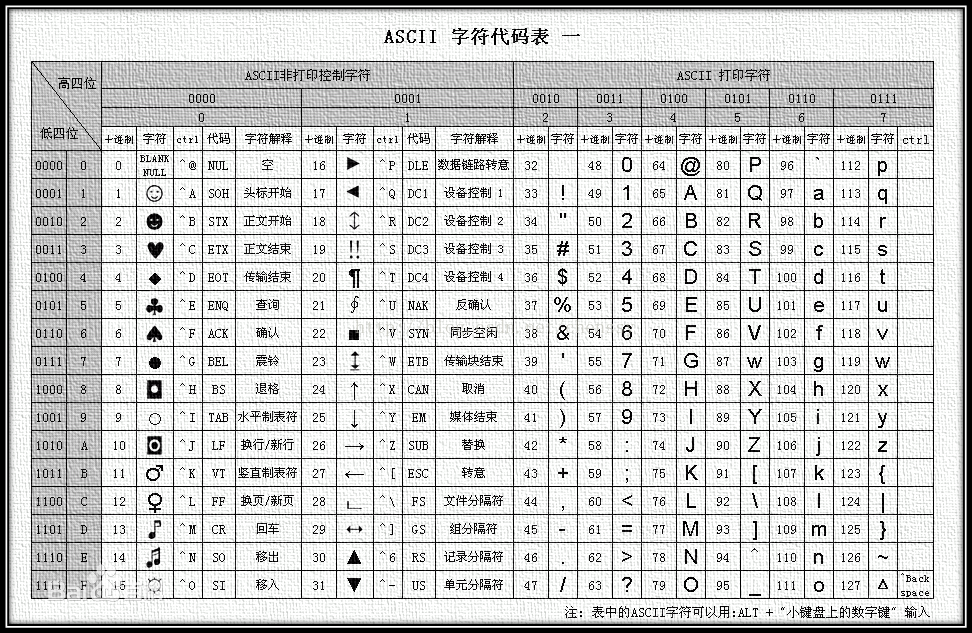
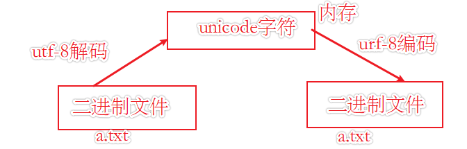

[TOC]

---

程序为什么会乱码？ 通过了解编码知识，可以更好的了解这是为什么。

---

#### 1 文本文件与二进制文件

根据我们以往的经验，文本文件通常用来保存肉眼可见的字符，比如 .txt 文件、.c 文件、.dat 文件等，用文本编辑器打开这些文件，我们能够顺利看懂文件的内容。而二进制文件通常用来保存视频、图片、音频等不可阅读的内容，当用文本编辑器打开这些文件，会看到一堆乱码，根本看不懂。

实际上，从数据存储的角度上分析，二进制文件和文本文件没有区别，它们的内容都是以二进制的形式保存在磁盘中的。

我们之所以能看懂文本文件的内容，是因为文本文件中采用的是 ASCII、UTF-8、GBK 等字符编码，文本编辑器可以识别出这些编码格式，并将编码值转换成字符展示出来。而对于二进制文件，文本编辑器无法识别这些文件的编码格式，只能按照字符编码格式胡乱解析，所以最终看到的是一堆乱码。图片视频等二进制文件有特殊的软件用于解码。

#### 2 字符

计算机在美国发明时，人们希望可以用计算机表示人们日常使用的字符，比如26个英文字母，数字，标点符号等。同时计算机在创建之初的一项重要作用就是打印，所以也需要对一些控制文档格式的字符进行表示，在美国人眼里这些字符被划分为两类。

- 可见字符
  - 英文字母，数字，标点符号等

- 控制字符
  - 回车，换行，空格等

在规划好要表示的字符后，人们用十进制数对每一个字符进行了对应，这个对应的字符叫做码位，然后将码位转换成了二进制数，以方便计算机的表示，即我们常说的`ASCII码`，又叫做`ASCII字符集`。

#### 3 ASCII码

`ASCII`字符集定义了从0到127的字符编码。并且规定一个字符存储在一个8位的字节中。（在计算机中我们使用二进制来表示各种字符，一个字节等于8bit，既一个字节是由8位二进制组成的，根据排列组合的原则，一个字节可以表示256种不同的东西，将一个字节转换为十进制，则分别对应0到255，这样，我们可以通过这些不同的类型，代表我们要表达的字符）对应关系如下图所示。



```wiki
0111 1111  => 127 
左边四位是高四位，右边四位是低四位
```

#### 4 扩展ASCII码

在相当长的一段时间内，人们使用剩下的128到255这段中的字符去表示各种各样不同的语言中的字符，如西欧的`Latin-1`字符集。它在`ASCII`的基础上对剩余位置进行了扩充。

#### 5 中文字符编码

由于中文字符比较多，所以设计时，使用分区管理的方式，采用16位表示一个汉字的方式，创造了`GB2312`，即使用两个字节去表示一个汉字。

`GB2312`码兼容了`ASCII`，计算机中可以很好的区分这两个不同的编码。

后续通过调整码位，又扩充出了包含汉字字符更多的`GBK`字符集，在此基础上又新增了包含少数民族字符的`GB18030`。

#### 6 Unicode字符集

由于各个国家都采用了不同的字符集去表示各自国家的文字，导致了信息交换的困难，最后国际组织采用了`unicode`字符集表示规则，该表示规则尽可能的包含各国的不同字符，所以可以通过通用的`unicode`来表示各个国家常用的字符。

`unicode`是一套字符集表示规则，但是他的存储方式却有很多种，因为不同的字符集在存储时，占用的字节数并不相同，造成了空间浪费。所以产生了各种各样的编码方式，比如`utf-8`一种可变长度的编码形式，他采用不同的字节来保存不同的字符。

`UTF-8`是我们比较常用的一种编码方式。

