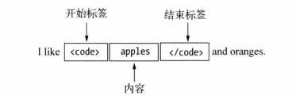
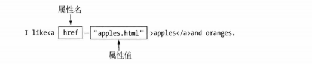

# HTML5

## 1 HTML5简介

### 1.1 HTML5引入了哪些更新？

- 引入了原生的多媒体支持
- 引入可编程内容(canvas结合js实现绘图)
- 引入语义WEB（语义化标签）

>  通过该网站可查看各浏览器对于HTML5和CSS3的支持情况：https://caniuse.com/

### 1.2 用户代理和HTML文档创建

#### 1.2.1 HTML文档创建

​		创建一个HTML文档最简单的方式是创建一个文本文件，并将其扩展名设为`.html`,这个文件可以从磁盘中直接载入到浏览器或者使用WEB服务器载入到浏览器当中（需要注意的是本地磁盘载入有些渲染呈现方式可能和web服务器载入时显示不一致）。

```html
<!--这是H5的文档声明，兼容前面的规范，告诉浏览器这是HTML文档 -->
<!DOCTYPE html>
<!-- html元素是HTML文档的根元素，包含其中的后代元素都会被作为HTML处理-->
<html>
    <head>
        <title>Document</title>
    </head>
    <body>
        <!-- 这是HTML中注释方式 -->
        <!-- HTML文档中需要呈现的内容通常放在body标签中 -->
        hello HTML!
    </body>
</html>
```

#### 1.2.2 用户代理

​		用于处理HTML文档的各种软件有一个共同的名称叫做用户代理，浏览器是最流行的用户代理，但不是唯一的一种。

### 1.3 HTML实体

| 显示结果 | 描述              | 实体名称          | 实体编号 |
| :------- | :---------------- | :---------------- | :------- |
|          | 空格              | &nbsp;            | &#160;   |
| <        | 小于号            | &lt;              | &#60;    |
| >        | 大于号            | &gt;              | &#62;    |
| &        | 和号              | &amp;             | &#38;    |
| "        | 引号              | &quot;            | &#34;    |
| '        | 撇号              | &apos; (IE不支持) | &#39;    |
| ￠       | 分（cent）        | &cent;            | &#162;   |
| £        | 镑（pound）       | &pound;           | &#163;   |
| ¥        | 元（yen）         | &yen;             | &#165;   |
| €        | 欧元（euro）      | &euro;            | &#8364;  |
| §        | 小节              | &sect;            | &#167;   |
| ©        | 版权（copyright） | &copy;            | &#169;   |
| ®        | 注册商标          | &reg;             | &#174;   |
| ™        | 商标              | &trade;           | &#8482;  |
| ×        | 乘号              | &times;           | &#215;   |
| ÷        | 除号              | &divide;          | &#247;   |

## 2 元素

### 2.1 元素的定义

#### 2.1.1 元素的基本定义

​		元素是一种用来向浏览器说明文档内容的工具。HTML中元素所包含的标签是不区分大小写的，通常约定使用小写表示，HTML5中引入了大量的语义元素，语义元素可以用来说明内容的含义以及内容的不同部分之间的关系。

​		较早版本的HTML元素，会对呈现形式产生影响，如`code`产生等宽字体，但是如今样式由CSS负责，而HTML主要是用来说明文档内容的结构和含义，所以我们一般会使用CSS去除这些默认样式，使用CSS控制其产生新的样式。

​		HTML中元素通常可以分为三部分，一部分是开始标签和结束标签，另一部分是在两个标签中的内容，称为元素内容。

```html
<body>
    like <code>apple</code> and oranges
</body>
```




#### 2.1.2 空元素

​		元素中不一定要包含元素内容，不包含元素内容的元素称为空元素。

```html
<code></code>
```

#### 2.1.3 自闭和标签

​		空元素可以使用一个标签表示。

```html
<code/>  <!-- 将开始标签和结束标签合二为一 -->
```

#### 2.1.4 虚元素

​		有些元素只能用一个标签表示，其中放置任何内容都不符合HTML规范。

```html
<!-- 虚元素有两种表示方法 -->
<!-- 方式一：只使用开始标签 -->
<hr>
<!-- 方式二：像空元素一样在标签中加入正斜杠 -->
<hr />
```

### 2.2 元素的类型和关系

#### 2.2.1 元素之间的关系

- 父元素
- 子元素
- 兄弟元素
- 后代元素

#### 2.2.2 元素类型

- 元数据元素
- 流元素
- 短语元素

### 2.3 元素的属性

#### 2.3.1 元素属性的基本定义

​		元素可以使用属性进行配置，通常属性包含全局属性（可以应用到所有的HTML元素）和元素专属属性（局部属性）。

```html
<!-- 属性只能应用于开始标签或者单个标签上，不能应用于结束标签上 -->
<!-- 属性具有名称和值两部分 -->
<a href="https://www.baidu.com"></a>
```

​		属性值可以使用单引号或者双引号进行界定，采用两种引号的方式可以相互包含，如值本身带有单引号，则可以使用双引号进行界定。



​				

​		一个元素可以拥有多个属性，属性之间使用空格进行间隔。

```html
<!-- 多个属性间没有顺序要求 -->
<a title="百度" href="https://www.baidu.com"></a>
```

#### 2.3.2 布尔属性

​		前面我们了解到的属性都是包含值的，但是HTML中有一类元素的属性称为布尔属性，他不需要值。布尔属性有自己的默认值，不需要用户进行设定。

```html		
<input disable /> <!-- 阻止用户进行输入 -->

<!-- 布尔属性的使用也可以表现为以下两种方式 -->
<input disable="" />
<input disable="disable" />
```

#### 2.3.3 自定义属性

​		HTML中支持用户自定义属性，属性以`data-`开头，这种属性称为扩展属性，主要的作用是避免与未来出现在HTML中的新元素冲突，同时增加与CSS和JS的绑定调用。

```html
<input disable="disable" data-creator="achui"/>
```

### 2.4 常用的全局属性

#### 2.4.1 class属性和ID属性

 		class属性用于将元素归类，经常用于css中的类选择器，js中的DOM操作，一个元素可以被归入多个类别，也就是class可以有多个属性值，这些属性值使用空格隔开。

```html
<div class="main testDiv">
 	哈哈哈哈
</div>
```

​		id属性和class属性相识，id属性用来给元素分配一个唯一的标识符。主要的作用是在css或者js中使用，同时可以做页面锚点跳转标定等。

#### 2.4.2 hidden属性和lang属性

​		hidden是个布尔属性，表示相关元素当前无需关注，浏览器对它的处理方式是隐藏相关元素。

​		lang属性用于说明元素内容使用的语言，值必须为有效的ISO语言代码。通常用在html中。

```html
<html lang="zh-CN">
    
</html>
```

#### 2.4.3 style属性和title属性

​		styles属性将css直接应用到行内，在css中又称为行内样式。

​		title提供了元素的额外信息。浏览器通常用这些东西显示工具提示。

#### 2.4.4 contenteditable属性和accesskey属性

​		contenteditable属性是H5中新增加的属性，其用途是让用户能够修改页面上的代码。		

```html
<!-- contenteditable的值为true时允许修改，为false时不允许，不给值得时候继承父元素的值 -->
<p contenteditable="true">
    哈哈哈哈哈哈哈
</p>
```

​		使用accesskey属性可以设定一个或几个用来选择页面上的元素的快捷键。

```html
<!-- 在windows上通过alt+p可触发点击事件 -->
<button onclick="alertTip()" accesskey="p">哈哈哈</button>
```

```js
function alertTip() {
    alert("hahahahaha");
}
```

#### 2.4.5 dir属性

​		dir属性用来规定元素中文字的方向，数值值ltr表示从左到右，属性值rtl从右到左。


