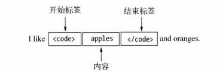
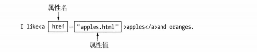
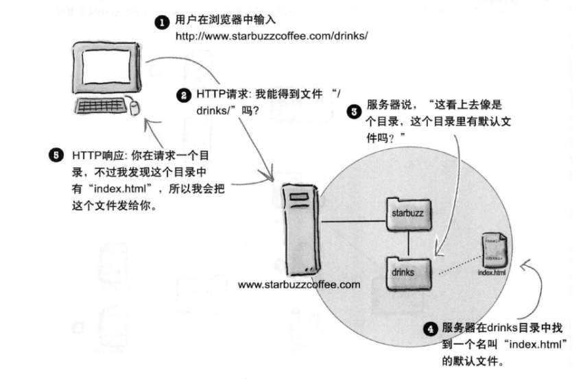
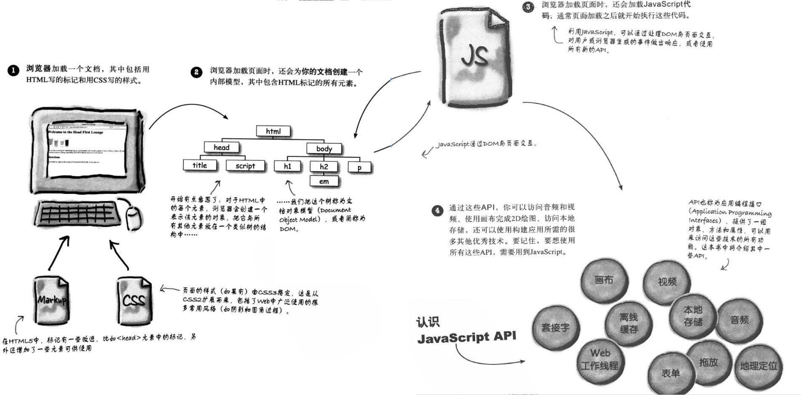
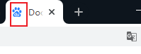
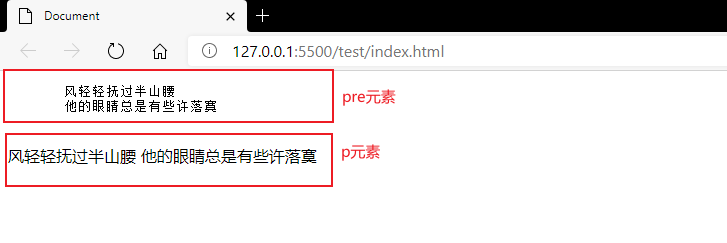

## 1 HTML概述

### 1.1 编写`HTML`文件

#### 1.1.1 `HTML`简介

超文本标记语言（简称`HTML`)，主要是用来规划文本结构和包含文本内容的，而浏览器负责渲染`HTML`文件，使用浏览器内置的**默认样式**将文件中的结构和内容呈现给用户。在渲染的过程中浏览器会忽略文件中的制表符，回车和大部分空格，通过`HTML`标记来进行换行或者分段，而这些特殊符号，只是为了让我们编写更易阅读的`HTML`文件。

> HTML 不是一门编程语言，而是一种用于定义内容结构的*标记语言*。

#### 1.1.2 元素的概念

##### 1.1.2.1 元素的定义

`HTML`是一种标记语言，在文档中以元素的形式存在， 具体的应用形式如下所示：



常规的元素由开始标签和结束标签以及其中包含的内容构成，上述例子可以称为`code`元素。但是元素可以不包含内容，不包含内容的元素称为**空元素**。

```html
<code></code>  <!-- 空元素 -->
<code/>  <!-- 空元素可以在开始标签中结束，即将结束标签中的正斜杠放在开始标签的末尾， 这是空元素的一种简写形式 -->
```

除了以上两种元素以外元素还有另一种形式，即**虚元素**，该类型的元素只能用一个标签表示。

```html
<!-- 虚元素的两种表示方式 -->
<hr>   <!-- 浏览器解析到虚元素的时候，不会等待结束标签, 所以不需要闭合 -->
<hr/>  <!-- 虚元素也可以表示为空元素的简写形式 -->
```

所以`HTML`中根据语法形式将元素分为以下三类：

- 常规元素
- 空元素
- 虚元素

> **注意事项**
>
> 1. `HTML`中元素所包含的标签是不区分大小写的，通常约定使用小写表示。
> 2. 开始标签和结束标签的区别主要是结束标签中包含`/`。
> 3. 大多数 HTML 元素可以嵌套（HTML 元素可以包含其他 HTML 元素）。

##### 1.1.2.2 元素的其他分类方法

H5中根据标签在文档中的存放位置将元素分为以下四类：

- 元数据元素
  - 构建HTML文档的基本结构，以及向浏览器提供文档信息。
- 流元素
  - 流元素是可以成为其他元素的父元素的元素，流元素是短语元素的超集， 所以流元素也是短语元素，也可以成为其他元素的子元素。
- 短语元素
  - 短语元素是HTML的基本成分， 短语元素可以成为其他元素的子元素。
- 其他元素
  - 如`li`元素：无法归入以上的三种类型，其无法成为其他大部分元素的子元素，因为他的父元素是特定的几种，如`ul`, `ol`, `ol`， 是一种受限的元素。
  - 文档元素 ： 构建`HTML`文档的一类元素。

#### 1.1.3 属性的概念

##### 1.1.3.1 属性的定义

元素可以用属性进行配置，为元素提供附加的信息，且属性只能出现在开始标签中和单个标签上，一个元素可以同时使用多条属性，所有元素中属性的顺序都不重要, 之间用一个或者多个空格隔开。

大多数 HTML 元素可拥有**属性**。属性名和属性值最好使用小写表示。



```html
<!-- 属性通常由属性名和属性值构成，但是属性值不是必须的，属性值通过单引号或者双引号界定 -->
<a href="http://www.baidu.com" alt="baidu">百度一下</a>
```

> HTML中有一类元素的属性称为**布尔属性**，他不需要值。布尔属性有自己的默认值，不需要用户进行设定。
>
> ```html
> <input disable />
> <!-- 布尔属性也可以表现为以下两种方式 -->
> <input disable="" />
> <input disable="disable" />
> ```

##### 1.1.3.2 属性的分类

属性通常可以分为**全局属性**和**专有属性**，全局属性可以应用在所有的元素上，而专有属性是一些元素特有的。

#### 1.1.4 创建`HTML`文档

创建一个`HTML`文档最简单的方式是创建一个文本文件，并将其扩展名设为`.html`,这个文件可以从磁盘中直接载入到浏览器或者使用WEB服务器载入到浏览器当中（需要注意的是本地磁盘载入有些渲染呈现方式可能和web服务器载入时显示不一致）。

```html
<!-- doctype定义要放在HTML文件的最前面，可以告诉浏览器你的文档是什么类型，让浏览器可以更准确的解释和显示页面内容  -->
<!DOCTYPE html>
<!-- html元素是HTML文档的根元素 -->
<html>
	<head>
		<title>Document</title>
        <!--  设置文本编码格式，通常中文较常使用的是UTF-8和GBK  -->
        <meta charset="UTF-8">
	</head>
	<body>
		<!-- 这是HTML中注释方式 -->
		<!-- HTML文档中需要呈现的内容通常放在body标签中 -->
		hello HTML!
	</body>
</html>
```

> **注意事项**
>
> 1. 建议使用`vscode` + 插件`Live Server` + `chrome`进行编写学习。

#### 1.1.5 HTML5

##### 1.1.5.1 H5的定义

`HTML5`有两种含义：

- `HTML`的最新版本
  - 引入原生的多媒体支持（主要是代替`Flash`插件的功能）。
  - 引入可编程内容（`canvas` 依赖 `js`实现）。
  - 引入语义`WEB`（将元素的语义与元素对其内容呈现结果的影响分开）。
- 制作现代富`Web`应用的总称
  - `HTML5`核心规范： 定义用以标记内容的元素并明确其含义。
  - `CSS`: 可用于控制标记过的内容呈现在用户面前的外貌。
  - `JavaScript`: 操控`HTML`文档的内容，以及响应用户操作。

##### 1.1.5.2 H5在语法上的变化

```html
<!-- style元素中的type属性，当前已经变为了可选项，因为css已经成为了web的标准 -->
<style type="text/css">
...
</style>

<!-- script元素中的type属性，当前已经变为了可选项，因为js已经成为了web的标准 -->
<script type="text/javascript">
	...
</script>

<!-- 引用外部样式表的type也变成了可选内容 -->
<link type="text/css" rel="stylesheet" href="style.css" />


<!-- 简化了meta元素中的属性声明 -->
<meta charset="UTF-8" />


<!-- 启用了全新的doctype -->
<!DOCTYPE HTML>
```


> **注意事项**
>
> 1. **用户代理**  : 浏览器是一种用户代理程序，所谓用户代理就是用于处理`HTML`文档各种软件的一个共同的名称，浏览器是最重要和常见的一种用户代理。
>2. **检测浏览器是否支持`HTML5`提供的新特性的两种方式**(HTML5是HTML的一个超集，不同的浏览器可能对某些标签不支持，可以采用妥善降级)
>    - `Modemizer`工具
>    - [Can I use](https://caniuse.com/)
> 3. 在不同的操作系统中，文件路径的分隔符可能是`/`或者`\`，但是对于网页而言，只能使用正斜杠（`/`）来进行路径的分割。
>4. H5允许创建预定义以外的元素，即新增自定义元素。

##### 1.1.5.3 语义标签

| 标签         | 描述                                                           |
| :----------- | :------------------------------------------------------------- |
| <article>    | 定义页面独立的内容区域。                                       |
| <aside>      | 定义页面的侧边栏内容。                                         |
| <bdi>        | 允许您设置一段文本，使其脱离其父元素的文本方向设置。           |
| <command>    | 定义命令按钮，比如单选按钮、复选框或按钮                       |
| <details>    | 用于描述文档或文档某个部分的细节                               |
| <dialog>     | 定义对话框，比如提示框                                         |
| <summary>    | 标签包含 details 元素的标题                                    |
| <figure>     | 规定独立的流内容（图像、图表、照片、代码等等）。               |
| <figcaption> | 定义 <figure> 元素的标题                                       |
| <footer>     | 定义 section 或 document 的页脚。                              |
| <header>     | 定义了文档的头部区域                                           |
| <mark>       | 定义带有记号的文本。                                           |
| <meter>      | 定义度量衡。仅用于已知最大和最小值的度量。                     |
| <nav>        | 定义导航链接的部分。                                           |
| <progress>   | 定义任何类型的任务的进度。                                     |
| <ruby>       | 定义 ruby 注释（中文注音或字符）。                             |
| <rt>         | 定义字符（中文注音或字符）的解释或发音。                       |
| <rp>         | 在 ruby 注释中使用，定义不支持 ruby 元素的浏览器所显示的内容。 |
| <section>    | 定义文档中的节（section、区段）。                              |
| <time>       | 定义日期或时间。                                               |
| <wbr>        | 规定在文本中的何处适合添加换行符。                             |

>H5兼容前面的HTML4，导致元素中包含许多毫无语义注重呈现样式的元素，如元素b。遇到这些元素应该尽量使用富含语义的元素代替。

##### 1.1.5.4 IE支持H5的方法

完美的 `Shiv` 解决方案。

```html
<!--[if lt IE 9]>
	<script src="http://cdn.static.runoob.com/libs/html5shiv/3.7/html5shiv.min.js"></script> <![endif]-->
```

```css
/*html5*/
article,aside,dialog,footer,header,section,nav,figure,menu{display:block}
```

#### 1.1.6  HTML实体字符

HTML 中包含一些预留字符，这些字符出现在HTML文档中，会被用户代理解析，如果希望使用这些字符的原始样貌，则需要使用字符实体代替这些字符。一些在键盘上找不到的字符也可以使用字符实体来替换。

常见的字符和字符实体对应关系如下所示。

| 显示结果 | 描述              | 实体名称            | 实体编号  |
| :------- | :---------------- | :------------------ | :-------- |
|          | 空格              | `&nbsp;`            | `&#160;`  |
| <        | 小于号            | `&lt;`              | `&#60;`   |
| >        | 大于号            | `&gt;`              | `&#62;`   |
| `&`      | 和号              | `&amp;`             | `&#38;`   |
| "        | 引号              | `&quot;`            | `&#34;`   |
| '        | 撇号              | `&apos;` (IE不支持) | `&#39;`   |
| ￠        | 分（cent）        | `&cent;`            | `&#162;`  |
| £        | 镑（pound）       | `&pound;`           | `&#163;`  |
| ¥        | 元（yen）         | `&yen;`             | `&#165;`  |
| €        | 欧元（euro）      | `&euro;`            | `&#8364;` |
| §        | 小节              | `&sect;`            | `&#167;`  |
| ©        | 版权（copyright） | `&copy;`            | `&#169;`  |
| ®        | 注册商标          | `&reg;`             | `&#174;`  |
| ™        | 商标              | `&trade;`           | `&#8482;` |
| ×        | 乘号              | `&times;`           | `&#215;`  |
| ÷        | 除号              | `&divide;`          | `&#247;`  |

#### 1.1.6 元素使用的原则

- 尽量使用需要阐述语义的元素进行编写，
- 保证语义元素的原有含义，不要胡乱使用语义元素，对于没有准确表达的内容可使用通用元素（`div`, `span`）,然后通过`class`属性对元素进行语义描述。
- 保证准确性和一致性


HTML文档中的元素是一种层次关系，抽象成树状图，可以更详细的描述这种层级关系。

父元素：两个元素所在的层级是连续的，它们之间是父子关系

两个元素之间跨两个层级以上，它们之间是祖辈和后代关系

HTML文档中，html元素也称为根元素。

相同层级的元素是兄弟关系。

## 1 H5升级的内容

### 1.1 HTML5和过去的hmtl有何不同

h5是html的一个超集

```html
<!-- 使用了新的文档类型声明 -->
<!-- 浏览器通过html标记出文档是html文档，不在需要冗长的文档声明 -->
<!DOCTYPE html>

<!-- 简化了meta标签 -->
<meta charset="utf-8">

<!-- link和script标签中不在需要声明type属性 -->
<!-- js和css已经成为浏览器的标准实现语言，不在需要type进行声明文档类型了 -->
<link rel="stylesheet" href="style.css">
<script>
	console.log("hello h5!");
</script>
```


### 2.2 元素的类型和关系

#### 2.2.1 元素之间的关系

- 父元素
- 子元素
- 兄弟元素
- 后代元素

#### 2.3.3 自定义属性

HTML中支持用户自定义属性，属性以`data-`开头，这种属性称为扩展属性，主要的作用是避免与未来出现在HTML中的新元素冲突，同时增加与CSS和JS的绑定调用。

```html
<input disable="disable" data-creator="achui"/>
```

`HTML`中提供了一些预定义的标记和元素属性，不同的浏览器也仅支持自己可识别的预定义标记和元素属性，但是`HTML5`允许用户创建属于自己的标记和元素属性，并可让浏览器正常渲染识别。

按照约定文件扩展名为`.html`的文件被认定为`HTML`文件， `HTML5`是`HTML`的升级版本，提供了更多新的功能和`API`(方便`JS`调用)。同时`HTML`标记中不区分大小写，但是按照约定俗成的写法是尽量使用小写。


把一个元素放在另一个元素中称为**嵌套**


块元素特立独行，内联元素随波逐流


浏览器使用file协议从你的计算机读取页面


url

协议，网站名， 资源的绝对地址

相对路径只用来链接同一个网站内的页面，而`URL`通常用来链接其他网站。


通过浏览器向web服务器请求一个目录而不是一个文件的时候会发生什么？


服务器会尝试在请求的目录中尝试返回一个默认的文件， 返回的默认文件的文件名取决于web服务器的类型。





大多数 HTML 元素被定义为**块级元素**或**内联元素**。

###


```
> 虽然 html 不区分大小写，但实体字符对大小写敏感。

### 2.4 常用的全局属性

#### 2.4.1 class属性和ID属性

 class属性用于将元素归类，经常用于css中的类选择器，js中的DOM操作，一个元素可以被归入多个类别，也就是class可以有多个属性值，这些属性值使用空格隔开。

​```html
<div class="main testDiv">
 	哈哈哈哈
</div>
```

id属性和class属性相识，id属性用来给元素分配一个唯一的标识符。主要的作用是在css或者js中使用，同时可以做页面锚点跳转标定等。


#### 2.4.2 hidden属性和lang属性

hidden是个布尔属性，表示相关元素当前无需关注，浏览器对它的处理方式是隐藏相关元素。

lang属性用于说明元素内容使用的语言，值必须为有效的ISO语言代码。通常用在html中。

```html
<html lang="zh-CN">

</html>
```

#### 2.4.3 style属性和title属性

styles属性将css直接应用到行内，在css中又称为行内样式。

title提供了元素的额外信息。浏览器通常用这些东西显示工具提示。

#### 2.4.4 contenteditable属性和accesskey属性

contenteditable属性是H5中新增加的属性，其用途是让用户能够修改页面上的代码。

```html
<!-- contenteditable的值为true时允许修改，为false时不允许，不给值得时候继承父元素的值 -->
<p contenteditable="true">
哈哈哈哈哈哈哈
</p>
```

使用accesskey属性可以设定一个或几个用来选择页面上的元素的快捷键。

```html
<!-- 在windows上通过alt+p可触发点击事件 -->
<button onclick="alertTip()" accesskey="p">哈哈哈</button>
```

```js
function alertTip() {
alert("hahahahaha");
}
```

#### 2.4.5 dir属性

dir属性用来规定元素中文字的方向，数值值ltr表示从左到右，属性值rtl从右到左。

### 2.5 文档元素和元数据元素

文档元素和元数据是`HTML`中最基础的元素，主要是用来创建`HTML`文档和说明其内容的元素。

#### 2.5.1 文档元素

文档元素只有4个。

- DOCTYPE
- html
- head
- body

##### 2.5.1.1 DOCTYPE

每一个HTML文档都必须以`DOCTYPE`元素开头，浏览器据此得知将要处理的内容是HTML文档。在HTML5中该元素只有一种写法。

```html
<!DOCTYPE HTML>
```

##### 2.5.1.2 html

html元素又称为根元素，它表示HTML文档的开始。

```html
<!DOCTYPE HTML>
<html>
</html>
```

##### 2.5.1.3 head

head元素包含着文档的元数据。元数据向浏览器提供了有关文档内容和标记的信息。此外还可以包含脚本和对外部资源的引用。

head元素内必须包含title元素，其他元素为可选内容

```html
<!DOCTYPE HTML>
<html>
	<head>
		<title>DOCUMENT</title>
	</head>
</html>
```

##### 2.5.1.4 body

body元素中主要是包含文档中的内容，它是html的第二个子元素。body中包含了所有的流元素和短语元素。以及一部分受限元素。

```html
<!DOCTYPE HTML>
<html>
    <!-- lang属性，表示网页内容默认的语言 -->
    <head lang="zh-cn">
    	<title>DOCUMENT</title>
    </head>
    <body>
    	网页的内容
    </body>
</html>
```

```html
<!-- 短引用 ： 内联元素-->
<q>简短文字</q>   <!-- 并不是所有的浏览器都会q元素引用的内容两边加双引号 -->

<!-- 长引用： 块元素 会单独显示引用的内容 -->
<blockquote>  <!-- 长引用在不同的浏览器中呈现的样式也不一样 -->
 大段文字
</blockquote>
```

#### 2.5.2 元数据元素

元数据元素向用户代理提供HTML文档的相关信息。放在head元素内， 可以主要包含以下元素。

| 序号  | 标签   | 描述                               |
| :---: | :----- | :--------------------------------- |
|   1   | title  | 定义了文档的标题                   |
|   2   | base   | 定义了页面链接标签的默认链接地址   |
|   3   | link   | 定义了一个文档和外部资源之间的关系 |
|   4   | meta   | 定义了HTML文档中的元数据           |
|   5   | script | 定义了客户端的脚本文件             |
|   6   | style  | 定义了HTML文档的样式文件           |

##### 2.5.2.1 title元素

  - 设置文档的标题和名称；
  - 通常显示在浏览器的标签页或者窗口顶部；
  - 每个浏览器只有一个title元素；

##### 2.5.2.2 base元素

- base元素用来设置一个基准的URL，让HTML文档中的相对链接在此基础上进行解析;
- 浏览器会把基准URL和相对URL拼接成完整的URL;
- 如果不指定基准URL，浏览器会使用相对URL解析文档中给出的资源路径

```html
<!DOCTYPE HTML>
<html>
    <head>
    	<title>DOCUMENT</title>
        <base href="http://www.xxxxx.com/" />
    </head>
    <body>
        <!-- 从http://www.xxxxx.com/test.jpg 寻找该图片  -->
    	
    </body>
</html>
```

##### 2.5.2.3 meta元素

- meta元素可以用来定义文档的各种元数据，一个HTML中可以包含多个meta元素;
- meta主要有以下三种使用方法
  - 指定名/值元数据对（使用`name`和`content`属性）
  - 声明字符编码
  - 模拟`HTTP`标头字段（模拟或者替换http标头中的三个字段, 使用`http-equiv`属性和`content`属性）

```html
<!--

<meta>标签的name属性表示元数据的名字，content属性表示元数据的值。它们合在一起使用，就可以为网页指定一项元数据


<meta>标签的http-equiv属性用来覆盖 HTTP 回应的头信息字段，content属性是对应的字段内容

-->
<head>
   	<title>test</title>
    <!-- 定义文档的字符编码方式 -->
    <meta charset="UTF-8" />
    <!-- 声明网站作者 -->
    <meta name="author" content="achui" />
    <!-- 定义网站描述 -->
    <meta name="description" content="this is a simple web"/>
    <!-- 定义网站关键词 -->
    <meta name="keywords" content="learning, share, note" />
    <!--  -->
    <meta />
    <!-- -->
    <meta />
    <!-- -->
    <meta />
</head>
```

##### 2.5.2.4 style元素

- style元素出现在head中，主要是用来内嵌css样式的；
- 一个HTML文件可以包含多个style元素；

##### 2.5.2.5 link元素

- 主要用来跟外部资源建立联系，如外部叠层样式表；

- link元素另一个最常用的点，是定义网站标志；

```html
<link rel="shortcut icon" href="https://www.baidu.com/cache/icon/favicon.ico" type="image/x-icon">
```

  

  ##### 2.5.2.6 script元素

- 这个元素主要的作用就是引入js代码的，具体用法查看js相关笔记。
- 该元素在head中是元数据元素，在文档的其他位置中是短语元素。

##### 2.5.2.7 noscript元素

- noscript元素可以用来向禁用了js或浏览器不支持js的用户显示一些内容。
- 它的元素类型取决于出现在文档中的位置，可以是元数据，流元素或者短语元素。

```html
<head>
	<noscript>
		<!-- 浏览器不支持js时， 可以利用meta进行重定向 -->
        <meta http-equiv="refresh" content="0; http://www.xxxxx.com"/>
	</noscript>
</head>
```

## 2 元素和属性

## 3 常用元素

### 3.1 描述文本的相关元素

#### 3.1.1 标题元素

```html
<!--
	HTML 标题（Heading）是通过<h1> - <h6> 标签来定义的
		1. <h1> 定义最大的标题。 <h6> 定义最小的标题;
		2. 搜索引擎使用标题为您的网页的结构和内容编制索引;
		3. 应该将 h1 用作主标题（最重要的），其后是 h2（次重要的），再其次是 h3，以此类推;
-->

<h1>
    Test Web
</h1>
```


#### 链接元素

```html
<!-- HTML 链接是通过标签 <a> 来定义的 -->
```

#### 图像元素

```html
<!-- HTML 图像是通过标签  来定义的 -->
```

#### 水平线元素

```html
<!-- <hr> 标签在 HTML 页面中创建水平线, hr 元素可用于分隔内容 -->
```

#### 折行

```html
<!--
	<br /> 表示换行
	<wbr></wbr> 将换行的权利交给浏览器
-->
```

> **HTML 中的 href 和 src 有什么区别**
>
> **href** 表示超文本引用（hypertext reference），在 link和a 等元素上使用。src 表示来源地址，在 img、script、iframe 等元素上。**src** 的内容，是页面必不可少的一部分，是引入。href 的内容，是与该页面有关联，是引用。区别就是，引入和引用。

| 序号  | 元素名  | 说明                                                   |
| :---: | :------ | :----------------------------------------------------- |
|   1   | b       | 加粗显示文本内容，没有特殊语义                         |
|   2   | em      | 对一段文字的强调                                       |
|   3   | i       | 一段文字与周围内容有本质区别，常用语外文词语和科技术语 |
|   4   | s       | 一段文字不再正确或准确                                 |
|   5   | strong  | 一段重要文字                                           |
|   6   | small   | 常用于免责声明和澄清声明                               |
|   7   | sub/sup | 表示下标和上标                                         |
|       |         |                                                        |
|       |         |                                                        |

```html
<body>
    <!-- abbr元素 : 表示缩写 , title属性的值用来描述完整词语-->
	<abbr title="work from home">WFH</abbr>
    <!-- dfn元素 ： -->
    <dnf></dnf>
    <!-- q元素 ： 引自他处的内容 , cite属性可以用来指定来源文章的URL -->
    <q cite="https://baike.baidu.com/item/%E9%B2%81%E8%BF%85/36231">鲁迅的方向，就是中华民族新文化的方向</q>
    <!-- cite元素 ： 表示引用作品的标题 -->
    <cite>茶花女</cite>
</body>
```


### 3.2 超链接元素

#### 3.2.1 定义

超链接元素主要的作用是实现网页中内容间的导航， 通常使用`a`标签表示。

```html
<body>
	<a href="http://www.baidu.com">百度一下</a>
</body>
```

#### 3.2.2 href

| 序号  | 属性名 | 描述                             |
| :---: | :----- | :------------------------------- |
|   1   | href   | 指定a元素所指资源的URL           |
|   2   | target | 告诉浏览器所链接的资源显示在哪里 |
|   3   |        |                                  |

> **注意事项**
>
> 1. 浏览器不仅支持http协议，还支持ftp，https， mailto等协议，所以可以使用a元素，实现邮件发送功能。

#### 3.2.3 target

该属性主要告诉浏览器所链接的资源显示在哪里， 主要的属性值为以下所示：

| 序号  | 属性值    | 说明               |
| :---: | :-------- | :----------------- |
|   1   | _blank    | 在新窗口中打开文档 |
|   2   | _parent   |                    |
|   3   | _self     | 在当前窗口打开文档 |
|   4   | _top      |                    |
|   5   | `<frame>` |                    |


### 3.3 图像元素

```html
<!--
	1. 流元素&虚元素。
	2. 图像在HTML标记处理完毕后才会加载，所以在使用的时候最好指定图像的height和width属性。
	3. 在使用图像的宽高属性的时候应该注意，不要使用其动态缩放图像，而是告诉浏览器图像多大，预留图像位置。
-->


```


浏览器对``元素的处理与其他元素稍有不同，浏览器处理普通的元素的时候，只需要把他们显示出来，但是在处理图像的时候，需要先获取这个图像，然后再显示。

浏览器会同时请求多个图像，如果没有指定图像的宽高时，则浏览器在页面中显示这个图像之前会自动确定图像的大小。

img是一个内联元素

使用该元素的时候必须加属性alt

对应视觉障碍用户，浏览器会

JPEG

PNG

GIF

指定图像的高度和宽度是一个很好的习惯。如果图像指定了高度宽度，页面加载时就会保留指定的尺寸。如果没有指定图片的大小，加载页面时有可能会破坏HTML页面的整体布局

### 3.4 列表

### 3.5 表格

表格的主要用途是以网格的形式显示二维数据，以前HTML4中也采用表格进行布局，但是H5中不在使用表格进行布局，主要用来展示数据（css中的display可以将元素显示为表格）。

以下为表格中主要使用的元素：

| 序号  |    元素     |      作用      |
| :---: | :---------: | :------------: |
|   1   | table,tr,td | 生成基本的表格 |
|   2   |     th      | 添加表头单元格 |
|       |             |                |
|       |             |                |
|       |             |                |
|       |             |                |
|       |             |                |

#### 4.1.1 表格中的三大基础元素

- table

  - 表示HTML文档中的表格；
  - 浏览器会保证让列的宽度足以容纳最宽的内容；
- tr

  - 表格中的行，HTML表格基于行而不是列，每个行必须分别标记；
- td

  - 表格中的单元格；

  **实例：编写一个表格**

```html
<body>
<!-- 两行三列的表格 -->
<!-- 浏览器会调整行与列的尺寸以维持表格的形式 -->
<table>
<tr>
<td>1</td>
<td>2</td>
<td>3</td>
</tr>
<tr>
<td>4</td>
<td>5</td>
<td>6</td>
</tr>
</table>
</body>
```

#### 4.1.2 表头单元格和表格结构元素

##### 4.1.2.1 表格单元格

- th

  - 用来区分数据和对数据的说明

  **实例：为每行每列添加单元格**

```html
<body>
<table>
<!-- 给每行和每列都添加一个表头单元格 -->
<tr>
<th>1row</th>
<th>2row</th>
<th>3row</th>
<th>4row</th>
</tr>
<tr>
<th>1col</th>
<td>1</td>
<td>2</td>
<td>3</td>
</tr>
<tr>
<th>2col</th>
<td>4</td>
<td>5</td>
<td>6</td>
</tr>
</table>
</body>
```

##### 4.1.2.2 表格结构元素

- tbody:表示构成表格主题的全体行（不包括表头行和表脚行）；
  - 浏览器在不存在tbody元素的情况下，可能会自动添加tbody元素，在使用css的时候需要特别注意；
- thead:用来标记表格的标题行；
  - 在没有thead的情况下，tr元素所包含的内容都会被视为表格主体的一部分；
- tfoot：用来标记组成表脚的行；

- **为表格增加结构元素的主要目的是方便CSS处理样式**；

#### 4.1.3 制作不规则表格

不规则表格的含义是单元格会跨越几行或几列，主要使用以下属性：

- colspan：跨越多列
- rowspan：跨越多行
- colspan和rowspan设置的值必须是整数

#### 4.1.4 关联表头和单元格

- td和th都定义了headers属性，他的值可被设置为一个或多个th单元格的id属性值

#### 4.1.5 为表格添加标题

- caption元素用来为表格定义一个标题并将其与表格关联起来，一个表格只能包含一个caption元素，它可以定义在table中的任何地方，但是总会显示在表格上方。

#### 4.1.6 处理列

- 使用colgroup元素，属性span

#### 4.1.7 表格边框属性border

- border：该属性用来告诉浏览器，**这个表格使用表示表格式数据，而不是用来布置其他元素的**。
  - border属性的值必须设置为1或空字符串（""）


### 3.6 表单元素

#### 3.6.1 表单的定义

`HTML` 表单是获取用户输入的各种不同类型的数据的手段之一， 构建表单元素的三个主要的元素是：

- form
- input
- button

具体的用法示例如下所示：

```html
<body>
    <!-- form元素告诉浏览器此处处理的是表单元素 -->
    <!-- action属性告诉浏览器应该把收集到的用户数据发送到什么地方， 默认为当前页面 -->
    <!--
		method属性指定了数据发送到服务器时使用的HTTP协议中的何种方法， 默认get方法
			1. get请求用于获取只读信息
			2. post请求用于会改变应用程序状态的各种操作
	-->
    <!--
		enctype属性指定了浏览器对发送给服务器的数据采用的编码方式，默认为application/x-www-form-urlencoded, 该属性包含三个属性值。
		1. application/x-www-form-urlencoded : 默认的方式，不能将文件上传到服务器
		2. multipart/form-data : 该编码方式用于将文件上传到服务器
		3. text/plain : 因浏览器而异，一般不使用该值
	-->
    <form action="getInfo.jsp" method="post" enctype="multipart/form-data">
        <!--
			input元素主要是用来收集用户信息
			1. name属性用来给表单设置一个独一无二的标识，用于css选择器的绑定，与id属性没有相关性。
			2.

			lable元素主要是为表单中的元素提供说明， 使用for属性绑定对应的input元素，绑定需要使用input元素的id值。
		-->
        <lable for="uploadFile">上传文件：</lable>
        <input name="foruploadFile" id="uploadFile" type="file"/>
        <!--
			buttton在未设置type属性时，默认的作用是提交表单信息，即type="submit"
				1. type的属性可以设置为reset， 将input元素重置为初始状态
				2. type的属性可以设置为button， 此时button元素是一个单纯的按钮
		-->
        <button>
            提交
        </button>
    </form>
</body>
```

> HTML4规范中，button元素和input元素，以及其他的相关表单元素只能出现在form元素包围中，但是H5中，不再进行限制，表单中的元素只要使用form属性关联form表单的id属性即可。

#### 3.6.2 表单分组

表单分组可以使用`fieldset`元素，同时可以使用`legend`元素提供分组说明信息。

```html
<body>
    <form method="" action="">
        <fieldset>
            <legend>基本信息</legend>
            <input />
        </fieldset>
         <fieldset>
            <legend>更多信息</legend>
            <input />
        </fieldset>
    </form>
</body>
```


| 序号  | 属性名       | 属性值                | 说明                                                             |
| :---: | :----------- | :-------------------- | :--------------------------------------------------------------- |
|   1   | autocomplate | on/off                | 表单是否允许浏览器填写表单，form和input都可以使用该属性          |
|   2   | target       | 于a元素的相关属性一致 | 服务器反馈的信息显示在哪里                                       |
|   3   | autofocus    | 布尔属性              | 用于聚焦某个input元素，只可有一个input有该属性，否则产生覆盖效果 |
|   4   | disabled     | 布尔属性              | 禁用input元素                                                    |

  `readonly`/`disable`  生成禁止编辑的文本框

`value`属性设置一个默认值

#### 3.6.3 input元素

`input`元素支持很多特定类型的数据，通过`type`属性进行指定。

| 序号  | 属性值                    | 说明                                                                                                                     |
| :---: | :------------------------ | ------------------------------------------------------------------------------------------------------------------------ |
|   1   | `text`                    | 浏览器中显示为一个单行的文本框，是input的默认形式                                                                        |
|   2   | `password`                | 提供一个密码输入框，`*`只是遮掩字符串，并不会在传输的时候加密密码                                                        |
|   3   | `submit`/`reset`/`button` | 生成与`button`类似的按钮                                                                                                 |
|   4   | `range`/`number`          | 获取一个范围内的数值，常与`step`， `min`, `max`一起使用                                                                  |
|   5   | `checkbox`                | 生成复选框                                                                                                               |
|   6   | `radio`                   | 生成一组单选按钮，每个选项中的`name`用来进行分组，`checked`用来标识初始值是哪一个，`value`属性用来标识提供给服务器的值。 |
|   7   | `email`/`tel`/`url`       | 通过数据框获取有规定格式的字符串。                                                                                       |
|   8   | `color`                   | 提供一个颜色选择框                                                                                                       |
|   9   | `search`                  | 该类型主要使用用来标识一个`input`数据框是用作搜索用途的，没有其他附加的特殊功能                                          |
|  10   | `img`                     | 配合`src`属性使用，将一个`input`数据框设置称为图标提交按钮，触发时提交表单                                               |
|  11   | `hidden`                  | 提供一个隐藏的数据提交框，通常用于保存一些常见的标识数据，用于服务器验证                                                 |
|  12   | `file`                    | 在表单提交时将文件提交到服务器，使用时需要将`form`的`enctype`属性设置为`multipart/form-data`                             |

> 1. `img`类型的`input`数据框，在提交到服务器的时候，可以将用户点击的坐标发送给服务器，所以也可以用作图片的分区响应。
> 2. `input`也支持时间类型数据的获取，但是由于各个浏览器的支持不同，所以通常使用js库去实现该功能。时间相关的类型，`datetime`, `datetime-local`,`date`,`month`,`time`,`week`。

```html
<body>
    <form method="post" action="">


    </form>
</body>
```


##### 3.6.3.1 text属性值

当input元素使用type中的text属性值得时候，它可以使用许多与之相关的属性。

```html
<body>
    <form action="" method="">
        <lable for="username">用户名：</lable>
        <!--
			1. maxlength设定最大字符容纳数
			2. size规定文本框可以显示的字符数目
			3. value设定一个默认值
			4. placeholder设定一个提醒的字符串
		-->
        <input type="text" name="username" id="username" maxlength="10" size="10" value="admin" placeholder="please enter your name"/>
    </form>
</body>
```

数据列表可以提供一批值，以便用户输入需要的数据。

```html
<!--
	将input元素中的list属性的属性值设置为datalist元素中id属性的属性值，即可完成文本框关联数据列表的功能
-->
<body>
    <form>
        <lable for="username">用户名：</lable>
        <input type="text" name="username" id="username" list="usernamelist" />
        <!-- datalist元素提供数据列表 -->
        <datalist id="usernamelist">
            <!--
				1. option可以用在一些特定的父元素中，datalist就是其中之一， 用来提供具体的数据项
				2. option可以使用虚元素的形式进行书写，元素的内容起到一个提示的作用，也可以通过lable
				3. option中的value代表使用时的数据值
			-->
        	<option value="tom" />
            <option value="mark" />
            <option value="suse" />
            <option value="hanke" />
        </datalist>
    </form>
</body>
```

生成只读或者被禁用的文本框，两者都可以导致文本框不可被编辑，区别是最终呈现的外观不同

```html

```

##### 3.6.3.2 password属性值

type属性中的该属性主要是用来进行密码的键入的。可以在用户输入信息时，提供`*`号进行文本的遮掩。

#### 3.6.4 select元素

该元素可以生成一个选项列表供用户选择。

```html
<body>
    <form>
        <!--  multiple属性允许用户一次性选择多个属性 -->
        <!--  size属性可以设置选择时显示多少个属性 -->
        <select id="tools" name="tools" multiple size="2">
            <!--  selected属性提供一个被自动选择的项，用户页面显示时的初始显示 -->
            <option selected value="Coverity" lable="Coverity">Coverity</option>
            <option value="Fortify" lable="Fortify">Fortify</option>
            <option value="pylint" lable="pylint">pylint</option>
            <option value="eslint" lable="eslint">eslint</option>
            <option value="shellcheck" lable="shellcheck">shellcheck</option>
            <option value="cppcheck" lable="cppcheck">cppcheck</option>
         </select>
    </form>
</body>
```


### 3.7 内容分组元素

用来将相关内容分组

### 3.8 结构元素

用于划分内容，让每个概念，观点或主题彼此分隔开。

HTML通常使用的结构元素是div   span

HTML5增加了一些新的结构元素来明确结构的含义， 而不再是一个模糊的容器， 有利于浏览器，搜索引擎和开发人员的识别。

###  内容嵌入元素


### 3.9  框架元素

通过使用框架，你可以在同一个浏览器窗口中显示不止一个页面。

```html
<iframe src="URL"></iframe>
```

### 3.3 组织内容的元素

这些元素的作用可以很好的组织文档的内容，使其更具结构性。

#### 3.3.1 段落元素

```html
<!--
	HTML 段落是通过标签 <p> 来定义的
		1. 浏览器会自动地在段落的前后添加空行。（</p> 是块级元素）;
		2. 段落元素包含的内容可以围绕一个观点或者多个论点围绕同一个主题进行阐述, ;
-->

<p>
    人生苦短，我用Python
</p>
```

#### 3.3.2 div元素

```html
<!--
	1. div 元素没有特殊的含义， 在内容没有合适的语义元素进行组织的时候，可以使用该元素，并使用全局属性class或者id属性，为其明确含义。
	2. 优先使用具有语义的元素组织文档结构，div不是首选的元素。
-->
<div>
    pass
</div>
```

#### 3.3.3 内容预先排版的元素

```html
<!--
	1. pre元素可以改变浏览器处理内容的方式，阻止合并空白字符，保留文档中的原始格式。
	2. 该元素应该谨慎使用，他打破了结构和呈现分离的原则。
-->
<pre>
	风轻轻抚过半山腰
	他的眼睛总是有些许落寞
</pre>
```

`pre`元素示例如下：



> 用`pre`去表示一些代码的原始格式，是比较常用的一种方式。

#### 3.3.4 引用内容元素

```html
<!--
	1. blockquote元素表示引用自他处的内容，他与q元素的区别是，他引用的内容更多一些。
	2. cite属性可以指定引用的来源地。
-->
```

#### 3.3.5 主题分隔元素

```html
<!--
	H5中，hr元素表示主题的分隔， 即一个主题向另一个主题的转换。
-->
<hr />
```

#### 3.3.6 列表元素

列表元素主要分为以下三类：

- 有序列表
- 无序列表
- 说明列表

> 无序和有序列表都需要用到li元素，该元素表示列表中的具体某项，他的父元素只能是特定的某几个。
>
> - li元素包含一个value属性，可在生成有序列表的时候，产生不连续编号。

##### 3.3.6.1 有序列表

```html
<!--
	1. type属性包含五种属性值（1, a, A, i. I），表示列表项中编号的风格
	2. start属性表示有序列表的起始值
-->
<ol type="1" start="10">
    <li>数学</li>
    <li>语文</li>
    <li>英语</li>
</ol>
```

##### 3.3.6.2 无序列表

```html
<!--
	1. 无序列表列表项每项前面有一个统一符号， 默认为实心圆圈。
	2. 统一符号，可以通过css的list-style-type属性，进行更改。
-->
<ul>
    <li>数学</li>
    <li>语文</li>
    <li>英语</li>
</ul>
```

##### 3.3.6.3 说明列表

```html
<!--
	说明列表包含着一系列术语和说明
-->
<dl> <!-- 定义说明列表 -->
    <dt>定义1</dt>
        <dd>说明1</dd>
    	<dd>说明2</dd>
	 <dt>定义2</dt>
        <dd>说明3</dd>
    	<dd>说明4</dd>
</dl>
```


### 9.2 事件处理

提供一些代码在时间发生时来调用。

| 序号  | 事件     | 事件关联属性 |
| :---: | :------- | ------------ |
|   1   | 点击事件 | `onclick`    |
|       |          |              |
|       |          |              |


HTML5 支持内联 SVG。

## 什么是SVG？

- SVG 指可伸缩矢量图形 (Scalable Vector Graphics)
- SVG 用于定义用于网络的基于矢量的图形
- SVG 使用 XML 格式定义图形
- SVG 图像在放大或改变尺寸的情况下其图形质量不会有损失
- SVG 是万维网联盟的标准

# HTML5 拖放（Drag 和 Drop）

------

拖放（Drag 和 drop）是 HTML5 标准的组成部分。


HTML 语言定义网页的结构和内容，CSS 样式表定义网页的样式，JavaScript 语言定义网页与用户的互动行为


跳过了第四，五章
