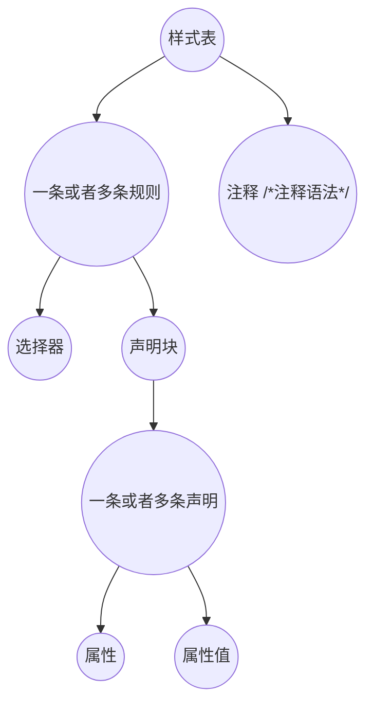
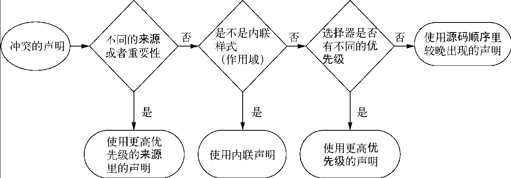
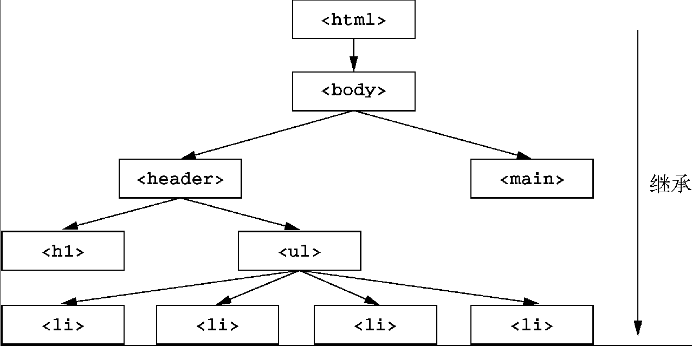
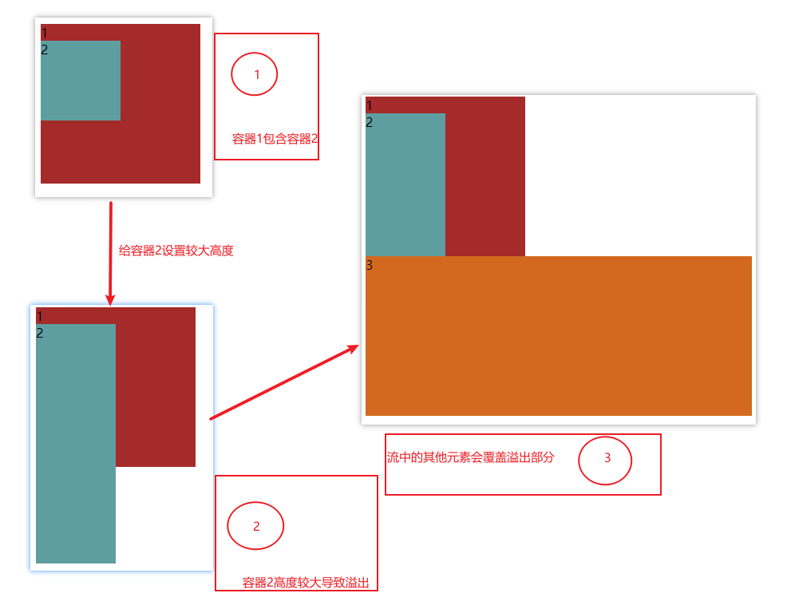
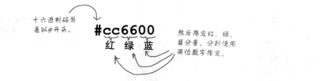
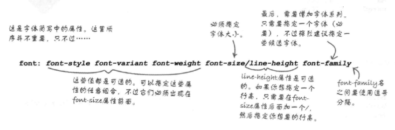
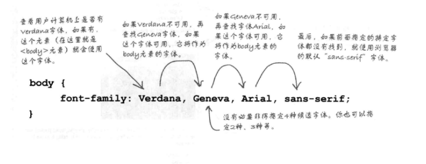

## 1 走进CSS

### 1.1 CSS简介

#### 1.1.1 `CSS`简介

`CSS`(层叠样式表)的目标是提供一个简单的**声明式样式语言**，以此来规定`HTML`文档的呈现形式，实现结构与表现的分离。层叠的含义是指样式可以结合起来使用，而且具有优先级。`CSS`主要的优势是能够轻易为同类型的所有元素应用一组样式。

`CSS`依赖元素 ， 在`CSS`中元素由两种形式:

- 置换元素 : 元素内容部分不由`HTML`文档内容直接表示， 如`img`。

- 非置换元素 ：元素内容由用户代理在元素自身生成的框中显示， 如`span`等。

另一种分类方式是根据呈现方式的不同进行分类：

- 块级元素： 独占一行
  - 列表是一种特殊的块级元素，它包含项目记号（如有序列表中的编号）
- 内联元素： 共享一行

> - **`CSS`开发很重要的一点就是以可预测的方式书写规则**。
> - 不要将`CSS`属性（property）跟HTML属性（attribute）混淆。
> - `HTML`中块级元素不能出现在行内元素中，但是CSS在显示的时候，不限制显示方式，通过属性`display`进行设置。
> - `CSS`的功能依赖于`HTML`文档中的父子关系。

#### 1.1.2 注释

```css
/*
	这是css中的注释，是不是跟js中的多行注释一样？
*/
```

### 1.2 编写样式表

#### 1.2.1 样式表的结构

样式表中不能出现HTML的标记，同时CSS中也会将空白制表符这些内容忽略掉（属性值之间关键字的间隔除外），样式表的内容结构如下图所示：



#### 1.2.2 规则结构

##### 1.2.2.1 常规的规则定义

`css`文件中一个规则集由两部分组成（规则集也简称规则），分别为**选择器**和**声明块**，声明块中又包含多条**声明**，每条声明包含**属性**和**值**，每条声明使用`;`隔开，属性值中如果有多个关键字则基本使用空白，逗号，或者`/`隔开，如果某条声明的属性或者值是错误的，那么该条声明被废弃。

一个值通常由一个关键字或者多个关键字组成，这些关键字构成了一个值，多个关键字常用空格隔开，有的使用正斜杠或者逗号，但不是每个值都可以接受很多个关键字。


```css
p {
    font : medium Helvetica;  /* 将段落中的字体设为中等，并使用Helvetica字体 */
}
```

##### 1.2.2.2 `@规则`

​		@规则（at-rules）是指用“@”符号开头的语法。比如`@import`规则或者`@media`查询。

```css
/*
	@import语句将样式从一个样式表导入另一个样式表中， 一个样式表中想要导入多少个别的样式表都行，该语句必须位于样式表顶端。

	@charset 声明样式表使用的编码
	如果样式表中未声明所使用的字符编码，那么浏览器将使用载入该样式表的HTML文档声明的编码，如果HTML文档也没有声明其编码，那么默认情况下使用的将是utf-8
*/
@import url("style.css")
@charset "UTF-8"
```

### 1..3 HTML关联CSS

#### 1.3.1 外部样式表

```html
<!-- 
	1. 文档想要链接多少样式表都行 
	2. 在链接外部样式表的时候，link使用的较多，@import主要是用在样式表内引用其他样式表
-->
<head>
    <!-- 方式一 ： 通过link标签，在head标签中嵌入外部样式表 -->
    <link rel="stylesheet" href="style.css">

    <!-- 方式二 ： import语句必须位于所在样式表顶端 -->
    <style>
    	@import url("style.css")
    </style>
</head>
```

#### 1.3.2 内嵌样式表
```html
<head>
    <style>
        div {
            background-color: yellow;
        }
    </style>
</head>
```

#### 1.3.3 行内样式

```html
<!-- 
	1. 通过html标签的style属性，提供行内样式,style是html的全局属性。
	2. 由于style不利于表现和结构的分离，所以现在较少使用。
-->
<p style="color:gray;">
   hahahah
</p>
```

## 2 选择器

### 2.1 选择器的分类

#### 2.1.1 元素选择器

通常这里的元素对于HTML来说指的就是HTML的预定义的元素， 如`p`，`div`这些。

```css
p {
	color : red;
}
```
> **注意事项**
>
> - 在使用元素选择器的时候，一些旧的浏览器不认识HTML5中提供新元素，这时可通过DOM，创建元素，让CSS可绑定`document.createElement(elemnetName);`

#### 2.1.2 群组选择器：

将一个样式应用到多个元素中。

```css
/* 使用逗号分隔多个元素 */
h1, p {  
    color: red;
}
```

#### 2.1.3 通用选择器：

通用选择器匹配所有元素，类似通配符。

```css
* { color:red;}
```

#### 2.1.4 类选择器和ID选择器

绑定元素的`class`属性，类选择器可以结合元素选择器进行范围指定

```css
/* 这种写法相当于 *.waring {font-weight: bold;} 隐式的包含通用选择器*/
.waring {
    font-weight: bold;
}

/* 结合元素选择器进行使用 */
p.waring {
    font-weight: bold;
}  

/* 串联多个类选择器 html中的class可以包含多个类型，所以可以使用该种方式进一步缩小范围 */
p.waring.urgent {
    font-weight: bold;
}

/*
	<p class="waring urgent"> 
		hello world!
	</p>
*/
```

ID选择器跟类选择器类似，点号换为#号

```css
/* 由于HTML中规定，ID只能唯一，所以在使用ID选择器的时候，不需要结合元素标签就可以定位到特定元素，虽然ID选择器也隐含通用选择器 */
/* ID选择器不支持串联，原因是HTML中ID属性的值不能是空格分隔的列表 */
#warning {
    font-weight: bold;
}
```

> **注意事项**
>
> - 在使用ID选择器，类选择器，属性选择器，伪类和伪元素选择器时，如果没有依附元素选择器，则隐式的依附于通用选择器。

#### 2.2.5 属性选择器

##### 2.2.5.1 简单属性选择器

```css
/* 
	选择一个具有某种属性的元素
*/
h1[class] {
    color:black;
}

* [class] {
    color:black;
}
```

##### 2.2.5.2 精准属性选择器

```css
/* 
	1. 选择属性为特定值得元素
	2. 精准属性选择器支持串联
*/
h1[class="main"][title="hello"] {
    color:black;
}
```

##### 2.2.5.3 匹配部分属性值选择器

通过元素具有的部分属性匹配元素，多种模糊匹配方式见下表。

| 序号 | 语法            | 说明                                                     |
| :--: | :-------------- | :------------------------------------------------------- |
|  1   | [foo \|= "bar"] | 元素包含foo属性，并且属性的值以`bar-`开头或者是`bar`本身 |
|  2   | [foo ~= "bar"]  | 元素包含foo属性，并且属性的值是包含`bar`这个词的一组词   |
|  3   | [foo *= "bar"]  | 元素包含foo属性，并且属性的值是包含`bar`子串             |
|  4   | [foo ^= "bar"]  | 元素包含foo属性，并且属性的值是以`bar`开头               |
|  5   | [foo $= "bar"]  | 元素包含foo属性，并且属性的值是以`bar`结尾               |

##### 2.2.5.4 起始值属性选择器

```css
/*
	匹配元素中第一个属性为lang，且属性值为en的元素
*/
*[lang|="en"] {
    color : red;
}
```

> 在使用属性选择器的时候，可以在方括号中加入`i`来匹配大小写都符合的属性值。
>
> ```css
> a[href$="*.pdf" i] { /* 在HTML文档中寻找所有符合条件的元素，并忽略pdf的大小写 */
>     color:red
> }
> ```
>
> 

#### 2.2.6 后代元素/子元素/相邻元素/同胞元素选择器

```css
/* 
	后代选择器 ： 两个元素之间的层级间隔可以是无限的
*/
h1 em {
    color: red;
}

/*
	子元素选择器
*/

h1 > em {
    color: red;
}

/*
	相邻元素选择器： 
*/

li + li { /* 后一个元素将被选中 */
    color: red; 
}

/*
	同胞元素选择器， 作用于兄弟元素之间
*/

h1 ~ p { /* h1的兄弟元素p都会被选中 */
 	  color: red;  
}
```

#### 2.2.7 伪类选择器

伪类选择器可以为文档中不一定存在的结构指定样式，或者为某些元素的特定状态赋予幽灵类(即元素本身并没有设置该类)。

伪类选择器支持串联，伪类始终指代所依附的属性。

```css
/*
	语法结构 ->   冒号 + 伪类名称
*/

:root {  /* 选择文档中的根元素， 对于xml文档作用比较大，因为xml可能有多个根元素 */
	
}

:empty {  /* 选择空元素， 虚元素也会被选中 */
    
}


```


- 伪元素选择器
- 结构性伪类选择器
- UI元素状态伪类选择器


## 3 `CSS`中的抽象概念

### 3.1 层叠

#### 3.1.1 层叠的概念

同一个元素可以被一个或者多个规则选中，


​		不同的规则应用到了同一个元素上时，就可能产生冲突，浏览器决定最终应用到该元素上的实际规则，而层叠就是浏览器解决冲突的依据。要想弄清楚最终哪个规则应用到元素上，就要理解`css`中的层叠概念。

​		层叠指的就是用户代理（这里指浏览器）将我们写好的样式应用到一个元素上，其间通过对继承，声明的来源，特指度这三个指标的衡量和计算，最终应用到元素上的过程。

#### 3.1.2 层叠的工作方式

​		当声明冲突时，层叠会依据三种条件解决冲突。

1. **样式表的来源**：样式是从哪里来的，包括你的样式和浏览器默认样式等。
2. **选择器优先级**：哪些选择器比另一些选择器更重要。
3. **源码顺序**：样式在样式表里的声明顺序。



##### 3.1.2.1 样式表的来源

​		以下样式表的来源，优先度依次从高到底（优先级高的会覆盖优先级低的）。

- 作者样式表（开发者制定的样式，即网站的样式）
- 用户样式表（有些浏览器允许用户定义一个用户样式表）
- 用户代理样式表（浏览器包含一些默认的样式）

> 1. 覆盖用户代理样式表的两种方案(原理就是利用层叠的规定，将用户代理的样式覆盖掉)
>
>    - [Reset CSS](https://meyerweb.com/eric/tools/css/reset/)
>
>    - [Normalize.css](http://necolas.github.io/normalize.css/?spm=a2c6h.12873639.0.0.6d231e22cDAy15)
>
> 2. 浏览器应用了用户代理样式后才会应用你的样式表，即作者样式表。你指定的声明会覆盖用户代理样式表里的样式。

##### 3.1.2.2 优先级

​		如果样式都来源于同一个样式表，如作者样式表，面对冲突的规则，则考虑优先级，浏览器将优先级分为两部分：

- HTML的行内样式（行内样式具有相对于选择器更高的优先级）

- 选择器的样式

>  如果用HTML的style属性写样式，这个声明只会作用于当前元素。实际上行内元素属于“带作用域的”声明，它会覆盖任何来自样式表或者`<style>`标签的样式。行内样式没有选择器，因为它们直接作用于所在的元素。


​		**选择器的优先级的准确规则如下**(不同类型的选择器有不同的优先级):

- 如果选择器的ID数量更多，则它会胜出（即它更明确）。
- 如果ID数量一致，那么拥有最多类的选择器胜出。
- 如果以上两次比较都一致，那么拥有最多标签名的选择器胜出。

> 伪类选择器（如:hover）和属性选择器（如[type="input"]）与一个类选择器的优先级相同。通用选择器（*）和组合器（>、+、~）对优先级没有影响。
>
> 数量的计算是依据规则涉及渲染元素中有关联的选择器进行计算累加的，无关的选择器不会加入计算，影响结果。
>
> ```html
> <!-- h1最终呈现的是chartreuse  
> 	因为h2 #tt这两个选择器跟h1元素毫无关系，所以两条规则对于h1元素的权重都是001 001， 按照源码的出现顺序来说，后出现的将被应用到元素上	
> -->
> <style>
> 	h1,h2,#tt {
>             color: brown;
>     }
>     
>      h1 {
>             color: chartreuse;
>      }
> </style>
> 
> <body>
>     <h1>
>         hello world
>     </h1>
>     <h2>
>          hahahaha
>     </h2>
>     <h3 id="tt">
>         xixixixi
>     </h3>
> </body>
> ```

##### 3.1.2.3 源码顺序

​		源码顺序。如果两个声明的来源和优先级相同，其中一个声明在样式表中出现较晚，或者位于页面较晚引入的样式表中，则该声明胜出。

#### 3.1.3 提高优先级（`! important`）

​		层叠的工作方式中有一个例外，标记了`!important`的声明会被当作更高优先级的存在。使用了该标记的声明在优先级中大于行内样式，在样式来源中大于作者样式，如果对于冲突中的多个声明都应用了该标记，则最终应用到元素上的声明按照层叠的正常工作方式比较后得出结果，进行应用。

```html
<!-- h1最终颜色为chartreuse -->
<style>
        h1 {
            color: chartreuse !important;  /* 放在声明的末尾分号之前， 最好是只在样式表内用!important */
        }
</style>
<body>
    <h1 style="color: hotpink;">
        hello world
    </h1>
</body>
```

>  **【特殊情况】** ： 如果用户样式中和作者样式中都标记了声明，则用户样式优先于作者样式。

#### 3.1.4 权重计算（特指度/优先级标记计算）		

​		对于优先级计算， `css`中有一个常用的表示优先级的方式, 是用数值形式来标记，通常用逗号隔开每个数。比如，“1,2,2”表示选择器由1个ID、2个类、2个标签组成。优先级最高的ID列为第一位，紧接着是类，最后是标签。有时，人们还会用4个数的标记，其中将最重要的位置用0或1来表示，代表一个声明是否是用行内样式添加的。此时，行内样式的优先级为“1,0,0,0”， 即最高位代表行内样式。

​		这种表示方法得出的结果，比较时从左向右进行比较，基于前面的优先级可以按照权重表示为如下:

- 行内样式`1,0,0,0`

- 选择器中每个ID属性值加`0,1,0,0`；
- 选择器中每个类属性值，属性选择或伪类加`0,0,1,0`；
- 选择器中每个元素和伪元素加`0,0,0,1`；
- 连接符和通用选择符不增加特指度；

> 1. 层叠值的概念
>    - 浏览器遵循三个步骤，即来源、优先级、源码顺序，来解析网页上每个元素的每个属性。如果一个声明在层叠中“胜出”，它就被称作一个层叠值。元素的每个属性最多只有一个层叠值。 层叠值作为层叠结果，是应用到一个元素上的特定属性的值。

#### 3.1.5 层叠建议

​		通常最好让优先级尽可能低，这样当需要覆盖一些样式时，才能有选择空间， 层叠中尽量遵守的两条法则

- 在选择器中不要使用`ID`
- 不要使用`!important`

### 3.2 继承

#### 3.2.1 继承的定义

继承是指把一个元素的某些属性值传递给其后代的机制。


如果一个元素的某个属性没有层叠值，则可能会继承某个祖先元素的值。比如通常会给`<body>`元素加上font-family，里面的所有祖先元素都会继承这个字体，就不必给页面的每个元素明确指定字体了。

继承指某些样式不仅应用到所指的元素上，还会延伸到元素的后代上，通过文档树可以清晰的看到为其中一个父节点设置属性，这些属性会沿着文档树，将其应用到他涉及到的所有后代节点上；



​		继承的流动是从父节点向下一直到所有后代节点的，属性的应用在继承中不具有向上传播的特性，但是`body`元素中设置背景样式时例外，在`body`元素上设置的背景相关属性会传播给`html`元素，不过这个特例仅限于给`body`元素设置了背景样式，而没有给`html`元素设置背景样式；

```html
  <!DOCTYPE html>
  <html lang="zh-cn" style="background-color: indigo;">
      <head></head>
      <body style="background-color: hotpink;">
      </body>
  </html>
```

> 使用开发者工具能够看到哪些元素应用了哪些样式规则，以及为什么应用这些规则。层叠和继承都是抽象的概念，使用开发者工具是最好的追踪方式。

#### 3.2.2 可被继承的属性

​		不是所有的属性都能被继承。默认情况下，只有特定的一些属性能被继承。它们主要是跟文本相关的属性：color、font、font-family、font-size、font-weight、font-variant、font-style、line-height、letter-spacing、text-align、text-indent、text-transform、white-space以及word-spacing。

​		还有一些其他的属性也可以被继承，比如列表属性：list-style、list-style-type、list-style-position以及list-style-image。表格的边框属性border-collapse和border-spacing也能被继承。

​		`border`属性就不会被继承。

#### 3.2.3 `inherit`

​		该属性值主要有两个作用：

- 继承其父元素的值

- 强制继承（继承一个通常不会被继承的属性）

#### 3.2.4 `initial`

​		每一个`CSS`属性都有初始（默认）值。如果将`initial`值赋给某个属性，那么就会有效地将其重置为默认值，这种操作相当于硬复位了该值。即该属性的主要作用是撤销作用于某个元素的样式。

> 声明`display: initial`等价于`display: inline`。不管应用于哪种类型的元素，它都不会等于`display: block`。这是因为initial重置为属性的初始值，而不是元素的初始值。`inline`才是`display`属性的初始值。


```css
/* 
	全局设置border-box -> 给页面上所有元素和伪元素设置border-box 
*/

:root {
  box-sizing: border-box;
}     

*,
::before,
::after {
  box-sizing: inherit;
}
```

```css
calc()
```


#### 3.3.3 元素溢出问题

##### 3.3.3.1 溢出

​		普通文档流是为限定的宽度和无限的高度设计的。内容会填满视口的宽度，然后在必要的时候折行。因此，容器的高度由内容天然地决定，而不是容器自己决定。

​		当明确设置一个元素的高度时，内容可能会溢出容器。文档流不考虑溢出的情况，其容器下方的任何内容都会渲染到溢出内容的上面。

​		除了垂直溢出，内容也可能在水平方向溢出

可以用overflow-x属性单独控制水平方向的溢出，或者用overflow-y控制垂直方向溢出。这些属性支持overflow的所有值



​		用`overflow`属性可以控制溢出内容的行为, 该属性支持以下4个值:

- visible（默认值）——所有内容可见，即使溢出容器边缘。
- hidden——溢出容器内边距边缘的内容被裁剪，无法看见。
- scroll——容器出现滚动条，用户可以通过滚动查看剩余内容。在一些操作系统上，会出现水平和垂直两种滚动条，即使所有内容都可见（不溢出）。不过，在这种情况下，滚动条不可滚动（置灰）。
- auto——只有内容溢出时容器才会出现滚动条。

##### 3.3.3.2 等高列

​		任意一列的内容增加，两列的高度都会增加，同时保持底部对齐

```css
<head>
    <meta charset="UTF-8">
    <meta name="viewport" content="width=device-width, initial-scale=1.0">
    <title>Document</title>
    <style>
        .container {
            /* 让容器布局像表格一样 */
            display: table;
            width: 100%;
            background-color: chocolate;
        }

        .main {
            display: table-cell;
            width: 70%;
            background-color: #fff;
            border-radius: .5em;
        }

        .sidebar {
            display: table-cell;
            width: 30%;
            margin-left: 1.5em;
            padding: 1.5em;
            background-color: #fff;
            border-radius: .5em;
        }
    </style>
</head>

<body>
    <div class="container">
        <main class="main">
            asdlkhaslkdjlaskjdlkasj
            <br />
            asjdklasjdlkasjdlkasjdlaks
            <br />
            aksdlkasldkasldklaskdlask
        </main>
        <aside class="sidebar">2</aside>
    </div>
</body>
```


> 除非别无选择，否则不要明确设置元素的高度，设置高度一定会导致更复杂的情况。

```css
min-height

max-height
```


##### 垂直居中

在容器里让内容居中最好的方式是根据特定场景考虑不同因素

案。可以用一个自然高度的容器吗？给容器加上相等的上下内边距让内容居中。容器需要指定高度或者避免使用内边距吗？对容器使用display: table-cell和vertical-align: middle。可以用Flexbox吗？ 如果不需要支持IE9，可以用Flexbox居中内容。参见第5章。容器里面的内容只有一行文字吗？设置一个大的行高，让它等于理想的容器高度。这样会让容器高度扩展到能够容纳行高。如果内容不是行内元素，可以设置为inline-block。容器和内容的高度都知道吗？将内容绝对定位。参见第7章。（只有当前面提到的方法都无效时才推荐这种方式。）不知道内部元素的高度？用绝对定位结合变形（transform）。参见第15章的例子。（还是只有当前面提到的方法都无效时才推荐该方法。）

## 4 `CSS`中的一些概念

### 4.1 web颜色

​		在`web`应用中大量使用到颜色，如在背景颜色，字体颜色，边框颜色等方面。在`css`中有三种表示颜色的方法：

- `rgb`
- 颜色名
- 十六进制码

RGBA 的意思是（Red-Green-Blue-Alpha）它是在 RGB 上扩展包括了 **“alpha”** 通道，运行对颜色值设置透明度。

选择器的作用

​		`web`颜色由红，绿， 蓝每种颜色分别指定一个从0 到 100%的数值，混合起来就是要显示的颜色， 如白色由100%的红色，绿色和蓝色构成， 黑色由0%的三种基础颜色构成。

```css
/*
	r => red
	g => green
	b => blue
*/
rgb(100%, 100%, 0%)

/*
	也可以使用0 ~ 255表示
*/
rgb(204, 102, 0)
```

​		`css`提供了较少的颜色名，大约150个, 如`red`

```css
h1 {
    color : red;
}
```

​		用`css`指定颜色有多种方式，常见的是十六进制码，如果十六进制每种颜色的两位都是相同的就可以简写，如

```css
#cc6600 => #c60
```




### 4.2 简写属性

#### 4.2.1 简写属性的概念

​		简写属性是用于同时给多个属性赋值的属性。

​		大多数简写属性可以省略一些值，只指定我们关注的值。但是要知道，这样做仍然会设置省略的值，即它们会被隐式地设置为初始值。这会默默覆盖在其他地方定义的样式。比如，如果给网页标题使用简写属性font时，省略font-weight，那么字体粗细就会被设置为normal。

#### 4.2.2 顺序性

上右下左， 顺时针

TRouBLe”口诀只适用于分别给盒子设置四个方向的值的属性


如果声明结束时四个属性值还剩一个没指定，没有指定的一边会取其对边的值。指定三个值时，左边和右边都会使用第二个值。指定两个值时，上边和下边会使用第一个值。如果只指定一个值，那么四个方向都会使用这个值。


### 4.3 厂商前缀

		由于浏览器有很多种类型，各厂商有些专属的属性，所以通过厂商前缀可以在特定的浏览器中实现一些独有的样式：(目前带有厂商前缀的属性，基本不再使用，新版本的浏览器中删除了这些属性，老的代码中可能出现)

| 序号 |   前缀   |                   厂商                   |
| :--: | :------: | :--------------------------------------: |
|  1   |  -epub-  |      国际数字出版论坛制定的ePub格式      |
|  2   |  -moz-   |     基于Mozilla的浏览器（如Firefox）     |
|  3   |   -ms-   |         微软的Internet Explorer          |
|  4   |   -o-    |            基于Opera的浏览器             |
|  5   | -webkit- | 基于WebKit的浏览器（如：Safari和Chrome） |

		演示：

```css
div {
    -moz-border-radius: 10px;
	-ms-border-radius: 10px;
	-o-border-radius: 10px;
	-webkit-border-radius: 10px;
	border-radius: 10px;
}
```

### 4.4 相对单位

绝对单位

- px

**相对单位**(相对单位的值会根据外部因素发生变化)

- em, rem

像素、点、派卡
CSS支持几种绝对长度单位，最常用、最基础的是像素（px）。不常用的绝对单位是mm（毫米）、cm（厘米）、in（英寸）、pt（点，印刷术语，1/72英寸）、pc（派卡，印刷术语，12点）。这些单位都可以通过公式互相换算：1in = 25.4mm = 2.54cm = 6pc = 72pt = 96px。因此，16px等于12pt（16/96×72）。设计师经常用点作为单位，开发人员则习惯用像素。因此跟设计师沟通的时候需要做一些换算。
像素是一个具有误导性的名称，CSS像素并不严格等于显示器的像素，尤其在高清屏（视网膜屏）下。尽管CSS单位会根据浏览器、操作系统或者硬件适当缩放，在某些设备或者用户的分辨率设置下也会发生变化，但是96px通常等于一个物理英寸的大小。


在CSS中，1em等于当前元素的字号，其准确值取决于作用的元素


：浏览器会根据相对单位的值计算出绝对值，称作计算值（computed value）


## 5 文本相关属性

​		通常文字字体相关的属性都会被继承。CSS常见属性

设置字体属性是样式表最常见的用途之一

`@font-face`是css2中定义的用来下载指定的自定义字体的属性。

```css
p {
    /* 定制页面中使用的字体，大多数计算机通常只安装了部分字体，选择字体的时候需要特别注意 */
    font-family:   ;
    
    /* 控制字体大小 */ 
    font-size： ;
     
    /* 改变文本颜色 ： color为什么不叫text-color 本质上是一个前景色 控制元素和边框的颜色 */
    color： ;
    
    /* 指定字体的粗细 */ 
    font-weight: ;
    
    
    /* 增加字体风格 */
    font-style: ;     /* italic : 斜体风格     oblique : 倾斜文本     */
    
    
    /* 为文本添加装饰 */  
    text-decoration: ; /* 添加上划线，下划线和删除线等 */ 
    /* line-through => 删除线  => html del*/
    /* 
    	underline => 下划线 => html ins
    	overline  => 上划线
    	none => 不启用任何装饰
    
    装饰不会累加，除非放在同一个属性中，同时应用
    */ 
    
    
    /*  */  
    
    /* 行高设置 ： 设置文件中各行之间的垂直距离 */ 
    line-height : 1.6em;   /* 为字体大小的1.6倍 */  
    
}


/* 字体属性的简写形式 */
```



### 5.1 font-family

#### 5.1.1 使用介绍

​		本质上是一个字体优先列表，第一个是最希望使用的，后面的依次为候选字体，最后一个是通用字体，覆盖面应该全面。



> 字体名包含多个单词时，可以使用引号进行界定

#### 5.1.2 扩展字体

​		通过浏览器向用户提供特殊的字体，这些字体的格式通常是`woff`， 尽量不使用该规则，会延长加载时间。

```css
/* 指定字体规则应该放在文件最上面，body之前 */
@font-face {
    font-family: "font name";  /* 定义字体的名字 */
    /* 可以将字体托管在特定的网站上 */
    src: url("字体的下载链接1"), url("字体的下载链接2");  /* 指定字体的下载链接 */
}

h1 {
    font-family: "font name";  /* 使用字体 */
}
```

### 5.2 font-size

#### 5.2.1 使用介绍

​		指定文字大小的多种方式

- px  ： 通过像素直接给出文字的大小
- % ： 相对于另一个元素的大小，另一个元素指从父元素继承来的大小的百分比
- em： 与百分数类似，是一种比例关系，1.2em即指是父元素的1.2倍
- 关键字指定： 每个型号相对于前一个大约在1.2倍
  - xx-small
  - x-small
  - small（约为12px）
  - medium（默认大小）
  - large
  - x-large
  - xx-large

#### 5.2.2 设置原则

1. 选择一个关键字，作为`body`的默认文字大小， 当然也可以使用`%`和`em`指定，因为存在默认大小（`medium`）
2. 使用`em`或者`%`指定其他后代元素的文件大小


### 5.3 font-weight

```css
font-weight: bold;
/* normal */
```


# 9 布局


https://www.cnblogs.com/yanayana/p/7066948.html


### 9.1 固定网格布局

严格定义尺寸大小（通过指定具体的像素（`px`））

### 9.2 流式网格布局

使用比例单位（百分数）而不是像素来表示宽度

```css
max-width: 100%;
```


​		流实际上就是浏览器在页面上摆放`HTML`元素所用的方法。浏览器从`HTML`文件最上面开始，从上到下沿着元素流逐个显示所遇到的各个元素。

​		块元素从上向下流，每个元素之间有一个换行。

​		内联元素在水平方向上会相互挨着，总体上会从左上方流向右下方。文本是内联元素的一种特殊形情况，浏览器会把它分解为适当大小的内联元素，以适应给定的空间。


#### 流和盒模型

- 浏览器并排放置两个内联元素时，如果两个元素都有外边距，那么两个元素的距离就是两个元素的外边距之和。

- 浏览器上下放置两个块元素时，元素的两个外边距会折叠在一起，折叠的外边距高度就是最大的外边距高度。（即如果有一个块元素的外边距为0，它下面的块元素的上外边距为20， 那么它们之间的外边距就是20）


## 1 浮动


CSS可以浮动任何元素，浮动通过`float`属性实现


使用`css`可以浮动任何元素，`css`中浮动主要通过属性`float`实现，浮动的元素脱离了正常的文档流，但是对正常的文档流有影响，因为其他的文档内容将会围绕他流动。浮动的元素外边距不折叠


浮动后生成的是块级框，如超级链接，类似于给浮动元素声明了`display:block`属性


#### 如何浮动一个元素

对于所有浮动元素都有一个要求：它必须有一个宽度。


### 流体布局

### 冻结布局

冻结布局会锁定元素，让它们冻结在页面上，这样这些元素根本不能移动

### 凝胶布局

​		锁定页面中内容区的宽度，并将内容区居中。

```css
#allcontent {
    width : 800px;
    
    margin-left: auto;
    margin-right: auto;
}
```

绝对定位

响应式web设计指的是根据用户浏览器的环境调整布局，通常是用`css`技术进行设计。主要包含以下三种技术：

- `css3`媒体查询
- 流式网格布局
- 流式图像和媒体


```css
/*
	CSS3媒体查询是一些逻辑表达式，用于计算用户浏览器中媒体特性的当前值，如果媒体查询表达式计算为TRUE，就会应用所包含的CSS


*/


/* 
	常见的媒体类型
	1. screen
	2. print
	3. all
	4. aural
	5. braille
	6. tv

*/
```

```css
@media screen {
    /* css rules for screens! */
}
```

```html
<link rel="stylesheet" type="text/css" href="screen.css" media="screen" />
```


```mermaid
graph TB;

  1((1))–>2((2))

  1((1))–>3((3))

  2((2))–>4((4))

  2((2))–>5((5))

  3((3))–>6((6))

  3((3))–>7((7))

  4((4))–>8((8))

  4((4))–>9((9))

  6((6))==>10((10))

  6((6))==>11((11))

  7((7))==>12((12))
```


| 序号 | 名称 | 逻辑运算符 |
| :--: | :--- | :--------- |
|  1   | 或   | `,`        |
|  2   | 与   | and        |
|  3   |      |            |

```css
/* 如果是在打印机或者是单色的显示器上，则应用以下样式 */

@media print, screen and (monochrome) {  /* monochrome -> 单色，黑白 | color -> 彩色 */
    /* css rules for screens! */
}
```


```css
/* style.css */

/*  颜色，排版， 基本布局  */
/*  公共结构  */
/*  桌面结构  */
/*  移动结构  */
```


#### 1.1.9 特性查询

css内置规则 @font-face   @import @media


##### 1.1.8.1 媒体查询的定义与设置方式

​		创作人员通过媒体查询定义浏览器在何种媒体环境中使用指定的样式表，主要作用是可以针对不同的媒体类型(包括显示器、便携设备、电视机，等等)设置不同的样式规则。

​		设置媒体查询的几种方式：

- link元素的media属性
- style元素的media属性
- @import声明的媒体描述符部分
- @media声明的媒体描述符部分

```css
/* 一个样式表中可以有任意多个@media块 */
h1 {color: maroon;}
@media projection { /* 在幻灯片中显示的页面背景为黄色 */
    body {
        background:yellow;
    }   
}
```

##### 1.1.8.2 媒体类型

- all：用于所以展示媒体
- print: 为有视力的用户打印文档时使用，也可以应用于打印预览
- screen: 在屏幕媒体上展示文档，带有web浏览器的计算机的显示器上展示
- projection: 幻灯片形式的文档展示
- handheld： 部分移动设备的浏览器支持该类型

> **注意事项：**
>
> - 多个媒体类型进行使用时，用逗号隔开如：
>
>   ```css
>   @media screen, print{
>       
>   }
>   ```

##### 1.1.8.3 媒体描述符

​		一个媒体描述符包含一个媒体类型和一个或者多个媒体特性列表，特性描述符要放在`()`中，没有媒体类型，就应用到所有媒体上：

```css
/* 媒体特性描述符就像声明一样，包含属性和值，但是值可以省略不指定，如color */
@media all and (color) {}

/* 多个特性描述符使用逻辑关键字链接，可以使用and not only ,and:满足全部条件样式才会被应用 */
@media all and (color) and (min-resolution:96dpi) {}
/* not代表整个条件取反, not只能在媒体查询开头写 */
@media not all and  (color) and (min-resolution:96dpi) {}
/* 使用逗号间隔代表or */
@media all and (color), all and(min-resolution:96dpi) {}

/* 没有媒体类型，就应用于全部媒体上 */
@media all and (min-resolution:96dpi) {}
/* 两者等价 */
@media (min-resolution:96dpi) {}
```

​		特性查询：根据用户代理是否支持特定的CSS属性及其值来应用一段样式，特性查询是渐进增强的一种方式。

```css
@support (color:black) {  /* 如果用户代理支持color属于就应用它中包含的样式，不支持就跳过 */
    body {color：black;}
    h1 {color:purple;}
}
```

​		特性查询支持嵌套，它可以嵌套在媒体查询中，或者媒体查询中嵌套它，或者自身嵌套自身。特性查询也支持逻辑运算符，如and, or, not。

```css
@support (display:grid) and (shape-outside:circle()){
    /* 栅栏的形状和样式 */
}

/* 与and等价的写法 */
@support (display:grid) {
    @support (shape-outside:circle()) {
        /* 栅栏的形状和样式 */
    }
}
```

​		为什么特性查询中要带属性呢？因为用户代理可能支持属性，但是不支持属性中的某个值。


## URL - 统一资源定位器


- scheme - 定义因特网服务的类型。最常见的类型是 http
- host - 定义域主机（http 的默认主机是 www）
- domain - 定义因特网域名，比如 runoob.com
- :port - 定义主机上的端口号（http 的默认端口号是 80）
- path - 定义服务器上的路径（如果省略，则文档必须位于网站的根目录中）。
- filename - 定义文档/资源的名称


在旧的浏览器中使用新元素的方式是在DOM中创建元素