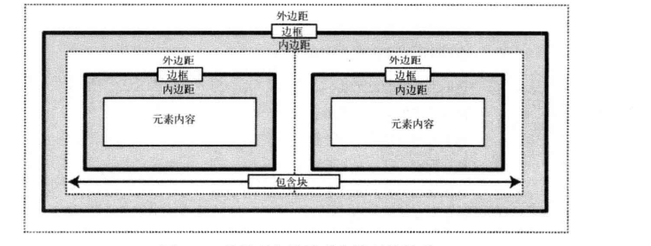
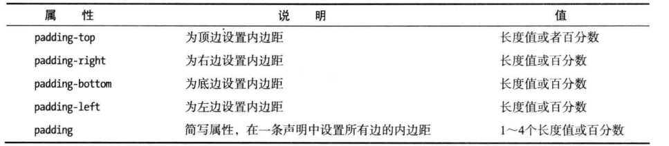
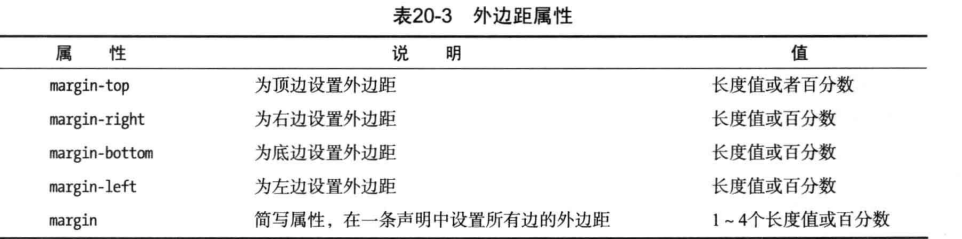
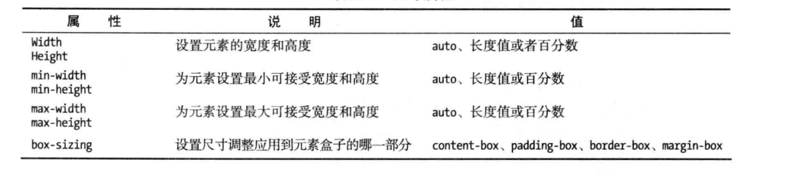
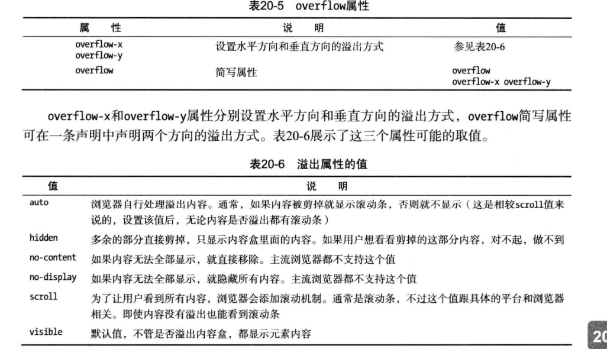

### 3.3 盒子模型

元素会在页面中占据一个矩形区域，这种呈现方式被称为盒模型，通过配置盒模型的相关属性可以设置元素在呈现时的外观以及文档的整体布局。

内边距是内容和边框之间的空间

外边距是边框和页面上其他元素之间的空间

父元素的盒模型称为子元素的块容器，简称容器。



#### 3.3.1 盒模型的概念

​		盒子模型(`box model`) ： 是`css`看待元素的一种方式，`css`将每个元素看做一个盒子。


内边距和外边距都是透明的，元素的背景颜色会延伸到内边距下面，但不会延伸到外边距

box-sizing: border-box会改变盒模型

《Head First Mobile Web》


​		当给一个元素设置宽或高的时候，指定的是内容区的宽或高，但是元素实际占用的位置是内边距，边框，外边框，以及内容区相加的结果。

```css
/*
	box-sizing -> 调整盒模型的行为
		1. box-sizing的默认值为content-box，这意味任何指定的宽或高都只会设置内容盒子的大小。
		2. 将box-sizing设置为border-box后，height和width属性会设置内容、内边距以及边框的大小总和
*/
```


### 内边距

盒模型的内边距可以去单独设置某一个方向上的内边距，也可以设置所有方向上的内边距。



> 使用百分数设定时，依赖的是父元素的宽度，与父元素的高度无关

padding可以指定1~4个值，来同时设定四个方向上的值。

### 外边距



### 元素尺寸控制



子元素的盒模型超出了父元素的盒模型的现象被称为溢出。

