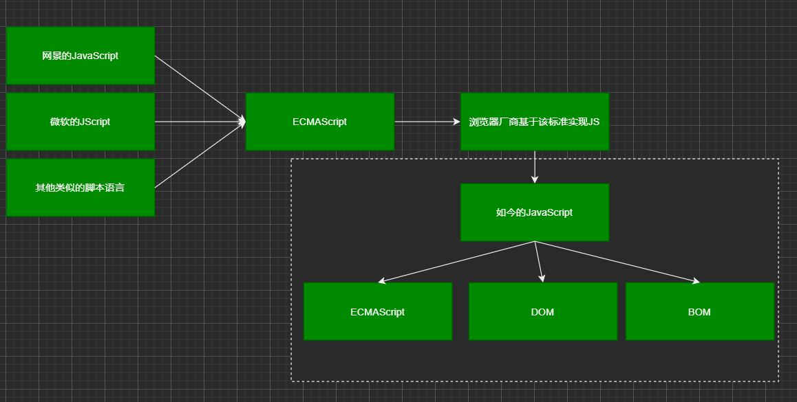

## 1 JavaScript简介

### 1.1 JavaScript简介

#### 1.1.1 JavaScript的诞生

##### 1.1.1.1 历史

`JavaScript`诞生于1995年，由布兰登-艾奇创造，起初的主要用途是处理以前由服务器端语言负责的一些输入验证操作，解决了人们在操作页面时，漫长的服务器端校验回传所浪费的时间，如今，`JavaScript`的用途早已不再局限于简单的数据验证，而是具备了与浏览器窗口以及其内容等几乎所有方面交互的能力。

由于 `JavaScript 1.0` 很受欢迎，`Netscape` 在`Netscape Navigator 3`中又发布了`JavaScript 1.1` 版本。不久，微软在 `Internet Explorer 3` 中也加入了脚本编程功能。为了避免与 `Netscape` 的 `JavaScript` 产生纠纷，微软特意将其命名为 `JScript`。1997 年，欧洲计算机制造商协会（`ECMA`）以 `JavaScript 1.1` 为基础制订了脚本语言标准——`ECMA-262`，并命名为 `ECMAScript`。1998 年，国际标准化组织和国际电工委员会（ISO/IEC）采用了 ECMAScript 标准（即 ISO/IEC-16262）。自此，浏览器厂商就以 `ECMAScript` 作为各自 JavaScript 实现的规范标准。简单概括，`ECMAScript` 是 `JavaScript` 语言的规范标准，`JavaScript` 是 `ECMAScript` 的一种实现。

`JavaScript` 本身不提供任何与 `I/O`（输入/输出）相关的 `API`，都要靠宿主环境提供，所以 `JavaScript` 只合适嵌入更大型的应用程序环境，去调用宿主环境提供的底层 `API`。宿主环境又称为用户代理，常见的用户代理，包括各式各样的浏览器，`nodejs`等。

> JavaScript和Java是完全不同的两种编程语言

##### 1.1.1.2 特性

`js`动态的, 弱类型的高级语言，他的语法借鉴了`Java`， 原型式继承基于`self`， 一等函数概念基于`Scheme`，支持多种范式的编程，如面向对象编程和函数式编程。

`js`支持面向对象和函数式编程。

##### 1.1.1.3 前景

`HTML5`推出后，`JavaScript`已成为标准的Web脚本语言。

> - js学习的难点
>
>   - 大量外部`api`;
>   - 语言本身的一些设计缺陷，导致运行时的怪异现象;

#### 1.1.2 JS与ES和TS

`Web` 浏览器只是 `ECMAScript `实现的宿主环境之一。宿主环境不仅提供基本的 ECMAScript 实现，同时也会提供各种扩展功能(DOM和BOM)。ECMAScript 是 JavaScript 的标准，但它并不等同于 JavaScript，也不是唯一被标准化的规范。

在浏览器中我们所指的 JavaScript 实现由以下 3 个不同部分组成：

- 核心（ECMAScript）：语言核心部分。
- 文档对象模型（Document Object Model，DOM）：网页文档操作标准。
- 浏览器对象模型（BOM）：客户端和浏览器窗口操作基础。

> chrome浏览器的js解释器（解释器又称引擎），代号`V8`.

`TypeScript` 是 `JavaScript `的超集，扩展了 `JavaScript` 的语法，因此现有的 `JavaScript `代码可与 `TypeScript` 一起工作无需任何修改，`TypeScript` 通过类型注解提供编译时的静态类型检查。

`TypeScript` 可处理已有的 `JavaScript` 代码，并只对其中的 `TypeScript` 代码进行编译。随着前端的工程化和日益规范化，ts可能是未来。

宿主为 JavaScript 定义了与外界交互所需的全部 API：DOM、网络请求、系统硬件、存储、事件、文件、加密，还有数以百计的其他API。