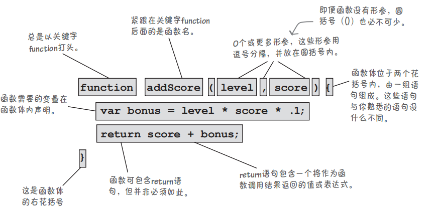
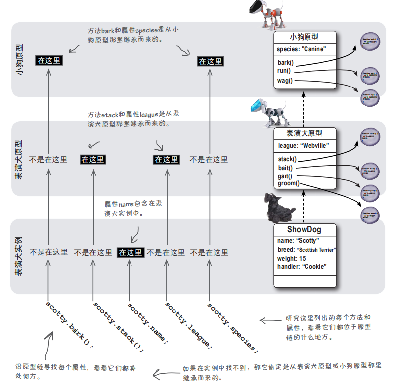

[TOC]

---

词法结构 ： 描述如何使用语言来进行程序编写，本篇主要介绍这门语言的语法基础，涵盖`ES3`和`ES5`。

---

## 1 JS的基本规定

### 1.1 基础规定

1. `JavaScript`程序使用`Unicode`字符集编写；

2. `JavaScript`中区分大小写；

### 1.2 标识符的规范

标识符主要是用来指定变量，函数，属性等的名称，ES中命名规范如下：

- 不能以数字开头，字符由字母，数字，下划线，美元符组成（除非有充分的理由，否则不要使用以`_` 或`$`打头的变量名，它们通常被`js`库所占用；
- 标识符最好采用驼峰大小写的方式进行命名，如`sayHello`,当然也可以使用下划线的方式命名（Unix风格）；
- 不要使用任何内置关键字和保留字；
- 标识符也可以使用 `Unicode` 字符。一般建议仅使用 ASCII 编码的字母，不建议使用多字节的字符（如汉字等）;

### 1.3 语句和表达式

表达式计算出一个值

语句不关心值，更改程序的运行状态

#### 1.1.9 注释

注释应该优先用来提高程序的可读性，与`python`等语言一样，解释器不会执行注释中的内容 ，`js`提供以下两种注释方式：

- 单行注释（建议使用）
- 多行注释（不建议使用）

```javascript
// 单行注释


/*
 *	块注释（第一行和尾行的写法是必须的，中间的行首以星号开始不是必须的，这样写主要是提高可读性）
 *  
 */


// 应该尽量避免在代码中出现块注释，因为块注释的语法字符可能会出现在正则表达式字面量中，导致代码不安全

/*
	var rm_a = /a*/.match(s);
*/
```

#### 1.2.2 严格模式

　　ES5中引入严格模式的概念，在严格模式下ES3中的一些不确定的行为将得到处理，对某些不安全的操作也会抛出错误。如在ES3中的函数中，不声明一个变量直接使用一个变量进行赋值操作时，就会引发异常（引发ReferenceError错误）。

```js
"use strict"; // 整个脚本中启用严格模式，可以在脚本的开头进行声明，这个声明其实是个编译指示

function sayHello() {
    "use strict";  // 在函数中使用严格模式，放在函数的顶层即可，严格模式只会在该函数中生效
    console.log("hello world!");
}
```

`js`解释器有自己的内存管理机制，可以自动对内存进行垃圾回收。


技术角度上，对象才可以拥有方法，但是原始数据类型中的字符串，布尔值和数字也可以调用方式，原因是它们使用了包装对象，这个是解释器自动调用的。


对象是可变类型


原始类型是不可变类型


可变和不可变的界定范围就是是否允许修改


js中数据类型是自动转换的

#### 1.1.9 基本语法

ES标准大量借鉴了C语言和类C语言的语法特征，编写代码时应该注意以下词法规范。

- 忽略多余的空格，换行符，格式控制符；

- 大括号与分号

  - 与python通过缩进和冒号来识别代码块不同，js中采用`{}`和`;`来区分代码块和语句，虽然实际操作中`;`不是必须的，但是最佳的实践是加上他，这样可以在文件中去除多余的空格来减少js的体积，以及减少解释器智能添加`;`的性能损耗，并增加代码性能。

  1. **代码块**
     - 从语法上说，代码块是放在花括号内的一组语句，可以只包含一条语句，也可以包含任意数量的语句。代码块中的所有语句被视为一个整体，要么都执行，要么都不执行。

  2. **分隔符**

     - 在JavaScript中，分隔符不被解析，主要用来分隔各种记号，如标识符、关键字、直接量等信息。 在 JavaScript 脚本中，常用分隔符来格式化代码，分隔符（空白符）就是各种不可见字符的集合，如空格（\u0020）、水平制表符（\u0009）、垂直制表符（\u000B）、换页符（\u000C）、不中断空白（\u00A0）、字节序标记（\uFEFF）、换行符（\u000A）、 回车符（\u000D）、行分隔符（\u2028）、段分隔符（\u2029）等。
     - 分隔符虽然无实际意义，但是在脚本中却不能缺少。如果在标识符与关键字之间不使用分隔符分隔，JavaScript 就会抛出异常;

- 代码块

  - 从语法上说，代码块是放在花括号内的一组语句，可以只包含一条语句，也可以包含任意数量的语句
  - 可选的分号
    - 使用分号将语句分隔开，但是一般建议不要省略，可以节省解释器资源，方便压缩体积，以及避免意外错误。

### 1.3 变量

#### 变量的命名规范

变量命名规范遵守以下原则：

- 变量名应该富有语义，尽可能使用有意义的单词，提高可度性；

- `js`惯例使用[小驼峰命名](..\..\..\0-术语与概念\命名法.md )；

- 符合标识符命名规范；

#### 定义变量

js的变量是松散类型（松散类型的意思是可以用来保存任何类型的数据），在生命周期内可以随时改变，定义变量使用关键字`var`声明;

```javascript
// 先声明在赋值
var name;
name = "achui";

// 声明和赋值同时进行
var age = 18;

// 声明后,在使用前没有赋值
var gender; // 变量在声明后没有赋值，保存一个默认的值undefined

// 给一个未声明的变量直接赋值，会导致该变量，为全局变量
// 这种情况在严格模式下会抛出ReferenceError错误
idCard = 1231231231312

// 定义多变量
var name = "achui",  // 换行可以提高可读性
    age = 18,
    gender = "women";
```

#### 1.3.2 变量的作用域

变量的定义位置决定了其作用域，即变量在代码的哪些地方可见，哪些地方不可见;

变量的作用域分两种：全局（global）和局部（local）如果变量是在函数外声明的，它就是全局变量；如果变量是在函数中声明的，它就是局部变量。使用未声明的变量时，它将自动被视为全局变量，即便他在函数中出现；

```js
// test.js

var name;  // 声明一个全局变量

function sayHello() {
    var name; // 声明一个局部变量
    age = 18;  // 在函数内定义了一个全局变量
}
```

> **注意事项**

> 1. **多个js文件被加载时，作用域怎么划分**
>    - 只有一个全局作用域，因此加载的每个文件看到的变量都相同（它们创建的全局变量位于同一个空间内）。因此，避免使用的变量发生冲突（并尽可能少用甚至不用全局变量）至关重要。
> 2. **全局变量和局部变量重名时，使用哪个变量**
>    - 如在函数内部使用时，函数内部的被局部变量将“遮住”（shadow）全局变量，即就近原则。

#### 1.3.3 变量的声明周期

　　全局变量的寿命与网页一样长。全局变量在JavaScript代码加载到网页之后降生，并在网页消失后死去。局部变量通常在函数结束时消失。局部变量是在函数被调用后创建的，并一直活到函数返回（无论函数是否返回值）。然而，在局部变量的大限到来前，可从函数返回它们的值。

#### 1.3.4 变量声明的最佳实践

- 在js文件开头声明全局变量， 在函数开头声明局部变量；
- 变量的命名应准守标识符规范；

- 将i用作迭代变量的做法历史悠久。这种约定始于空间有限的年代，也算是一种命名规范；

#### 1.3.4 变量提升

通常JS引擎会在正式执行之前先进行一次预编译，在这个过程中，首先将变量声明及函数声明提升至当前作用域的顶端，然后进行接下来的处理。

## 2 数据类型

能够表示并操作的值的类型称为数据类型。`js`中支持多种数据类型。

### 2.1 数据类型和数据类型判断

#### 2.1.1 数据类型

`ES5`中包含5种简单数据类型（基本或原始数据类型），一种复杂数据类型`Object`，ES不支持任何创建自定义类型的机制（C语言中支持创建自定义数据类型）。

- `Undefined`
- `Null`
- `Boolean`
- `Number`
- `String`
- `Object`
  - 普通对象（`Object`）
  - 数组（`Array`）
  - 函数（`Function`）

#### 2.1.2 数据类型判断

`ES`中的变量是动态的，不像`Java`等强类型语言一样，定义变量时一并声明了变量的类型，在任何时刻，一个`ES`变量都可以存放任意类型的数据。

在`ES`中提供了3种方式，来判断数据类型。

- `typeof`运算符
- `instanceof`运算符
- `Object.prototype.toString`方法

##### 2.1.2.1 typeof

在`ES`中可以使用`typeof`操作符来对一个变量的数据类型进行判断, `typeof`返回一个字符串，大致为以下几种。

```js
"undefined" // 这个值未被定义
"boolean"  // 这个值是布尔值
"string"  // 这个值是字符串
"number"  // 这个值是数字
"object" // 这个值是对象(包含数组)或者null
"function"  // 这个值是函数
```

`typeof`是一个操作符不是一个函数，所以在类型判断时候，不需要使用调用运算符(`调用运算符指圆括号`)，后面直接跟变量或者字面量进行判断即可。

```js
var arrayTets = [1, 2, 3];  // 定义一个数组
var num = 24;  // 定义一个数字

console.log(typeof arrayTets);  // res => object
console.log(typeof num);  // res => number
console.log(typeof 29);  // res => number
console.log(typeof null);  // res => object  , 特殊值null被认为是一个空的对象引用
```

示例中发现，typeof其实并不能很好的确定对象数据类型具体指向哪一种类型。`instanceof`运算符可以区分数组和对象。

### 2.2 基本数据类型详解

#### 2.2.1 Undefined

`Undefined`类型只有一个值，即特殊的`undefined`，表示不存在。以下几种情况都会返回该值。

- 函数没有返回值时

- 声明的变量，未赋值时

- 对象的属性不存在时

> 使用var声明变量时，但并未初始化时，这个变量的值就是undefined。(即在对变量进行声明时变量的默认值会被设置为undefined，而不需要在程序中显式的指定)。
>
> 一个变量在未声明和未赋值的前提下，直接进行使用的时候会引起错误提示，但是这个变量却可以使用操作符typeof进行类型判断，并返回undefined值。这一点很奇特需要我们多注意，它有一个好处，就是我们在代码中显式的初始化我们声明的每一个变量，那么当一个变量在进行类型判断时，返回undefined，则证明该变量未被声明，也未被初始化。

#### 2.2.2 Null

`Null`类型也只有一个值，这个特殊的值为`null`，`null`表示一个空的对象引用，所以在使用`typeof`操作符时，会返回一个对象类型`object`, 所以一个变量如果想去保存对象而不是原始数据类型，可以显式的将其初始化为`null`，这样在条件测试中我们就可以判断该值是否被赋值为一个有意义的对象。

```js
// 这里需要注意的是undefined派生自null，所以使用普通的判断时，他两是相等。

if (null == undefined) { // 条件成立
	console.log(true);      
}
```

> **undefined与null的区别**
>
> `null`是一个表示“空”的对象，转为数值时为`0`；`undefined`是一个表示"此处无定义"的原始值，转为数值时为`NaN`。

#### 2.2.3 Boolean

`Boolean`类型包含两个值，分别为`true`和`false`， 他们在条件测试中是很有用的，如果要将一个值转换为`Boolean`类型，可以使用内置函数`Boolean()`，使用`Boolean`转换类型的规则如下所以，要牢记，这在条件测试中很有用：

| 序号 | 数据类型  | 转换为true的值 | 转换为false的值 |
| :--: | :-------: | :------------: | :-------------: |
|  1   |  Boolean  |      true      |      false      |
|  2   |  String   | 任何非空字符串 |    空字符串     |
|  3   |  Number   |  任何非零数字  |     0和NaN      |
|  4   |  Object   |    任何对象    |      null       |
|  5   | Undefined |   **不适用**   |    undefined    |

在条件测试中一些情况下会自动的调用`Boolean`函数，得到布尔值，所以一定要牢记上面的表格。

#### 2.2.4 Number

##### 2.2.4.1 数字的表示

`Number`类型用来表示整数和浮点数，通常采用的字面量都是十进制数。所有数字都是以64位浮点数形式储存， 也就是说`JavaScript` 语言的底层根本没有整数，所有数字都是小数。

```js
console.log(1 === 1.0);  // res => true
```

> 某些运算只有整数才能完成，此时 JavaScript 会自动把64位浮点数，转成32位整数，然后再进行运算。

数字类型也可以表示其他进制的数字。

```js
// 八进制
var num1 = 076; // 通过第一位声明为0,可以表明该字面量为八进制数

// 八进制指定0~7表示，如果声明了八进制，但是后面的数字超出了声明的进制范围，则0被省略，字面量被表示为十进制
// 同时应该注意的情况是，严格模式下，是不允许使用八进制进行数字表示的，在严格模式下，八进制无效，会抛出异常
var num2 = 078; 

// 十六进制
// 字面量开头使用0x表示
var num3 = 0xA;
```

在进行数字计算的时候，不同的进制都会转换为十进制进行计算。

在进行浮点数保存时，不建议省略小数点前的0，同时应该注意Number类型会自动的将可以保存为整数的浮点数转换为整数进行保存，节省空间。

```js
var num1 = 1;
var num2 = 1.0;

if (num1 == num2) { // 由于num2中的浮点数被自动的转换为整数保存，所以num1和num2的值是相等的
    console.log(true);
}
```

对于极大或者极小的数值，可以采用科学计数法进行表示：

```js
var num1 = 3.125e7; // 表示的值为31250000
var num2 = 3.125e-7; // 表示的值为0.0000003125
```

由于计算机的硬件限制，在使用浮点数时一定要小心，因为`0.1 +  0.2`这样的表达式，通常不会被计算为`0.3`，而是会产生误差。

##### 2.2.4.2 数值范围和精度

　　由于内存的限制，数字类型并不能表示世界上的所有数，只能表示一个范围中的数字，通常在浏览器中的Number.MIN_VALUE和Number.MAX_VALUE属性中保存着数字类型可表示的最小值和最大值。

　　某个计算结果如果超出了js表示数字范围的最大范围，则会被转换为一个特殊值Infinity（正无穷）,如果小于最小表示范围则为-Infinity（负无穷）。同时应该注意的是Infinity是不能参与运算的。如果想要查看一个数是否在可表示的范围内可以使用以下函数：

```js
isFinite(num); //返回true，证明该数可以被表示
```

　　在js中使用NaN表示一个非数值的数，避免在程序中抛出异常，如在js中任何数值除以非数值，都会返回NaN值;

```js
console.log(0 / "a"); // res => NaN

// NaN有两个特点
// 1. 涉及到NaN的运算都会返回NaN
// 2. NaN与任何值都不相等，包括他自己， 所以引入isNaN函数来判断一个值是否为NaN

var test = 0 / 0;
console.log(typeof test);  // res => number

if (isNaN(test)) { // isNaN(test) 等于 true
    console.log("this is not a number!");
}

// 由于NaN不是一个数值，所以他也不在数值得可表示范围中，所以使用isFinite也可以判断
if (!isFinite(test)) { // isFinite(test)等于false,!isFinite(test)等于true
    console.log("this is not a number!");
}
```

##### 2.2.4.3 数值转换

　　数值转换的方法主要涉及到Number(),parseInt()和parseFloat()，前一个方法可以将任何类型转换为数值，后两种方法主要针对字符串转换为数值而言。

　　**Number方法转换规则如下所示：**

|   序号    |                             规则                             |
| :-------: | :----------------------------------------------------------: |
|  Boolean  |                    true -> 1 , false -> 0                    |
|  Number   |                           原路输出                           |
|   null    |                              0                               |
| undefined |                             NaN                              |
|  string   |                   规则比较复杂，放在下面说                   |
|  object   | 先调用对象的valueOf方法，然后根据字符串规则去转换，如果结果是NaN,则调用toString方法，再根据字符串规则转换 |

　　Number方法转换字符串的规则如下所示：

1. 字符串中只包含数字，则转换为十进制数 ；（如字符串中是个十六进制的数，直接转换为10进制的数）

2. 字符串只包含浮点数，则转换为对应的浮点数；

3. 如果字符串是空的则转换为0；

4. 如果超出上述范围则准换为NaN

   ```js
   var test = "1222323sldsldlsdl"
   console.log(Number(test)); // res => NaN
   ```

　　**由于Number方法生成规则教为复杂，且对于以数值开头的混合字符串支持的不好，所以有了parseInt方法，该方法的转换规则如下：**

　　首先会忽略字符串前面的空格，直到找到一个非空格的字符，如果第一个字符不是数值或者负号，则返回NaN，如果第一个字符是数值或者负号，则会进行读取一直到下一个符号不为数值为止，然后将读取的符号返回，形成数值。同样，该方法也可以识别八进制和十六进制，并将它们转换为十进制。

```js
var num1 = " 2356235.1asjdkasjdlkasj";
console.log(parseInt(num1)); // res => 2356235
```

　　关于在该方法中解析八进制的能力，是有区别的ES3中可以识别八进制的前导零，而ES5不能识别八进制的前导零；

```js
var num1 = "070";
console.log(parseInt(num1));  // ES5引擎解析为70，ES引擎解析为56（将070按照八进制转换为了十进制数56）

// 基于上述的差异，parseInt方法提供了基数指定参数，让我们在转换的时候，手动明确要转换的原始数据的进制
var num1 = "070";
console.log(parseInt(num1， 8)); // res => 56

// 所以在使用该方法的时候一定要明确的指定解析的基数
parseInt(stringTest， 10);  // 通常情况下10进制用的比较多
```

　　**上面的方法弥补了Number不能解析混合字符串的缺点，但是他无法解析包含浮点数的混合字符串，js中的parseFloat方法，可以解析混合字符串，他会保留第一个小数点，以及之后的数值（当然科学计数法中的e(E)也会被保留），不过该方法无法解析非十进制的数，因为他不识别前导零。**

```js
var num1 = "23123123.1231231assadkasdkaskd";
console.log(parseInt(num1, 10)); // 23123123
console.log(parseFloat(num1));  // 23123123.1231231

var num2 = "0xA";
console.log(parseFloat(num2)); // 0

var num3 = "2323723.32323.32323";
console.log(parseFloat(num3));  // 2323723.32323

var num4 = "3.123E7";
console.log(parseFloat(num4));  // 31230000
```

#### 2.2.5 string

##### 2.2.5.1 字符类型的基本定义

`String`类型用于表示由零个或者多个16位`Unicode`字符组成的字符序列，即字符串。字符串由`'`和`"`包含。在`ES`中，单引号和双引号并没有实质性的区别。

字符类型中包含一些特殊的字面量，称为转义序列，用于表示具有特殊作用的字符（防止转义可以在特殊字符前加`\`进制转义）。

| 序号 | 字面量 |  含义  |
| :--: | :----: | :----: |
|  1   |   \n   |  换行  |
|  2   |   \t   |  制表  |
|  3   |  \\\   |  斜杠  |
|  4   |  \\'   | 单引号 |
|  5   |  \\"   | 双引号 |

> 　通常约定 JavaScript 语言的字符串只使用单引号。

`ES`中没有`python`中的多行字符串表示方式，字符串默认写在一行，可以使用反斜杠折行，但是输出的字符串依旧是单行字符串。

```js
var stringTest = 'a \
b \
c \
d';

console.log(stringTest);  // res => a b c d
```

通过注释的方式实现多行字符串的输出

```js
(function () { /*
line 1
line 2
line 3
*/}).toString().split('\n').slice(1, -1).join('\n')
// "line 1
// line 2
// line 3"
```

字符串支持索引，索引下标从零开始，我们可以通过方括号运算符去访问字符串中的字符。

```js
var s = 'hello';
s[0] // "h"
s[1] // "e"
s[4] // "o"
```

> 字符串是不可变的，字符串一旦创建就不能改变他的值，如果发生改变，会销毁原来的字符串，把新的字符串填充到现有变量中, 所以只能访问他的字符，而不能进行删除修改。

可以调用字符串的特殊方法，获取字符串的长度，长度属性也不支持修改，或者说修改也是无效的。

```js
var test = "aksdhjkasdhjk";
console.log(test.length);
```

##### 2.2.5.2 转码

`Base64` 是一种编码方法，可以将任意值转成 0～9、A～Z、a-z、`+`和`/`这64个字符组成的可打印字符。使用它的主要目的，不是为了加密，而是为了不出现特殊字符，简化程序的处理。

`JavaScript` 原生提供两个 `Base64` 相关的方法。

- `btoa()`：任意值转为 Base64 编码
- `atob()`：Base64 编码转为原来的值

两个方法不适合非 ASCII 码的字符，会报错, 　要将非 ASCII 码字符转为 Base64 编码，必须中间插入一个转码环节，再使用这两个方法。

```js
function b64Encode(str) {
  return btoa(encodeURIComponent(str));
}

function b64Decode(str) {
  return decodeURIComponent(atob(str));
}

b64Encode('你好') // "JUU0JUJEJUEwJUU1JUE1JUJE"
b64Decode('JUU0JUJEJUEwJUU1JUE1JUJE') // "你好"
```

> 这种转码通常用于api的访问。

##### 2.2.5.2 转换为字符串

　　方式一是使用每个对象自身的toString方法，这个方法返回相应值得字符串表现，不过null和undefined没有该方法，可以给toString传参，指定输出的进制。

```js
var test = 19;
console.log(test.toString()); // res => "19"
```

　　方式二使用转换函数String方法，在不确定变量值是否为null和undefined的情况下建议使用该方法。该方法的转换规则如下所示:

- 如果变量包含toString方法，则使用String方法得到的结果相同；
- 如果变量是null ，则返回"null";
- 如果变量是undefined， 则返回"undefined";

### 2.3 自动转换

#### 2.3.1 自动转换规则

　　**js中，在对不同类型数据进行比较的时候遵寻以下原则：**

- 比较字符串和数字时，都将把字符串转换为数字，再对两个数字进行比较；

- 比较布尔值和其他类型，在这种情况下，将把布尔值转换为数字，再进行比较；
- 比较null和undefined，这两个值的比较结果为true；

　　**当在其他运算中出现不同类型的数据操作时，js也可以进行自动转换，如字符串的拼接操作，表达式中的数学运算**

- 将数字和字符串相加，JavaScript将把数字转换为字符串，再进行拼接。这与==运算符的情况大致相反;
- 对于其他算术运算符，如乘法、除法和减法运算符，JavaScript将认为你要执行的是算术运算，而不是字符串运算;

```js
var order = 1 + 2 + " pizzas";
// 结果将为"3 pizzas"，而不是"12 pizzas"。这是因为从左往右计算时，先将1和2相加(因为它们都是数字)，结果为3；接下来，将3与字符串"pizzas"相加，因此将3转换为字符串，再拼接这两个字符串。
```

　　通常比较运算符中的大小比较都是比较数字类型的，但是如果运算符的两边是字符串，如何进行比较？

- "mango"以m打头，而b在字母表中排在m前面，因此"banana"比"mango"小。"mango"比"melon"小，因为虽然它们的第一个字母相同，但比较第二个字母时，发现a排在e的前面。

### 2.4 Object类型


`js对象`实际上就是一个属性集合


访问对象中属性的两种方式

- 句点运算符
- 中括号运算符


　　对象是一组数据和功能的集合，所谓数据就是对象的属性，所谓功能就是对象的方法。对象可以通过执行new操作符跟要创建的对象类型的名称来创建。

　　Object对象具有如下的属性和方法：

- constructor
  - 保存着用于创建当前对象的函数；
- hasOwnProperty(prepertyName)
  - 用于检查给定的属性在当前的实例对象中是否存在；
- isPrototypeOf(object)
  - 用于检查传入的对象是否是当前对象的原型；
- propertyIsEnumerable(propertyName)
  - 用于检查给定的属性是否能够使用for-in语句；
- toLocaleString()
  - 返回对象的字符串表示，该字符串与执行环境的地区对应；
- toString()
  - 返回对象的字符串表示；
- valueOf()
  - 返回对象的字符串，数值或布尔值表示，通常与toString()方法的返回值相同；

### 1.5 对象

#### 1.5.1 数组

数组（array）是按次序排列的一组值。每个值的位置都有编号（从0开始），整个数组用方括号表示。数组是一种可存储很多值的JavaScript数据类型。数组可存储的元素数受制于计算机的内存量。定义一个数组的方式如下所示：

```js
// 创建一个空的数组
var arrayTest = [];

// 数组中可以存储不同的数据类型
var arrayTest1 = [1, 2, "hello"];

// 通过构造函数创建一个新的数组
var arrayTest2 = new Array(3); // 创建一个包含三个索引的数组，但是字面量方式创建数组的方式较为常用
```

　　如何访问数组中的元素：

```js
var arrayTest1 = [1, 2, "hello"];

// 通过索引的方式访问数组，js中的数组没有负索引
// 如果一个访问的元素不存在，返回undefined
console.log(arrayTest1[1]) 

// 获取数组的长度arrayTest1.length, 可以结合for循环，遍历数组
for (var i = 0; i < arrayTest1.length-1; i++) {
    console.log(arrayTest1[i])
}

// 向数组中添加一个值
arrayTest1.push("hi")  // 在数组末尾添加一个新元素,类似python中列表的append方法
```

　　数组的稀疏性：

```js
// 首先需要明确的是数组是稀疏的，稀疏数组是有些索引处有值，而其他索引处没有值的数组。

// 以下创建了一个稀疏数组，为数组添加值得时候一定要注意数组的稀疏性
var sparseArray = [];
sparseArray[0] = true;
spraseArray[100] = true;
```

#### 1.5.2 对象

　　访问对象的属性，可以通过句点表示法：

```js
var student = {
    name: "achui",
    age: 18
};

// 为对象添加新的属性
student.gender = "women";

// 访问对象的属性,访问不存在的属性时将得到undefined
student.gender;

// 修改对象的属性值
student.gender = "man";

// 删除属性的值,使用特殊的关键词delete
delete student.gender;

// 访问属性的另一种方式使用方括号进行访问
student["gender"]
```

　　变量在存储对象的时候，实际上存储的是对象的引用，而不是像原始类型那样直接存储实际的值。这对于函数传参来说很有趣，我们了解到，js中传递参数是按照值进行传递的，而保存对象的变量实际上保存的是对象的引用，这时在传递时就会将对象引用的副本传递给形参，这样，实参和形参指向了同一个对象，所以在函数中进行对象的属性操作的时候，是会影响引用他的其他变量的。

　　为对象添加行为：

#### 1.5.3 对象的创建

对象字面量提供了一个便利方式，让你能够在代码中随时随地创建对象，但需

要创建大量对象（如一个出租车车队）时，你不想输入数百个对象字面量，不

是吗？

```js
var student = {
    name: "achui",
    age: 18,
    study: function() {
        console.log("study");
    }
};

// 使用对象的方法
student.study();

// 通过this关键词，在方法中使用对象的属性，它与python中的self是相同的
// this关键词指代的就是当前对象
```


## 3 对象

### 3.1 对象的概念

对象是

在一个对象中绑定函数，称为这个对象的方法。

instanceof来确定对象是由哪个构造函数创建的

构造函数自动返回它创建的新对

象。

需要创建少量对象时，适合使用

对象字面量。 

属性包括名字和值，属性名可以是包含空白字符串在内的任意字符串，对象中不能存在两个同名的属性

创建，设置，查找，删除，检测，枚举它的属性

■ 

需要创建大量类似的对象时，适

合使用构造函数。

### 3.2 原型

#### 3.2.1 原型的概念

​		将实例对象共用的属性（包括方法）保存在原型中，而不是每个实例对象中，从而大大减少宿主环境的内存消耗，并达到了代码层面的复用，这就是继承的好处。在传统的编程语言中，通过类模型完成实例对象从类中继承属性（包括方法），而js中没有类的概念，js采用原型式方式进行继承，并可实现传统的类模型中的其他面向对象的思想。对象从其他对象那里继承行为，我们称之为原型式继承（prototypal inheritance）或基于原型的继承。


重写原型

每一个js对象都和另一个对象相关联，另一个对象就是原型，每一个对象都从原型继承属性。所有通过对象直接量创建的对象都具有同一个原型对象，

```js
"use strict"

function Dog(name, age, gender) {
    this.name = name;
    this.age = age;
    this.gender = gender;
};

Dog.prototype.talk = function () {  // 给原型添加属性和方法，在构造函数被使用之前
    return this.name + " wang!wang!";
};

var dog1 = new Dog("achui", 18, "man");
var dog2 = new Dog("bigchui", 18, "man");

dog2.talk = function () {  // 重写原型
    return this.name + " wow!wow!";
};

console.log(dog1.talk());  // res -> achui wang!wang!
console.log(dog2.talk());  // res -> bigchui wow!wow!

Dog.prototype.run = function () {  // 原型是动态的
    return this.name + " run!run!";
};

console.log(dog1.run());// res -> achui run!run!
console.log(dog2.run());// res -> bigchui run!run!
```


​		事实上，你创建的每个原型链的终点都是Object。

这是因为对于你创建的任何实例，其默认原型都是

Object，除非你对其进行了修改。


**constructor**

**hasOwnProperty**

**isPrototypeOf**

**propertyIsEnumerable**

**toString**

**toLocaleString**

**valueOf**

hfjsp_ch13.indd 609 

17/8/14 上午10:25

属性**constructor**指向与这个原型相关联的构造函

数。

**toLocalString**是一个方法。它类似于**toString**，也将对象转换为字

符串。通过重写这个方法，可提供描述对象的本地化字符串（如用

你的母语表示的字符串）。

**isPrototype**是一个方法，用于判断一个对象是否是

另一个对象的原型。

你知道这个方法的作用。

方法**propertyIsEnumerable**用于判断通过迭代对象

的所有属性是否可访问指定的属性。

### 3.2 创建对象

#### 3.2.1 创建对象的多种方式

​		通常在ES5中创建对象的方式为以下三种：

- 对象直接量

- 关键字`new`

- `Object.create()`函数

  **对象直接量创建对象演示：**

```js
// 注意事项：
// 属性名可以是js中的标识符，也可以是字符串的直接量（包含空字符串）
// 对象的最后一个属性结尾的逗号分隔符可以忽略
var person = {
    name: "achui",
    age: 18,
    baseInfo: {
        classInfo: "3年2班",
        schoolInfo: "函授本科"
    }
};
```

​		**使用关键字创建对象演示：**

```js
// 注意事项：
// 关键字new后跟随一个函数的调用，这个函数被称为构造函数，js中的原始类型都包含内置的构造函数
var person = new Object();
```

#### 3.2.2 自定义构造函数


### 1.3.9 构造函数

构造函数涉及到的关键字主要是`this`, `new`, `function`,有一件事情不能做，

那就是从构造函数中返回值，

因为除非返回的是this，否则

这将导致构造函数不返回它创

建的对象。

```js
// 构造函数名字首字母大写，是js的约定，方便辨别
function Dog(name, age, gender) {
    this.name = name;
    this.age = age;
    this.gender = gender;
    this.sayHello = function() {
      console.log(this.name + " say hello!")  
    };
} 

// 通过new创建新的对象
var huahua = new Dog("huahua", 2, "mu");
huahua.sayHello();
```

但有一件事情不能做，

那就是从构造函数中返回值，

因为除非返回的是this，否则

这将导致构造函数不返回它创

建的对象。


这两种方式都有其用武

之地。需要创建大量包含相同

属性和方法的对象时，构造函

数很有帮助。使用构造函数很

方便，可重用代码，还可确保

对象的一致性。

但有时候，需要创建一次性的

简单对象。在这种情况下，使

用对象字面量显得更简洁、更

具表达力。


## 4 表达式和运算符

表达式主要是用来获取一个值的，`js`解释器会将表达式计算出一个结果。而运算符就是将简单表达式组装成复杂表达式的工具。通过特定的运算规则对操作数进行运算得出新的值。

表达式的分类

- 原始表达式
- 初始化表达式
- 函数定义表达式
- 属性访问表达式
- 调用表达式
- 对象创建表达式

### 4.1 原始表达式

原始表达式是表达式的最小单位，它不再包含其他表达式，`js`中的原始表达式是常量，变量，直接量和关键字。

```js
'hello'  // 字符串直接量
true // 真
this // 返回当前对象
```

#### 初始化表达式

```js
[``]
```


## 5 语句


## 4 函数

如果函数用来初始化一个对象（通过`new`操作符），则该函数被称为构造函数，构造函数的命名规范通常使用大驼峰命名法。


你调用函数时向它传递实参，这些实参对应于函数定义中的形参

可通过实参传递任何JavaScript值，如字符串、布尔值或数字。

还可以将变量作为实参传递

还可以将表达式用作实参


传递的是实参的副本

JavaScript按值传递实参(pass-by-value)，这意味着把每个实参的值复制给形参。

首先复制其值，再将这个值赋给相应的形参

按值传递的真正意义在于，在函数

中修改形参的值时，只会影响形参，而不会影响传递给函数的变量

### 4.1 定义一个函数

在`js`中定义一个函数有多种方式。

#### 4.1.1 函数声明

函数声明方式定义一个函数语法如下所示：



> **注意事项**
>
> - 没有return语句的函数返回undefined；
> - 

#### 4.1.2 函数表达式

函数表达式没有函数名，没有函数名的函数被称为**匿名函数**，通常用于需要函数引用的地方。如以下通过赋值语句进行定义：

```js
var fly = function(num) {
    for (var i = 0; i < num; i++) {
        console.log("Flying");
    }
};

fly(3);
```

#### 4.1.3 函数声明和函数表达式的区别

1. **运行时的区别：**

在分析网页期间（执行任何代码之前），浏览器查找函数声明。找到函数声明时，浏览器创建相应的函数，并将得到的函数引用赋给与函数同名的变量，处理所有的函数声明后，浏览器回到代码开头，开始按从头到尾的顺序，而通过函数表达式创建的函数就像普通表达式一样，包含在语句之内，并不会被浏览器预先加载生成。

因为函数声明会被预先加载，所有我们可以不必关注调用函数和定义函数之间的顺序关系（在`shell`中需要注意，在使用函数前，需要先定义函数，否则报错）， 这种特性使得我们可以将函数声明放在文件的任何地方, 通常将函数声明统一放置在一起是最佳实践。

2. **赋值时的区别**

函数声明是一条语句。可以认为它包含一条隐藏的赋值语句，这条语句将函数引用赋给一个变量。函数表达式不自动将函数引用赋给任何变量，你必须显式地将其进行赋值。

#### 4.1.4 使用构造函数

在`js`中函数也是一种对象，可以使用构造函数定义一个新的函数。

```js
var sum = new Function(a, b, "return a * b");
sum(1, 2);
```


### 4.2 函数传参

#### 4.2.1 形参和实参


#### 4.2.2 函数对传入参数的个数和类型的要求

　　js中向函数传递实参，是没有类型限制和数量限制的，对于类型而言，我们可以**传入以下类型**：

- 可通过实参传递任何JavaScript值，如字符串、布尔值或数字;
- 可以将变量作为实参传递;
- 可以将表达式用作实参（如函数表达式）;

　　**对于传递的参数个数js函数会做出以下反应：**

1. ***如果传递的实参太多，结果将如何？***

   在这种情况下，JavaScript将忽略多余的实参。

2. ***如果传入的实参不够，结果将如何？***

   将没有相应实参的形参设置为未定义（undefined）。

#### 4.2.3 argments关键字

它只在函数内部起作用，并且永远指向当前函数的调用者传入的所有参数。`arguments`的使用方式类似`Array`但它不是一个`Array`；

它包含一个类似数组的`length`方法，可以输出参数个数。

```js
function abs() {
    if (arguments.length != 0) {
        for (var i in arguments) {
            console.log(arguments[0]);
        }
    } else {
        console.log("No params!")
    }
}

abs(); // No params!
abs(11); // 11
```

#### 4.2.4 JavaScript按值传递实参

- 向函数传递实参时，首先复制其值，再将这个值赋给相应的形参，按值传递的真正意义在于，在函数中修改形参的值时，只会影响形参，而不会影响传递给函数的变量；
- 对于对象而言，传递的其实是对象的引用，所以在函数内部对对象的属性进行更改的时候，会影响原有对象，因为操作的变量中的引用和实参变量中对象的引用指向同一个对象；

#### 4.2.5 ES6的rest参数

　　rest参数主要是获取多余参数的一种手段，使用rest可以避免在获取多余参数时对arguments的遍历操作。

```js
function testRest(a, b, ...rest) {
    console.log(a + " " + b);
    console.log("-----------------------");
    console.log(rest);
}

testRest();
testRest(3, 4, 5);

undefined undefined      
-----------------------
[]  // 没有多余参数时返回空的数组

3 4
-----------------------
[ 5 ]
```

### 4.3 函数作用域

#### 4.3.1 函数的作用域

`js`使用词法作用域， 在`ES5`中，规定只有函数才可以产生新的作用域，在函数包含的语句中使用变量时，变量的查找的顺序，可从最里面（当前函数）开始依次向最外面进行查找，直到找到它为止。如果在这些函数中都找不到它，则它要么是全局的，要么未定义。

作用域的主要作用是防止变量名冲突。

> - 词法作用域 : 意味着只需要查看代码的结构就可确定变量的作用域，而不是等到代码执行时才明白。
> - 如果内部函数定义了与外部函数重名的变量，则内部函数的变量将“屏蔽”外部函数的变量。
> - 同函数内部的同名变量互相独立，互不影响， 因为他们处于不同的作用域。
> - 在代码顶层定义的函数是全局的，而在函数中定义的函数是局部的， 在代码顶层定义的函数与在函数中定义的函数之间的唯一差别在于，它们的作用域不同。

全局变量的寿命与网页一样长。全局变量在JavaScript代码加载到网页之后降生，并在网页消失后死去。重新加载网页时，将销毁并重新创建所有的全局变量。

因此，可在合适的情况下使用全局变量，但要适度，并尽可能使用局部变量

只有一个全局作用域，因此加载的每个文件看到的变量都相同(它们创建的全局变量位于同一个空间内

实际上，可将函数放在JavaScript文件的任何地方。

JavaScript不在乎函数是在使用前还是使用后声明的

实际情况是，浏览器分两遍读取网页：第一遍读取所有的函数定义，第二遍开始执行代码。这让你可以将函数放在文件的任何地方

要声明函数，使用关键字function，并在它后面指定函数名。

将函数的所有形参都放在

#### 4.3.2 变量提升

可以将函数声明放在任何地方（代码的开头、末尾、中间），且可在任何地方调用它们。在代码的任何地方，函数声明创建的函数都是已定义的，这被称为提升（hoisting）。

浏览器在执行代码时，先处理函数声明，创建声明的函数，然后按照顺序执行代码，所以函数在使用时总是已经被定义了，这仅限于函数声明的方式。

### 4.4 函数是一等对象

所谓的一等函数需要满足以下特征：

- 函数可以像其他类型的值一样，被赋给变量或存储在数组和对象等数据结构中；
- 将函数当做参数进行传递，传递的是指向函数的引用；
- 从函数中返回函数；

#### 4.4.1 匿名函数

没有名称的函数被称为匿名函数，通常在只需要使用一次性函数的地方，使用匿名函数。他是一种简化代码，提升效率的编程技巧。

```javascript
// 使用匿名函数作为参数
setTimeout(function() {
    alert("hello world!");
}, 60000);
```

#### 4.4.2 嵌套函数

`js`中支持函数中嵌套其他函数。嵌套的每一层函数都生成一个保存变量的环境，在多层环境中形成环境链，在使用变量的时候，沿着环境链从里到外依次查找，如果环境链中没有，则去全局坏境中查找。

#### 4.4.3 闭包

闭包：名词，指的是函数和引用环境。

自由变量： 不在本地定义的变量，比如外层函数定义的变量，在内层函数中使用时，这个变量就是自由变量。函数通常包含局部变量（它们是在函数体中定义的，包括所有的形参），还可能包含不是在本地定义的变量。

闭包提供更好的封装性。

```js
function makeCounter() {
 	var count = 0;
    function counter() {
        count = count + 1;
        return count;
    }
	return counter;
}
```

## 5 面向对象编程

### 5.1 面向对象

#### 5.1.1 js中的面向对象

面向对象编程（Object Oriented Programming，缩写为 OOP）是目前主流的编程范式。它将真实世界各种复杂的关系，抽象为一个个对象，然后由对象之间的分工与合作，完成对真实世界的模拟。

对象的概念：

- **对象是单个实物的抽象**；
- **对象是一个容器，封装了属性（property）和方法（method）**，属性描述对象的状态，方法描述对象的行为；

在面向对象的世界里，大多语言都使用类作为构建对象的蓝图，而在`js`中，使用构造函数（`constructor`）和原型链（`prototype`）进行对象的构建。通过构造函数去批量创造对象，类似于其他语言中的类，是一个蓝图或者说模板，而通过原型实现面向对象的重要特性——继承。

#### 5.1.2 构建对象的方式

在js中创建自定义对象主要有以下两种种方式：

- 通过字面量创建对象，适合创建那些一次性使用的对象，比如使用对象作为函数的参数；
- 通过构造函数创建对象，适用于批量创建同类型的对象；
- 通过现有对象生成新的实例对象；

```js
// 通过字面量创建对象

var person1 = {
    name : "achui",
    gender : "men",
    age : "18"
} ;

// 通过现有对象创建一个新的对象
// 	person2继承了person1的属性和方法

var person2 = Object.creat(person1);
```


> 使用构造函数的方式创建对象，可以在代码层面最大限度的复用代码，而在构造函数的基础上使用原型的方式，可以在运行的层面上减少资源的消耗，通过继承的特性，使对象可以共享一些属性和方法，而不是大量的创建一些副本各自保存在自己的空间中。

### 5.2 构建实例对象

#### 5.2.1 构造函数

构造函数就是一个普通的函数，但具有自己的特征和用法。

- 构造函数名字的第一个字母通常大写。

- 函数体内部使用了`this`关键字，代表了所要生成的对象实例。
- 生成对象的时候，必须使用`new`命令。

```javascript
// new命令的作用，就是执行构造函数，返回一个实例对象，在忽略new的情况下，会导致构造函数变成普通函数，this指向全局对象。所以建议在构造函数内部使用严格模式

function Person(name) {
    "use strict"
    this.name = name;
}

var tom = new Person("tom");


// 除了严格模式的限制以外还可以使用return语句为未使用new的语句，创建一个正确的对象
// 如果构造函数内部有`return`语句，而且`return`后面跟着一个对象，`new`命令会返回`return`语句指定的对象；否则，就会不管`return`语句，返回`this`指代的对象。
// 基础类型不是对象，所以如果对于普通函数使用new操作符时，恰好return跟的是基础类型的值，则new操作符直接忽略该返回语句，同时由于普通函数中没有this指代对象，则直接把new创建的空对象返回。

function Person(name) {
   	if (!(this instanceof Person)) {
    	return new Person(name);    
    }
    this.name = name;
}

// 函数内部可以使用new.target属性。如果当前函数是new命令调用，new.target指向当前函数，否则为undefined

function Person(name) {
   	if (!new.target) {
    	return new Person(name);    
    }
    this.name = name;
}
```

#### 5.2.2 new操作符

使用`new`操作符时，它后面的函数依次执行下面的步骤。

1. 创建一个空对象，作为将要返回的对象实例。
2. 将这个空对象的原型（`__proto__`），指向构造函数的`prototype`属性。
3. 将这个空对象赋值给函数内部的`this`关键字。
4. 开始执行构造函数内部的代码。


#### 5.2.3 this

`this`可以用在构造函数之中，表示实例对象。除此之外，`this`还可以用在别的场合。但不管是什么场合，`this`都有一个共同点：它总是返回一个对象。

`this`的指向是动态的，没有办法事先确定到底指向哪个对象。

### 5.1 原型的概念

#### 5.1.1 原型定义

不同于`python`等语言采用类的方式实现面对对象，`JavaScript`采用的不是基于类的面向对象系统，而是更强大的原型模型，其中的对象可继承和扩展其他对象的行为，在`JavaScript`中，对象从其他对象那里继承属性和方法，我们称之为**原型式继承**（prototypal inheritance）或基于原型的继承，而被继承的对象称为**原型**。

原型对象的所有属性和方法，都能被实例对象共享

#### 5.1.2 原型式继承 

通过构造函数生产实例对象的方式，实现了在代码层面的复用，但是在运行层面上，每个实例对象都会将构造函数中的属性和方法的副本放到自身对象当中，由于多个实例之间，无法共享属性，从而造成对系统资源的浪费。

```js
function Person(name, gender){
    this.name = name;
    this.gender = gender;
    this.sayHello = function() {
        console.log(this.name + " say hello!")
    }
}

var tom = new Person("tom", "men");
var achui = new Person("achui", "men");

console.log(tom.sayHello === achui.sayHello);  // false  
```

在运行方面复用的方式就是使用`js`中的`prototype`属性，该属性指向一个对象。JavaScript 规定，每个函数都有一个`prototype`属性。对于普通函数来说，该属性基本无用。但是，对于构造函数来说，生成实例的时候，该属性会自动成为实例对象的原型

原型对象的作用，就是定义所有实例对象共享的属性和方法。这也是它被称为原型对象的原因，而实例对象可以视作从原型对象衍生出来的子对象。

只要修改原型对象，变动就立刻会体现在**所有**实例对象上

当实例对象本身没有某个属性或方法的时候，它会到原型对象去寻找该属性或方法。这就是原型对象的特殊之处。

如果实例对象自身就有某个属性或方法，它就不会再去原型对象寻找这个属性或方法。

```js
function Person(name, gender){
    this.name = name;
    this.gender = gender;
}

Person.prototype.sayHello = function() {
   console.log(this.name + " say hello!")
}

var tom = new Person("tom", "men");
var achui = new Person("achui", "men");

console.log(tom.sayHello === achui.sayHello);  // true  
```


　　如何通过代码创建原型，通过构造函数的**prototype**属性，该属性是一个指向原型的引用；

```js
// 创建构造函数用于生成对象
function Dog(name, breed, weight) {
     this.name = name;
     this.breed = breed;
     this.weight = weight;
}

// 创建原型
Dog.prototype.species = "Canine";
Dog.prototype.bark = function() {
     if (this.weight > 25) {
     	console.log(this.name + " says Woof!");
     } else {
     	console.log(this.name + " says Yip!");
     }
};
Dog.prototype.run = function() {
 	console.log("Run!");
};
Dog.prototype.wag = function() {
 	console.log("Wag!");
};

// 创建一个Dog对象
var spot = new Dog("Spot", "Chihuahua", 10);

// 重写bark方法，对对象调用方法时，如果在对象中找不到，将在原型中查找它
spot.bark = function() {
 	console.log(this.name + " says WOOF!");
}
```

> **注意事项：**

> - 原型是动态的，给原型添加新的方法或属性后，继承该原型的所有对象实例都将立即看到它；
> - 修改原型的任何属性时，都将影响继承该原型的所有对象——只要它们没有重写这个属性；
> - 对象实例中如果对原型中同名的属性或者方法进行了修改操作，则认为在实例对象中重写了该属性或方法；

#### 5.1.2 判断属性在原型还是在对象实例中

　　可使用每个对象都有的方法hasOwnProperty。如果属性是在对象实例中定义的，这个方法将返回true，hasOwnProperty方法来自于Object对象。

### 5.2 原型链

在JavaScript中，可建立供对象继承的原型链（可以理解为python中的继承树，只不过js是单继承的），原型链原理如下所示：

如果对象自身和它的原型，都定义了一个同名属性，那么优先读取对象自身的属性，这叫做“覆盖”（overriding）。



接着原型中的狗对象，我们创建图示的原型链：

```js
// 狗类在5.1中
function ShowDog(name, breed, weight, handler) {
     Dog.call(this, name, breed, weight);
     this.handler = handler;
}

ShowDog.prototype = new Dog();
ShowDog.prototype.constructor = ShowDog;
Showdog.prototype.league = "Webville";
ShowDog.prototype.stack = function() { 
	console.log("Stack");
};
ShowDog.prototype.bait = function() {
	console.log("Bait");
};
ShowDog.prototype.gait = function(kind) {
	console.log(kind + "ing");
};
ShowDog.prototype.groom = function() {
	console.log("Groom");
};

var scotty = new ShowDog("Scotty", "Scottish Terrier", 15, "Cookie");
```

**创建的每个原型链的终点都是Object**


不可重写

千万不要重写Object的如下属性：

可以重写

熟悉原型并知道如何安全地重写属性后，就可以重写Object的

如下属性了：

不可重写部分

**constructor**

**hasOwnProperty**

**isPrototypeOf**

**propertyIsEnumerable**


可重写部分

**toString**

**toLocaleString**

**valueOf**

## 6 异步编程

### 6.1 进程和线程

#### 6.1.1 进程和线程

进程中的一个执行任务（控制单元），负责当前进程中程序的执行。一个进程至少有一个线程，一个进程可以运行多个线程，多个线程可共享数据。

#### 6.1.2 js的单线程模型

