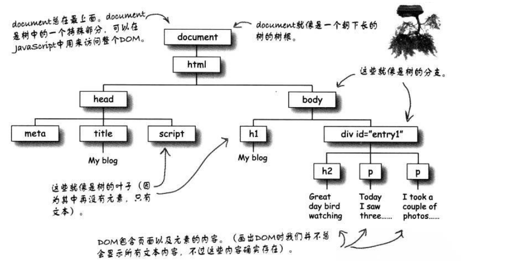

[TOC]

---

> W3C对DOM的定义是: **一个与系统平台和编程语言无关的接口，程序和脚本可以通过这个接口动态的访问和修改文档的内容，结构和样式。**

---

## 1 DOM概述

### 1.1 DOM简介

`DOM` 即文档对象模型， 是一套对文档的内容进行抽象和概念化的方法， `DOM`将一份文档映射为一棵树，通过父子兄弟之间的关系来映射文档中结构化的内容关系。

### 1.2 浏览器中的DOM

当前主流的浏览器都对`DOM`进行了内置的支持， 利用`DOM`给文档增加交互能力。

`DOM`代表着加载到浏览器窗口的当前网页，浏览器提供了网页的地图（或者说是模型），可以通过`JS`去读取或者调用这种地图的信息。

文档对象模型（`Docment Object Model`）可以在所有浏览器上提供一种一致的方式，通过代码访问`HTML`的结构和内容。

每个DOM的最上面都有一个`document`对象，然后是一个包含分枝和叶子节点的树，分别对应`HTML`标记中的各个元素。

`document`对象表示浏览器中的整个页面，它包含完整的`DOM`。



### 1.3 操作节点树的方法

文档是由节点构成的，节点是文档树上的树枝和树叶，通常将节点分为：

- 元素节点
  - 获取元素节点的三种方法
    - 元素名（标签名就是元素名） => `getElementByTagName` => 返回元素的对象数组
    - `id`名 => `getElementById` => 返回元素对象
    - `class`名 => `getElementByClassName` => 返回元素的对象数组
- 文本节点
- 属性节点
  - 属性节点用来对元素做出更具体的描述


`getAttribute` : 获取属性节点的值

`setAttribute` : 更改属性节点的值

## 9 DOM


```js
var changeContent = document.getElementById("elementID");
changeContent.innerHTML="";
```


> 完全加载页面并创建DOM之后再运行代码

```js
function init() {
var changeContent = document.getElementById("elementID");
	changeContent.innerHTML="";
}

windows.onload = init;  // 页面完全加载时在执行init函数

```


- 从`DOM`获取元素
  - `getElementById`
- 向`DOM`创建或者增加元素
  - `createElement`
  - `appendChild`
- 从`DOM`删除元素
- 获取和设置元素的属性
  - value


js中的对象可以分为三种

- 用户自定义对象
- 内建对象
- 宿主对象

