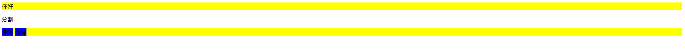

# css基础介绍

## 1 走进CSS

### 1.1 CSS简介

#### 1.1.1 CSS简介

​		CSS-层叠样式表，目标是提供一个简单的声明式样式语言，层叠的含义是指样式可以结合起来使用，而且具有优先级。CSS3由多个独立的模块构成，每个模块进行独立的演进。

​		CSS主要的优势是能够轻易为同类型的所以元素应用一组样式。

#### 1.1.2 置换元素和非置换元素

​		元素是文档结构的根基，这里的元素指的就是HTML中的元素，CSS依赖元素，CSS眼中元素通常有两种形式：

- 置换元素：置换元素内容的部分不由文档内容直接表示，如img，内容由文档之外的图像文件替换，相识的还有input。

- 非置换元素：元素的内容由用户代理（通常指浏览器），在元素自身生成的框中显示，HTML中大部分元素属于此类。

#### 1.1.3 块级和行内元素

 	 CSS也把元素分为块级和行内两种基本类型（这是两种最常见的类型）：

- 块级元素：生成一个填满父级元素内容域的框，旁边不能有其他的元素，如：div, 列表等。

- 行内元素：在一个行文本内生成元素框，不打断所在的行，即旁边可以有其他的元素。

- HTML规定，块级元素不能出现在行内元素当中，但是行内元素通常放在块级元素中，但是CSS元素可以更改这种显示方式（通过display）。

  - ```css
    p {dispaly: inline}
    em {diplay: block}
    ```

  演示如下：

```html
<!DOCTYPE html>
<html lang="en">

<head>
    <title>Document</title>
    <meta charset="utf-8">
    <style>
        div {
            background-color: yellow;
        }

        div span {
            background-color: blue;
        }
    </style>
</head>

<body>
    <div>
        你好
    </div>
    <p>分割</p>
    <div>
        <span>你好</span>
        <span>他好</span>
    </div>
</body>

</html>
```



#### 1.1.4 将css关联到html

##### 1.1.4.1 外部样式表

```html
<!-- 通过link标签，在head标签中嵌入外部样式表 -->
<head>
     <link rel="stylesheet" href="style.css">
</head>
```

##### 1.1.4.2 内嵌样式表

```html
<head>
    <style>
        div {
            background-color: yellow;
        }
    </style>
</head>
```

##### 1.1.4.3 行内样式

```html
<!-- 通过html标签的style属性，提供行内样式,body元素没有style属性，其他元素都有 -->
<p style="color:gray;">
   hahahah
</p>
```

##### 1.1.4.4 @import

```html
<!--
	@import url(style.css) 这种形式可以在外链和内嵌中引入其他的css文件
	不过需要将其放在所有的样式规则之上，同时可以包含多个,需要注意的是import不能应用在行内元素上
-->
<head>
    <style>
		@import url(style.css);
        @import url(style1.css);
        div {
            background-color: yellow;
    	}
</style>
</head>
```

#### 1.1.5 规则结构

​		css文件中一个规则由两部分组成，分别为选择器和声明块，声明块中又包含多条声明，每条声明包含属性和值，用`;`隔开，如果某条声明的属性或者值是错误的，那么该条声明被废弃。

​		一个值通常由一个关键字或者多个关键字组成，这些关键字构成了一个值，多个关键字常用空格隔开，有的使用正斜杠或者逗号，但不是每个值都可以接受很多个关键字。


```cs
p {
    font : medium Helvetica;  /* 将段落中的字体设为中等，并使用Helvetica字体 */
}
```


#### 1.1.6 厂商前缀

​		由于浏览器有很多种类型，各厂商有些专属的属性，所以通过厂商前缀可以在特定的浏览器中实现一些独有的样式：(目前带有厂商前缀的属性，基本不再使用，新版本的浏览器中删除了这些属性，老的代码中可能出现)

| 序号 |   前缀   |                   厂商                   |
| :--: | :------: | :--------------------------------------: |
|  1   |  -epub-  |      国际数字出版论坛制定的ePub格式      |
|  2   |  -moz-   |     基于Mozilla的浏览器（如Firefox）     |
|  3   |   -ms-   |         微软的Internet Explorer          |
|  4   |   -o-    |            基于Opera的浏览器             |
|  5   | -webkit- | 基于WebKit的浏览器（如：Safari和Chrome） |

​		演示：

```css
div {
    -moz-border-radius: 10px;
	-ms-border-radius: 10px;
	-o-border-radius: 10px;
	-webkit-border-radius: 10px;
	border-radius: 10px;
}
```

#### 1.1.7 注释

```css
/*
	这是css中的注释，是不是跟js中的多行注释一样？
*/
```

#### 1.1.8 媒体查询(没懂)

##### 1.1.8.1 媒体查询的定义与设置方式

​		创作人员通过媒体查询定义浏览器在何种媒体环境中使用指定的样式表，主要作用是可以针对不同的媒体类型(包括显示器、便携设备、电视机，等等)设置不同的样式规则。

​		设置媒体查询的几种方式：

- link元素的media属性
- style元素的media属性
- @import声明的媒体描述符部分
- @media声明的媒体描述符部分

```css
/* 一个样式表中可以有任意多个@media块 */
h1 {color: maroon;}
@media projection { /* 在幻灯片中显示的页面背景为黄色 */
    body {
        background:yellow;
    }   
}
```

##### 1.1.8.2 媒体类型

- all：用于所以展示媒体
- print: 为有视力的用户打印文档时使用，也可以应用于打印预览
- screen: 在屏幕媒体上展示文档，带有web浏览器的计算机的显示器上展示
- projection: 幻灯片形式的文档展示
- handheld： 部分移动设备的浏览器支持该类型

> **注意事项：**
>
> - 多个媒体类型进行使用时，用逗号隔开如：
>
>   ```css
>   @media screen, print{
>       
>   }
>   ```

##### 1.1.8.3 媒体描述符

​		一个媒体描述符包含一个媒体类型和一个或者多个媒体特性列表，特性描述符要放在`()`中，没有媒体类型，就应用到所有媒体上：

```css
/* 媒体特性描述符就像声明一样，包含属性和值，但是值可以省略不指定，如color */
@media all and (color) {}

/* 多个特性描述符使用逻辑关键字链接，可以使用and not only ,and:满足全部条件样式才会被应用 */
@media all and (color) and (min-resolution:96dpi) {}
/* not代表整个条件取反, not只能在媒体查询开头写 */
@media not all and  (color) and (min-resolution:96dpi) {}
/* 使用逗号间隔代表or */
@media all and (color), all and(min-resolution:96dpi) {}

/* 没有媒体类型，就应用于全部媒体上 */
@media all and (min-resolution:96dpi) {}
/* 两者等价 */
@media (min-resolution:96dpi) {}
```

#### 1.1.9 特性查询

​		特性查询：根据用户代理是否支持特定的CSS属性及其值来应用一段样式，特性查询是渐进增强的一种方式。

```css
@support (color:black) {  /* 如果用户代理支持color属于就应用它中包含的样式，不支持就跳过 */
    body {color：black;}
    h1 {color:purple;}
}
```

​		特性查询支持嵌套，它可以嵌套在媒体查询中，或者媒体查询中嵌套它，或者自身嵌套自身。特性查询也支持逻辑运算符，如and, or, not。

```css
@support (display:grid) and (shape-outside:circle()){
    /* 栅栏的形状和样式 */
}

/* 与and等价的写法 */
@support (display:grid) {
    @support (shape-outside:circle()) {
        /* 栅栏的形状和样式 */
    }
}
```

​		为什么特性查询中要带属性呢？因为用户代理可能支持属性，但是不支持属性中的某个值。

### 1.2 选择器

#### 1.2.1 基础的选择器

- 元素选择器：

  - 通常这里的元素对于HTML来说指的就是HTML的元素，P，div这些。

- 群组选择器：

  - 将一个样式应用到多个元素中

  - ```css
    h1, p { /* 使用逗号分隔多个元素 */ color: red;}
    ```
  
- 通用选择器：

  - 通用选择器匹配所有元素

  - ```css
    * { color:red;}
    ```
  
- 类选择器

  - 绑定元素的class属性，类选择器可以结合元素选择器进行范围指定

  - ```css
    .waring {font-weight: bold;} /* 这种写法相当于 *.waring {font-weight: bold;} 隐式的包含通用选择器*/
    p.waring {font-weight: bold;}  /* 结合元素选择器进行使用 */
    p.waring.urgent {font-weight: bold;}  /* 串联多个类选择器 html中的class可以包含多个类型，所以可以使用该种方式进一步缩小范围 */
    ```

- ID选择器

  - ID选择器跟类选择器类型，点号换为#号

  - ```css
    /* 由于HTML中规定，ID只能唯一，所以在使用ID选择器的时候，不需要结合元素标签就可以定位到特定元素，虽然ID选择器也隐含通用选择器 */
    /* ID选择器不支持串联，原因是HTML中ID属性不支持多个, ID选择器的权重比类选择器高 */
    #warning {font-weight: bold;}
    ```
> **注意事项**
>
> - 在使用元素选择器的时候，一些旧的浏览器不认识HTML5中提供新元素，这时可通过DOM，创建元素，让CSS可绑定`document.createElement(elemnetName);`

#### 1.2.2 属性选择器

- 简单属性选择器

  - ```css
    h1[class] {color:black;}
    *[class] {color:black;}
    ```

- 精准属性选择器

  - ```css
    /* 配合属性和属性值进行选择 ， 精准属性选择器支持串联*/
    h1[class="main"][title="hello"] {color:black;}
    ```

  - 

- 部分匹配属性值选择器

- 起始值属性选择器