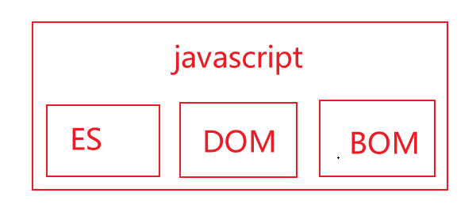
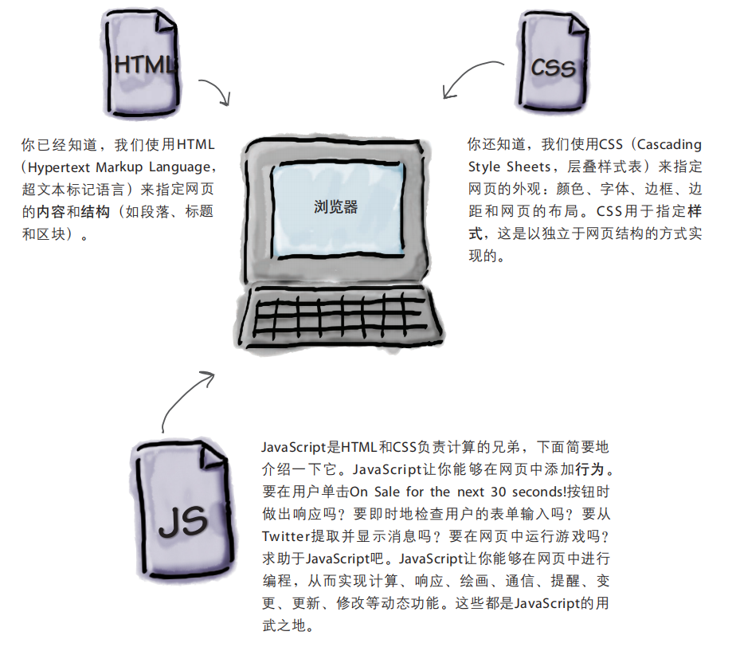
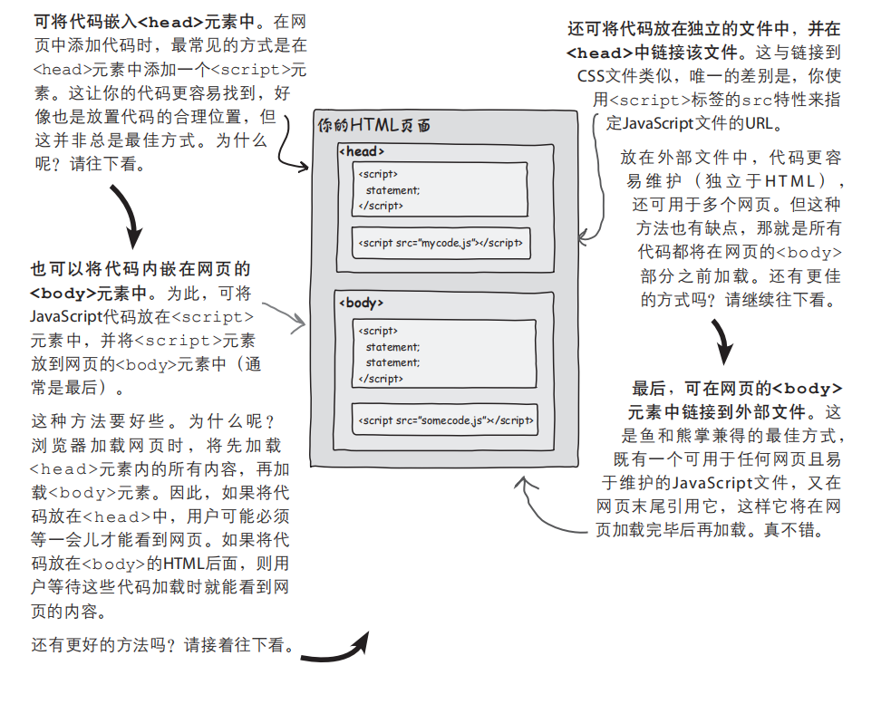
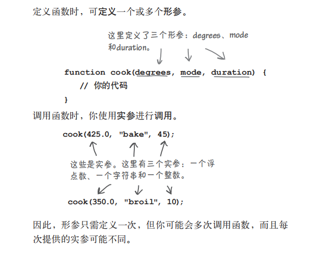

# 1. JavaScript简介

[TOC]

## 1 JavaScript简介

### 1.1 JavaScript简介

#### 1.1.1 JavaScript的诞生

>JavaScript诞生于1995年，由布兰登-艾奇创造，起初的主要用途是处理以前由服务器端语言负责的一些输入验证操作，解决了人们在操作页面时，漫长的服务器端校验回传所浪费的时间，如今，JavaScript的用途早已不再局限于简单的数据验证，而是具备了与浏览器窗口以及其内容等几乎所有方面交互的能力。

#### 1.1.2 JS与ES

　　由于 JavaScript 1.0 很受欢迎，Netscape 在 Netscape Navigator 3 中又发布了 JavaScript 1.1 版本。不久，微软在 Internet Explorer 3 中也加入了脚本编程功能。为了避免与 Netscape 的 JavaScript 产生纠纷，微软特意将其命名为 JScript。1997 年，欧洲计算机制造商协会（ECMA）以 JavaScript 1.1 为基础制订了脚本语言标准——ECMA-262，并命名为 ECMAScript。1998 年，国际标准化组织和国际电工委员会（ISO/IEC）采用了 ECMAScript 标准（即 ISO/IEC-16262）。自此，浏览器厂商就以 ECMAScript 作为各自 JavaScript 实现的规范标准。简单概括，ECMAScript 是 JavaScript 语言的规范标准，JavaScript 是 ECMAScript 的一种实现。

　　Web 浏览器只是 ECMAScript 实现的宿主环境之一。宿主环境不仅提供基本的 ECMAScript 实现，同时也会提供各种扩展功能(DOM和BOM)。ECMAScript 是 JavaScript 的标准，但它并不等同于 JavaScript，也不是唯一被标准化的规范。

#### 1.1.3 JavaScript如今的含义

　　实际上，现在我们所指的 JavaScript 实现由以下 3 个不同部分组成：

- 核心（ECMAScript）：语言核心部分。
- 文档对象模型（Document Object Model，DOM）：网页文档操作标准。
- 浏览器对象模型（BOM）：客户端和浏览器窗口操作基础。



#### 1.1.4 JS的能力和它的未来

- JavaScript是一款纯正的Web编程语言，让你能够给网页添加行为；

- JavaScript是最流行的编程语言之一，所有现代浏览器（和大多数古老的浏览器）都支持它；

- 当今的js已经被嵌入除浏览器外的其他众多环境中；

#### 1.1.5 浏览器中html,css,js的协同关系



#### 1.1.6  引入js代码

　　JavaScript程序不能够独立运行，只能在宿主环境中执行。一般情况下可以把 JavaScript 代码放在网页中，借助浏览器环境来运行（这是因为浏览器中包含js的解释器，如chrome浏览器使用的js引擎称为V8）

　　通过HTML标签中的`<script>`标签可以引入js代码(包含两种方式):

　　**1. 内嵌js代码：**

```html
<!DOCTYPE html>
<html lang="zh-CN">
<head>
    <meta charset="UTF-8">
    <title>Document</title>
    <script type="text/javascript">
        alert("hello js!")
    </script>
</head>
<body>
    hello
</body>
</html>
```

　　**2. 从外部引入js代码：**

```javascript
// hello.js
alert("hello js")
```

```html
<!DOCTYPE html>
<html lang="zh-CN">
<head>
    <meta charset="UTF-8">
    <title>Document</title>
    <script type="text/javascript" src="./hello.js"></script>
</head>
<body>
    hello
</body>
</html>
```

　　上述过程可概括成以下图示：



> **注意事项**

> - 不能在引用JavaScript文件的同时内嵌JavaScript代码，即script标签在使用src属性后，不能在标签中包含js代码，因为浏览器不会再去解析其中的代码；
> - `<script>`标签可以存放在`<body>`或者`<head>`中，最好是存放在`<body>`中的结尾处，这样不影响用户加载网页内容，否则可能会导致浏览器在下载js代码时，造成页面显示的延迟；
> - type属性以及其值text/javascript，不是必须设置的，现代浏览器默认 `<script>` 标签的脚本类型为 JavaScript，因此可以省略 type 属性；如果考虑到兼容早期版本浏览器，则需要设置 type 属性；
> - html文档中，script标签不能在开始标签中闭合，引入的外部文件的后缀名不是必须的，为其他语言动态生成js代码提供了可能性，不过省略的前提是保证服务器能正确的返回MIME类型；

#### 1.1.7 js中的输入输出

　　js核心语法没有提供输入输出api，输入输出由宿主环境提供。

1. 浏览器提供了一个内置函数，可以用来获取用户输入；这个函数就是prompt;

```js
var name = prompt("Enter your name:");
```

2.  浏览器提供的输出方法，主要是以下四种；

```js
// 弹出警告框
window.alert()
// 将内容写到 HTML 文档中直接写入 HTML 输出流,只能在 HTML 输出中使用 document.write。如果在文档加载后使用该方法，会覆盖整个文档
document.write()
// HTML-DOM中独有的innerHTML, 将内容写到HTML中
innerHTML
// 写入到浏览器的控制台
console.log()
```

#### 1.1.8 js中的一些语法注意点

1. **大括号与分号**

   - 与python通过缩进和冒号来识别代码块不同，js中采用`{}`和`;`来区分代码块和语句，虽然实际操作中`;`不是必须的，但是最佳的实践是加上他，这样可以在文件中去除多余的空格来减少js的体积，以及减少解释器智能添加`;`的性能损耗，并增加代码性能。

2. **代码块**

   - 从语法上说，代码块是放在花括号内的一组语句，可以只包含一条语句，也可以包含任意数量的语句。代码块中的所有语句被视为一个整体，要么都执行，要么都不执行。

3. **分隔符**

   - 在JavaScript中，分隔符不被解析，主要用来分隔各种记号，如标识符、关键字、直接量等信息。 在 JavaScript 脚本中，常用分隔符来格式化代码，分隔符（空白符）就是各种不可见字符的集合，如空格（\u0020）、水平制表符（\u0009）、垂直制表符（\u000B）、换页符（\u000C）、不中断空白（\u00A0）、字节序标记（\uFEFF）、换行符（\u000A）、 回车符（\u000D）、行分隔符（\u2028）、段分隔符（\u2029）等。
   - 分隔符虽然无实际意义，但是在脚本中却不能缺少。如果在标识符与关键字之间不使用分隔符分隔，JavaScript 就会抛出异常;

4. **标识符**

   - 标识符被用于语句，变量，参数，属性名，运算符和标记，ES中命名规范如下所示：

     - ECMAScript的标识符区分大小写， test和Test是两个不同的标识符；

     - 不能以数字开头，字符由字母，数字，下划线，美元符组成（除非有充分的理由，否则不要使用以_ 或**$**打头的变量名，它们通常被js库所占用。）;

     - 标识符最好采用驼峰大小写的方式进行命名，如`sayHello`,当然也可以使用下划线的方式命名（Unix风格）；

     - 不使用任何内置关键字和保留字；

     - 除了第一个字符外，其他位置可以使用 Unicode 字符。一般建议仅使用 ASCII 编码的字母，不建议使用双字节的字符（如汉字等）;

#### 1.1.9 注释

　　注释应该优先用来提高程序的可读性，js提供以下两种注释方式：

```javascript
// 单行注释

/*
 *	块注释（第一行和尾行的写法是必须的，中间的行首以星号开始不是必须的，这样写主要是提高可读性）
 *  与python等语言一样，解释器不会执行注释中的内容
 */
```

> **注意事项：**

> - 应该尽量避免在代码中出现块注释，因为块注释的语法字符可能会出现在正则表达式字面量中，导致代码不安全；
>
> ```js
> /*
> 	var rm_a = /a*/.match(s);
> */
> ```

### 1.2 变量

#### 1.2.1 定义变量

　　js的变量是松散类型（可以用来保存任何类型的数据），在生命周期内可以随时改变，定义变量使用关键字`var`声明;

```javascript
// 先声明在赋值
var name;
name = "achui";

// 声明和赋值同时进行
var age = 18;

// 声明后,在使用前没有赋值
var gender; // 变量在声明后没有赋值，保存一个默认的值undefined

// 给一个未声明的变量直接赋值，会导致该变量，为全局变量
// 这种情况在严格模式下会抛出ReferenceError错误
idCard = 1231231231312

// 定义多变量
var name = "achui",  // 换行可以提高可读性
    age = 18,
    gender = "women";
```

#### 1.2.2 变量的作用域

　　变量的定义位置决定了其作用域，即变量在代码的哪些地方可见，哪些地方不可见;

　　变量的作用域分两种：全局（global）和局部（local）如果变量是在函数外声明的，它就是全局变量；如果变量是在函数中声明的，它就是局部变量。使用未声明的变量时，它将自动被视为全局变量，即便他在函数中出现；

```js
// test.js

var name;  // 声明一个全局变量

function sayHello() {
    var name; // 声明一个局部变量
    age = 18;  // 在函数内定义了一个全局变量
}
```

> **注意事项**

> 1. **多个js文件被加载时，作用域怎么划分**
>    - 只有一个全局作用域，因此加载的每个文件看到的变量都相同（它们创建的全局变量位于同一个空间内）。因此，避免使用的变量发生冲突（并尽可能少用甚至不用全局变量）至关重要。
> 2. **全局变量和局部变量重名时，使用哪个变量**
>    - 如在函数内部使用时，函数内部的被局部变量将“遮住”（shadow）全局变量，即就近原则。

#### 1.2.3 变量的声明周期

　　全局变量的寿命与网页一样长。全局变量在JavaScript代码加载到网页之后降生，并在网页消失后死去。局部变量通常在函数结束时消失。局部变量是

在函数被调用后创建的，并一直活到函数返回（无论函数是否返回值）。然而，在局部变量的大限到来前，可从函数返回它们的值。

#### 1.2.4 变量声明的最佳实践

- 在js文件开头声明全局变量， 在函数开头声明局部变量；
- 变量的命名应准守标识符规范；

- 将i用作迭代变量的做法历史悠久。这种约定始于空间有限的年代，也算是一种命名规范；


### 1.3 函数

#### 1.3.1 函数的基本定义


> **注意事项**

> - 不在乎函数是在使用前还是使用后声明的,shell中函数需要在使用前定义, 这是因为浏览器分两遍读取网页：第一遍读取所有的函数定义，第二遍开始执行代码，所以可以将函数放在文件的任何地方, 通常将函数放置在一起是最佳实践；
> - 没有return语句的函数返回undefined；
>

#### 1.3.2 函数传参

1. **形参和实参**



2. **可以向函数传递哪些东西**

   - 可通过实参传递任何JavaScript值，如字符串、布尔值或数字;

   - 可以将变量作为实参传递;

   - 可以将表达式用作实参;

3. **JavaScript按值传递实参**

   - 向函数传递实参时，首先复制其值，再将这个值赋给相应的形参按值传递的真正意义在于，在函数中修改形参的值时，只会影响形参，而不会影响传递给函数的变量；

   - 在函数中处理形参时，其影响范围将限制在函数中；

4. **如果传递的实参太多，结果将如何？**

   在这种情况下，JavaScript将忽略多余的实参。

5. **如果传入的实参不够，结果将如何？**

   将没有相应实参的形参设置为未定义（undefined）。

### 1.4 数据类型

#### 1.4.1 数组

　　如何使用JavaScript表示多个值，数组是一种可存储很多值的JavaScript数据类型。数组可存储的元素数受制于计算机的内存量。定义一个数组的方式如下所示：

```js
// 创建一个空的数组
var arrayTest = [];

// 数组中可以存储不同的数据类型
var arrayTest1 = [1, 2, "hello"];

// 通过构造函数创建一个新的数组
var arrayTest2 = new Array(3); // 创建一个包含三个索引的数组，但是字面量方式创建数组的方式较为常用
```

　　如何访问数组中的元素：

```js
var arrayTest1 = [1, 2, "hello"];

// 通过索引的方式访问数组，js中的数组没有负索引
// 如果一个访问的元素不存在，返回undefined
console.log(arrayTest1[1]) 

// 获取数组的长度arrayTest1.length, 可以结合for循环，遍历数组
for (var i = 0; i < arrayTest1.length-1; i++) {
    console.log(arrayTest1[i])
}

// 向数组中添加一个值
arrayTest1.push("hi")  // 在数组末尾添加一个新元素,类似python中列表的append方法
```

　　数组的稀疏性：

```js
// 首先需要明确的是数组是稀疏的，稀疏数组是有些索引处有值，而其他索引处没有值的数组。

// 以下创建了一个稀疏数组，为数组添加值得时候一定要注意数组的稀疏性
var sparseArray = [];
sparseArray[0] = true;
spraseArray[100] = true;
```

#### 1.4.2 对象

　　访问对象的属性，可以通过句点表示法：

```js
var student = {
    name: "achui",
    age: 18
};

// 为对象添加新的属性
student.gender = "women";

// 访问对象的属性,访问不存在的属性时将得到undefined
student.gender;

// 修改对象的属性值
student.gender = "man";

// 删除属性的值,使用特殊的关键词delete
delete student.gender;

// 访问属性的另一种方式使用方括号进行访问
student["gender"]
```

　　变量在存储对象的时候，实际上存储的是对象的引用，而不是像原始类型那样直接存储实际的值。这对于函数传参来说很有趣，我们了解到，js中传递参数是按照值进行传递的，而保存对象的变量实际上保存的是对象的引用，这时在传递时就会将对象引用的副本传递给形参，这样，实参和形参指向了同一个对象，所以在函数中进行对象的属性操作的时候，是会影响引用他的其他变量的。

　　为对象添加行为：

```js
var student = {
    name: "achui",
    age: 18,
    study: function() {
        console.log("study");
    }
};

// 使用对象的方法
student.study();

// 通过this关键词，在方法中使用对象的属性，它与python中的self是相同的
// this关键词指代的就是当前对象
```


