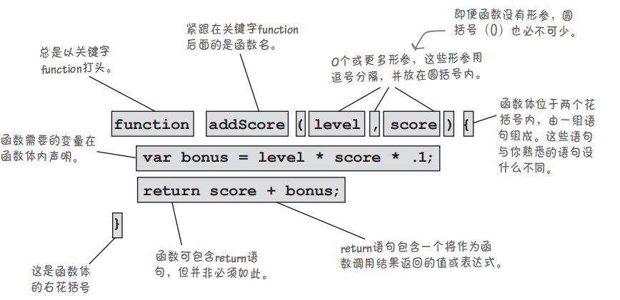
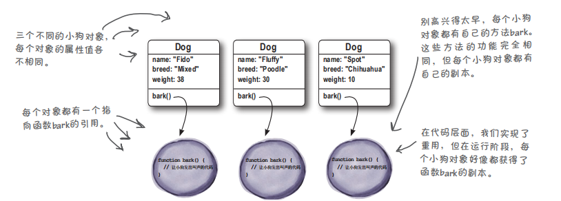

# 1. JavaScript简介

[TOC]

## 1 JavaScript简介

### 1.1 JavaScript简介

#### 1.1.1 JavaScript的诞生

>JavaScript诞生于1995年，由布兰登-艾奇创造，起初的主要用途是处理以前由服务器端语言负责的一些输入验证操作，解决了人们在操作页面时，漫长的服务器端校验回传所浪费的时间，如今，JavaScript的用途早已不再局限于简单的数据验证，而是具备了与浏览器窗口以及其内容等几乎所有方面交互的能力。

#### 1.1.2 JS与ES

　　由于 JavaScript 1.0 很受欢迎，Netscape 在 Netscape Navigator 3 中又发布了 JavaScript 1.1 版本。不久，微软在 Internet Explorer 3 中也加入了脚本编程功能。为了避免与 Netscape 的 JavaScript 产生纠纷，微软特意将其命名为 JScript。1997 年，欧洲计算机制造商协会（ECMA）以 JavaScript 1.1 为基础制订了脚本语言标准——ECMA-262，并命名为 ECMAScript。1998 年，国际标准化组织和国际电工委员会（ISO/IEC）采用了 ECMAScript 标准（即 ISO/IEC-16262）。自此，浏览器厂商就以 ECMAScript 作为各自 JavaScript 实现的规范标准。简单概括，ECMAScript 是 JavaScript 语言的规范标准，JavaScript 是 ECMAScript 的一种实现。

　　Web 浏览器只是 ECMAScript 实现的宿主环境之一。宿主环境不仅提供基本的 ECMAScript 实现，同时也会提供各种扩展功能(DOM和BOM)。ECMAScript 是 JavaScript 的标准，但它并不等同于 JavaScript，也不是唯一被标准化的规范。

#### 1.1.3 JavaScript如今的含义

　　实际上，现在我们所指的 JavaScript 实现由以下 3 个不同部分组成：

- 核心（ECMAScript）：语言核心部分。
- 文档对象模型（Document Object Model，DOM）：网页文档操作标准。
- 浏览器对象模型（BOM）：客户端和浏览器窗口操作基础。


#### 1.1.4 JS的能力和它的未来

- JavaScript是一款纯正的Web编程语言，让你能够给网页添加行为；

- JavaScript是最流行的编程语言之一，所有现代浏览器（和大多数古老的浏览器）都支持它；

- 当今的js已经被嵌入除浏览器外的其他众多环境中；

#### 1.1.5 浏览器中html,css,js的协同关系


#### 1.1.6  引入js代码

　　JavaScript程序不能够独立运行，只能在宿主环境中执行。一般情况下可以把 JavaScript 代码放在网页中，借助浏览器环境来运行（这是因为浏览器中包含js的解释器，如chrome浏览器使用的js引擎称为V8）

　　通过HTML标签中的`<script>`标签可以引入js代码(包含两种方式):

　　**1. 内嵌js代码：**

```html
<!DOCTYPE html>
<html lang="zh-CN">
<head>
    <meta charset="UTF-8">
    <title>Document</title>
    <script type="text/javascript">
        alert("hello js!")
    </script>
</head>
<body>
    hello
</body>
</html>
```

　　**2. 从外部引入js代码：**

```javascript
// hello.js
alert("hello js")
```

```html
<!DOCTYPE html>
<html lang="zh-CN">
<head>
    <meta charset="UTF-8">
    <title>Document</title>
    <script type="text/javascript" src="./hello.js"></script>
</head>
<body>
    hello
</body>
</html>
```

　　上述过程可概括成以下图示：


> **注意事项**

> - 不能在引用JavaScript文件的同时内嵌JavaScript代码，即script标签在使用src属性后，不能在标签中包含js代码，因为浏览器不会再去解析其中的代码；
> - `<script>`标签可以存放在`<body>`或者`<head>`中，最好是存放在`<body>`中的结尾处，这样不影响用户加载网页内容，否则可能会导致浏览器在下载js代码时，造成页面显示的延迟；
> - type属性以及其值text/javascript，不是必须设置的，现代浏览器默认 `<script>` 标签的脚本类型为 JavaScript，因此可以省略 type 属性；如果考虑到兼容早期版本浏览器，则需要设置 type 属性；
> - html文档中，script标签不能在开始标签中闭合，引入的外部文件的后缀名不是必须的，为其他语言动态生成js代码提供了可能性，不过省略的前提是保证服务器能正确的返回MIME类型；

#### 1.1.7 js中的输入输出

　　js核心语法没有提供输入输出api，输入输出由宿主环境提供。

1. 浏览器提供了一个内置函数，可以用来获取用户输入；这个函数就是prompt;

```js
var name = prompt("Enter your name:");
```

2.  浏览器提供的输出方法，主要是以下四种；

```js
// 弹出警告框
window.alert()
// 将内容写到 HTML 文档中直接写入 HTML 输出流,只能在 HTML 输出中使用 document.write。如果在文档加载后使用该方法，会覆盖整个文档
document.write()
// HTML-DOM中独有的innerHTML, 将内容写到HTML中
innerHTML
// 写入到浏览器的控制台
console.log()
```

#### 1.1.8 js中的一些语法注意点

1. **大括号与分号**

   - 与python通过缩进和冒号来识别代码块不同，js中采用`{}`和`;`来区分代码块和语句，虽然实际操作中`;`不是必须的，但是最佳的实践是加上他，这样可以在文件中去除多余的空格来减少js的体积，以及减少解释器智能添加`;`的性能损耗，并增加代码性能。

2. **代码块**

   - 从语法上说，代码块是放在花括号内的一组语句，可以只包含一条语句，也可以包含任意数量的语句。代码块中的所有语句被视为一个整体，要么都执行，要么都不执行。

3. **分隔符**

   - 在JavaScript中，分隔符不被解析，主要用来分隔各种记号，如标识符、关键字、直接量等信息。 在 JavaScript 脚本中，常用分隔符来格式化代码，分隔符（空白符）就是各种不可见字符的集合，如空格（\u0020）、水平制表符（\u0009）、垂直制表符（\u000B）、换页符（\u000C）、不中断空白（\u00A0）、字节序标记（\uFEFF）、换行符（\u000A）、 回车符（\u000D）、行分隔符（\u2028）、段分隔符（\u2029）等。
   - 分隔符虽然无实际意义，但是在脚本中却不能缺少。如果在标识符与关键字之间不使用分隔符分隔，JavaScript 就会抛出异常;

4. **标识符**

   - 标识符被用于语句，变量，参数，属性名，运算符和标记，ES中命名规范如下所示：

     - ECMAScript的标识符区分大小写， test和Test是两个不同的标识符；

     - 不能以数字开头，字符由字母，数字，下划线，美元符组成（除非有充分的理由，否则不要使用以_ 或**$**打头的变量名，它们通常被js库所占用。）;

     - 标识符最好采用驼峰大小写的方式进行命名，如`sayHello`,当然也可以使用下划线的方式命名（Unix风格）；

     - 不使用任何内置关键字和保留字；

     - 除了第一个字符外，其他位置可以使用 Unicode 字符。一般建议仅使用 ASCII 编码的字母，不建议使用双字节的字符（如汉字等）;

#### 1.1.9 注释

　　注释应该优先用来提高程序的可读性，js提供以下两种注释方式：

```javascript
// 单行注释

/*
 *	块注释（第一行和尾行的写法是必须的，中间的行首以星号开始不是必须的，这样写主要是提高可读性）
 *  与python等语言一样，解释器不会执行注释中的内容
 */
```

> **注意事项：**

> - 应该尽量避免在代码中出现块注释，因为块注释的语法字符可能会出现在正则表达式字面量中，导致代码不安全；
>
> ```js
> /*
> 	var rm_a = /a*/.match(s);
> */
> ```

## 2 变量与数据类型

### 1.2 变量

#### 1.2.1 定义变量

　　js的变量是松散类型（可以用来保存任何类型的数据），在生命周期内可以随时改变，定义变量使用关键字`var`声明;

```javascript
// 先声明在赋值
var name;
name = "achui";

// 声明和赋值同时进行
var age = 18;

// 声明后,在使用前没有赋值
var gender; // 变量在声明后没有赋值，保存一个默认的值undefined

// 给一个未声明的变量直接赋值，会导致该变量，为全局变量
// 这种情况在严格模式下会抛出ReferenceError错误
idCard = 1231231231312

// 定义多变量
var name = "achui",  // 换行可以提高可读性
    age = 18,
    gender = "women";
```

#### 1.2.2 变量的作用域

　　变量的定义位置决定了其作用域，即变量在代码的哪些地方可见，哪些地方不可见;

　　变量的作用域分两种：全局（global）和局部（local）如果变量是在函数外声明的，它就是全局变量；如果变量是在函数中声明的，它就是局部变量。使用未声明的变量时，它将自动被视为全局变量，即便他在函数中出现；

```js
// test.js

var name;  // 声明一个全局变量

function sayHello() {
    var name; // 声明一个局部变量
    age = 18;  // 在函数内定义了一个全局变量
}
```

> **注意事项**

> 1. **多个js文件被加载时，作用域怎么划分**
>    - 只有一个全局作用域，因此加载的每个文件看到的变量都相同（它们创建的全局变量位于同一个空间内）。因此，避免使用的变量发生冲突（并尽可能少用甚至不用全局变量）至关重要。
> 2. **全局变量和局部变量重名时，使用哪个变量**
>    - 如在函数内部使用时，函数内部的被局部变量将“遮住”（shadow）全局变量，即就近原则。

#### 1.2.3 变量的声明周期

　　全局变量的寿命与网页一样长。全局变量在JavaScript代码加载到网页之后降生，并在网页消失后死去。局部变量通常在函数结束时消失。局部变量是在函数被调用后创建的，并一直活到函数返回（无论函数是否返回值）。然而，在局部变量的大限到来前，可从函数返回它们的值。

#### 1.2.4 变量声明的最佳实践

- 在js文件开头声明全局变量， 在函数开头声明局部变量；
- 变量的命名应准守标识符规范；

- 将i用作迭代变量的做法历史悠久。这种约定始于空间有限的年代，也算是一种命名规范；

### 1.2.4 变量提升

通常JS引擎会在正式执行之前先进行一次预编译，在这个过程中，首先将变量声明及函数声明提升至当前作用域的顶端，然后进行接下来的处理。

### 1.4 数据类型

#### 1.4.1 数字

```js
var test = 0 / 0;
console.log(typeof test);  // res => number

if (isNaN(test)) { // isNaN(test) 等于 true
    console.log("this is not a number!");
}
```

#### 1.4.2 字符串

　　为什么字符串既像基本类型又像对象(即他包含方法)字符串是如何表现得既像基本类型因为JavaScript提供了这样的支持。换句话说，在JavaScript中，可创建作为基本类型的字符串，也可创建作为对象的字符串(支持大量的字符串操作方法)，一般把字符串看做为字符串对象即可。

#### 1.4.3 布尔值

　　在js中，布尔类型的值有两个一个是true一个是false，通常都是用于条件测试表达式，但是js中其他数据类型的值也可以在条件测试中返回布尔类型的值，在JavaScript中，假值有5个：

- undefined

- null

- 0

- 空字符串

- NaN

#### 1.4.4 Undefine

#### 1.4.5 null

### 1.5 对象

#### 1.5.1 数组

　　如何使用JavaScript表示多个值，数组是一种可存储很多值的JavaScript数据类型。数组可存储的元素数受制于计算机的内存量。定义一个数组的方式如下所示：

```js
// 创建一个空的数组
var arrayTest = [];

// 数组中可以存储不同的数据类型
var arrayTest1 = [1, 2, "hello"];

// 通过构造函数创建一个新的数组
var arrayTest2 = new Array(3); // 创建一个包含三个索引的数组，但是字面量方式创建数组的方式较为常用
```

　　如何访问数组中的元素：

```js
var arrayTest1 = [1, 2, "hello"];

// 通过索引的方式访问数组，js中的数组没有负索引
// 如果一个访问的元素不存在，返回undefined
console.log(arrayTest1[1]) 

// 获取数组的长度arrayTest1.length, 可以结合for循环，遍历数组
for (var i = 0; i < arrayTest1.length-1; i++) {
    console.log(arrayTest1[i])
}

// 向数组中添加一个值
arrayTest1.push("hi")  // 在数组末尾添加一个新元素,类似python中列表的append方法
```

　　数组的稀疏性：

```js
// 首先需要明确的是数组是稀疏的，稀疏数组是有些索引处有值，而其他索引处没有值的数组。

// 以下创建了一个稀疏数组，为数组添加值得时候一定要注意数组的稀疏性
var sparseArray = [];
sparseArray[0] = true;
spraseArray[100] = true;
```

#### 1.5.2 对象

　　访问对象的属性，可以通过句点表示法：

```js
var student = {
    name: "achui",
    age: 18
};

// 为对象添加新的属性
student.gender = "women";

// 访问对象的属性,访问不存在的属性时将得到undefined
student.gender;

// 修改对象的属性值
student.gender = "man";

// 删除属性的值,使用特殊的关键词delete
delete student.gender;

// 访问属性的另一种方式使用方括号进行访问
student["gender"]
```

　　变量在存储对象的时候，实际上存储的是对象的引用，而不是像原始类型那样直接存储实际的值。这对于函数传参来说很有趣，我们了解到，js中传递参数是按照值进行传递的，而保存对象的变量实际上保存的是对象的引用，这时在传递时就会将对象引用的副本传递给形参，这样，实参和形参指向了同一个对象，所以在函数中进行对象的属性操作的时候，是会影响引用他的其他变量的。

　　为对象添加行为：

#### 1.5.3 对象的创建

对象字面量提供了一个便利方式，让你能够在代码中随时随地创建对象，但需

要创建大量对象（如一个出租车车队）时，你不想输入数百个对象字面量，不

是吗？

```js
var student = {
    name: "achui",
    age: 18,
    study: function() {
        console.log("study");
    }
};

// 使用对象的方法
student.study();

// 通过this关键词，在方法中使用对象的属性，它与python中的self是相同的
// this关键词指代的就是当前对象
```

### 1.6 运算符

#### 1.6.1 自动转换

　　**js中，在对不同类型数据进行比较的时候遵寻以下原则：**

- 比较字符串和数字时，都将把字符串转换为数字，再对两个数字进行比较；

- 比较布尔值和其他类型，在这种情况下，将把布尔值转换为数字，再进行比较；
- 比较null和undefined，这两个值的比较结果为true；

　　**当在其他运算中出现不同类型的数据操作时，js也可以进行自动转换，如字符串的拼接操作，表达式中的数学运算**

- 将数字和字符串相加，JavaScript将把数字转换为字符串，再进行拼接。这与==运算符的情况大致相反;
- 对于其他算术运算符，如乘法、除法和减法运算符，JavaScript将认为你要执行的是算术运算，而不是字符串运算;

```js
var order = 1 + 2 + " pizzas";
// 结果将为"3 pizzas"，而不是"12 pizzas"。这是因为从左往右计算时，先将1和2相加(因为它们都是数字)，结果为3；接下来，将3与字符串"pizzas"相加，因此将3转换为字符串，再拼接这两个字符串。
```

#### 1.6.2 比较运算符

通常比较运算符中的大小比较都是比较数字类型的，但是如果运算符的两边是字符串，如何进行比较？

- "mango"以m打头，而b在字母表中排在m前面，因此"banana"比"mango"小。"mango"比"melon"小，因为虽然它们的第一个字母相同，但比较第二个字母时，发现a排在e的前面。

## 3 对象

在一个对象中绑定函数，称为这个对象的方法。

instanceof来确定对象是由哪个构造函数创建的

构造函数自动返回它创建的新对

象。

需要创建少量对象时，适合使用

对象字面量。 

■ 

需要创建大量类似的对象时，适

合使用构造函数。

### 1.3.9 构造函数

构造函数涉及到的关键字主要是`this`, `new`, `function`,有一件事情不能做，

那就是从构造函数中返回值，

因为除非返回的是this，否则

这将导致构造函数不返回它创

建的对象。

```js
// 构造函数名字首字母大写，是js的约定，方便辨别
function Dog(name, age, gender) {
    this.name = name;
    this.age = age;
    this.gender = gender;
    this.sayHello = function() {
      console.log(this.name + " say hello!")  
    };
} 

// 通过new创建新的对象
var huahua = new Dog("huahua", 2, "mu");
huahua.sayHello();
```

但有一件事情不能做，

那就是从构造函数中返回值，

因为除非返回的是this，否则

这将导致构造函数不返回它创

建的对象。


这两种方式都有其用武

之地。需要创建大量包含相同

属性和方法的对象时，构造函

数很有帮助。使用构造函数很

方便，可重用代码，还可确保

对象的一致性。

但有时候，需要创建一次性的

简单对象。在这种情况下，使

用对象字面量显得更简洁、更

具表达力。

## 4 函数

### 4.1 定义一个函数 

#### 4.1.1 函数声明定义



> **注意事项**

> - 没有return语句的函数返回undefined；

#### 4.1.2 函数表达式

　　函数表达式没有函数名，没有函数名的函数被称为**匿名函数**，通常用于需要函数引用的地方。如以下通过赋值语句进行定义：

```js
var fly = function(num) {
    for (var i = 0; i < num; i++) {
        console.log("Flying");
    }
};

fly(3);
```

#### 4.1.3 函数声明和函数表达式的区别

1. **运行时的区别：**

　　在分析网页期间（执行任何代码之前），浏览器查找函数声明。找到函数声明时，浏览器创建相应的函数，并将得到的函数引用赋给与函数同名的变量，处理所有的函数声明后，浏览器回到代码开头，开始按从头到尾的顺序，而通过函数表达式创建的函数就像普通表达式一样，包含在语句之内，并不会被浏览器预先加载生成。

　　因为函数声明会被预先加载，所有我们可以不必关注调用函数和定义函数之间的顺序关系（在shell中需要注意，在使用函数前，需要先定义函数，否则报错）

，这种特性使得我们可以将函数声明放在文件的任何地方, 通常将函数声明放置在一起是最佳实践。

2. **赋值时的区别**

　　函数声明是一条语句。可以认为它包含一条隐藏的赋值语句，这条语句将函数引用赋给一个变量。函数表达式不自动将函数引用赋给任何变量，你必须显式地将其进行赋值。

> **注意事项：**

> - 无论是函数声明还是函数表达式，最终都将得到一个函数。但它们之间存在一些重要的差别。一个差别是，使用函数声明时，函数将在执行代码前创建；而使用函数表达式时，函数将在运行阶段执行代码时创建。另一个差别与函数命名相关：使用函数声明时，将创建一个与函数同名的变量，并让它指向函数；而使用函数表达式时，通常不给函数指定名称，因此你要么在代码中将函数赋给一个变量，要么以其他方式使用函数表达式（如传参等）。

### 4.2 函数传参

#### 4.2.1 形参和实参


#### 4.2.2 函数对传入参数的个数和类型的要求

　　js中向函数传递实参，是没有类型限制和数量限制的，对于类型而言，我们可以**传入以下类型**：

- 可通过实参传递任何JavaScript值，如字符串、布尔值或数字;
- 可以将变量作为实参传递;
- 可以将表达式用作实参（如函数表达式）;

　　**对于传递的参数个数js函数会做出以下反应：**

1. ***如果传递的实参太多，结果将如何？***

   在这种情况下，JavaScript将忽略多余的实参。

2. ***如果传入的实参不够，结果将如何？***

   将没有相应实参的形参设置为未定义（undefined）。

#### 4.2.3 argments关键字

　　它只在函数内部起作用，并且永远指向当前函数的调用者传入的所有参数。`arguments`的使用方式类似`Array`但它不是一个`Array`；

```js
function abs() {
    if (arguments.length != 0) {
        for (var i in arguments) {
            console.log(arguments[0]);
        }
    } else {
        console.log("No params!")
    }
}

abs(); // No params!
abs(11); // 11
```

#### 4.2.4 JavaScript按值传递实参

- 向函数传递实参时，首先复制其值，再将这个值赋给相应的形参，按值传递的真正意义在于，在函数中修改形参的值时，只会影响形参，而不会影响传递给函数的变量；
- 对于对象而言，传递的其实是对象的引用，所以在函数内部对对象的属性进行更改的时候，会影响原有对象，因为操作的变量中的引用和实参变量中对象的引用指向同一个对象；

#### 4.2.5 ES6的rest参数

　　rest参数主要是获取多余参数的一种手段，使用rest可以避免在获取多余参数时对arguments的遍历操作。

```js
function testRest(a, b, ...rest) {
    console.log(a + " " + b);
    console.log("-----------------------");
    console.log(rest);
}

testRest();
testRest(3, 4, 5);

undefined undefined      
-----------------------
[]  // 没有多余参数时返回空的数组

3 4
-----------------------
[ 5 ]
```

### 4.3 函数作用域

#### 4.3.1 函数的作用域

- 如果一个变量在函数体内部申明，则该变量的作用域为整个函数体，在函数体外不可引用该变量；
- 如果两个不同的函数各自申明了同一个变量，那么该变量只在各自的函数体内起作用。换句话说，不同函数内部的同名变量互相独立，互不影响；
- 由于JavaScript的函数可以嵌套，此时，内部函数可以访问外部函数定义的变量，反过来则不行；
- 如果内部函数和外部函数的变量名重名怎么办？JavaScript的函数在查找变量时从自身函数定义开始，从“内”向“外”查找。如果内部函数定义了与外部函数重名的变量，则内部函数的变量将“屏蔽”外部函数的变量；

#### 4.3.2 变量提升

前面说过，可以将函数声明放在任何地方（代码的开头、末尾、中间），且可在任何地方调用它们。在代码的任何地方，函数声明创建的函数都是已定义的，这被称为提升（hoisting）。

在代码顶层定义的函数是全局的，而在函数中定义的函数是局部的

在代码顶层定义的函数与在函数中定义的函数之间的唯一差别在于，它们的作用域不同，在函数内部，如果你使用函数声明创建了一个嵌套函数，那么在这个函数的函数体的任何地方，嵌套函数都是已定义的；如果你使用函数表达式创建了一个嵌套函数，则在这个函数的函数体内，仅当函数表达式执行后，嵌套函数才是已定义的。

#### 1.3.4 函数是一等对象

- 将其赋给变量或存储在数组和对象等数据结构中（匿名函数的应用）；

- 将其传递给函数（将函数当做参数进行传递，传递的是指向函数的引用）；

- 从函数中返回它们；

#### 


#### 


#### 1.3.7 嵌套函数

前面我们讲到过，函数在调用完成后消逝，但是其中定义的局部变量会在局部作用域中保留下来

所谓词法作用域，指的是JavaScript的作用域规则完

全基于代码的结构，而不是一些动态的运行阶段属性。这

意味着只需查看代码的结构，就能确定变量是在什么地方

定义的。另外别忘了，在JavaScript中，只有函数会引入新

的作用域。因此，对于在函数中引用的变量，要确定它是

在哪里定义的，可从最里面（当前函数）开始依次向最外

面进行查找，直到找到它为止。如果在这些函数中都找不

到它，则它要么是全局的，要么未定义。

别忘了，JavaScript函数都是在定义它的环境中

执行的。在函数中，要确定变量来自何方，可

按从内到外的顺序依次在包含它的函数中搜索。

#### 1.3.8 闭包

闭包：名词，指的是函数和引用环境。

函数通常包含局部变量（它们

是在函数体中定义的，包括所有的形参），还可能包含不是在本

地定义的变量，这些变量被称为自由变量。自由一词源于这样一

点：在函数体内，自由变量没有绑定到任何值（换而言之，它们

不是在本地声明的）。有了给每个自由变量都提供了值的环境后，

便将函数敲定了；而函数和环境一起被称为闭包。

对于函数体内的变量，如果它既

不是在本地定义的，又不是全局变量，

便可肯定它来自包含当前函数的其他

函数，可从环境中获取其值。

```js
function makeCounter() {
 	var count = 0;
    function counter() {
        count = count + 1;
        return count;
    }
	return counter;
}
```

并非只能通过从函数返回函数来创建闭包。如果函数使用了自由变量，则

每当你在创建该函数的上下文外面执行它时，都将创建一个闭包。

学习闭包时，大家常常错误地认为闭包的环境包含所有变量及其值的副本。实际上不是这样

的。环境引用的是实时变量

函数表达式是在运行阶段与其

他代码一起执行的，因此在函

数表达式所在的语句执行前，

它创建的函数是未定义的。

通常使用闭包来为事件处理程

序捕获状态

## 5 面向对象编程

　　在js中创建自定义对象主要有以下三种方式：

- 通过字面量创建对象，适合创建那些一次性使用的对象；
- 通过构造函数创建对象，适用于批量创建同类型的对象；
- 原型方式创建对象是对构造函数创建对象的一种加强，可以使得每个对象不需要单独保存方法的引用；

　　这里通过《Heard First JavaScript》一书的小狗例子进行说明：

```js
// 建立一个构造函数
function Dog(name, breed, weight) {
    this.name = name;
    this.breed = breed;
    this.weight = weight;
    this.bark = function() {
        if (this.weight > 25) {
            alert(this.name + " says Woof!");
        } else {
            alert(this.name + " says Yip!");
        }
    };
}

// 创建三个狗对象
var fido = new Dog("Fido", "Mixed", 38);
var fluffy = new Dog("Fluffy", "Poodle", 30);
var spot = new Dog("Spot", "Chihuahua", 10);
```

　　上述三个狗对象可抽象为以下图示(通过图示发现，实际运行代码时，方法对象被每个对象所单独保存了指向他的引用，这极大的浪费了内存空间)：



　　为了解决上述问题，以下就引出了原型的概念，我们通过对原型对象的扩展，达到在运行时上对方法的重用，避免每个对象都保存方法的副本，节省内存空间。

### 5.1 原型的概念

#### 5.1.1 原型定义

　　不同于python等语言采用类与实例的方式实现面对对象编程，JavaScript采用的不是基于类的面向对象系统，而是更强大的原型模型，其中的对象可继承和扩展其他对象的行为，在JavaScript中，对象从其他对象那里继承行为，我们称之为**原型式继承**（prototypal inheritance）或基于原型的继承，而被继承的对象称为**原型**。

　　如何通过代码创建原型，通过构造函数的**prototype**属性，该属性是一个指向原型的引用；

```js
// 创建构造函数
function Dog(name, breed, weight) {
     this.name = name;
     this.breed = breed;
     this.weight = weight;
}

// 创建原型
Dog.prototype.species = "Canine";
Dog.prototype.bark = function() {
     if (this.weight > 25) {
     	console.log(this.name + " says Woof!");
     } else {
     	console.log(this.name + " says Yip!");
     }
};
Dog.prototype.run = function() {
 	console.log("Run!");
};
Dog.prototype.wag = function() {
 	console.log("Wag!");
};

// 创建一个Dog对象
var spot = new Dog("Spot", "Chihuahua", 10);

// 重写bark方法，对对象调用方法时，如果在对象中找不到，将在原型中查找它
spot.bark = function() {
 	console.log(this.name + " says WOOF!");
}
```

> **注意事项：**

> - 原型是动态的，给原型添加新的方法或属性后，继承该原型的所有对象实例都将立即看到它；
> - 修改原型的任何属性时，都将影响继承该原型的所有对象——只要它们没有重写这个属性；
> - 对象实例中如果对原型中同名的属性或者方法进行了修改操作，则认为在实例对象中重写了该属性或方法；

#### 5.1.2 判断属性在原型还是在对象实例中

　　可使用每个对象都有的方法hasOwnProperty。如果属性是在对象实例中定义的，这个方法将返回true，hasOwnProperty方法来自于Object对象。

### 5.2 原型链

　　在JavaScript中，可建立供对象继承的原型链（可以理解为python中的继承树，只不过js是单继承的），原型链原理如下所示：


接着原型中的狗对象，我们创建图示的原型链：

```js
// 狗类在5.1中
function ShowDog(name, breed, weight, handler) {
     Dog.call(this, name, breed, weight);
     this.handler = handler;
}

ShowDog.prototype = new Dog();
ShowDog.prototype.constructor = ShowDog;
Showdog.prototype.league = "Webville";
ShowDog.prototype.stack = function() { 
	console.log("Stack");
};
ShowDog.prototype.bait = function() {
	console.log("Bait");
};
ShowDog.prototype.gait = function(kind) {
	console.log(kind + "ing");
};
ShowDog.prototype.groom = function() {
	console.log("Groom");
};

var scotty = new ShowDog("Scotty", "Scottish Terrier", 15, "Cookie");
```

**创建的每个原型链的终点都是Object**


不可重写

千万不要重写Object的如下属性：

可以重写

熟悉原型并知道如何安全地重写属性后，就可以重写Object的

如下属性了：

不可重写部分

**constructor**

**hasOwnProperty**

**isPrototypeOf**

**propertyIsEnumerable**


可重写部分

**toString**

**toLocaleString**

**valueOf**