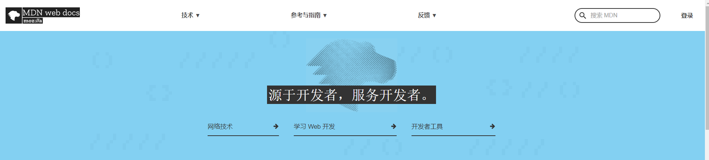

# learningWebFromBooks
#### 简介

>书中自有黄金屋，书中自有颜如玉

:ear:业余前端爱好者

#### 免费的学习网站

:thumbsup:[MDN](https://developer.mozilla.org/zh-CN/)

>  **MDN Web Docs**:是一个汇集众多Mozilla基金会产品和网络技术开发文档的免费网站。

:thumbsup:[菜鸟教程](https://www.runoob.com/)

> **菜鸟教程**:致力于推广各种编程语言技术，所有资源是完全免费的，并且会根据当前互联网的变化实时更新本站内容。

